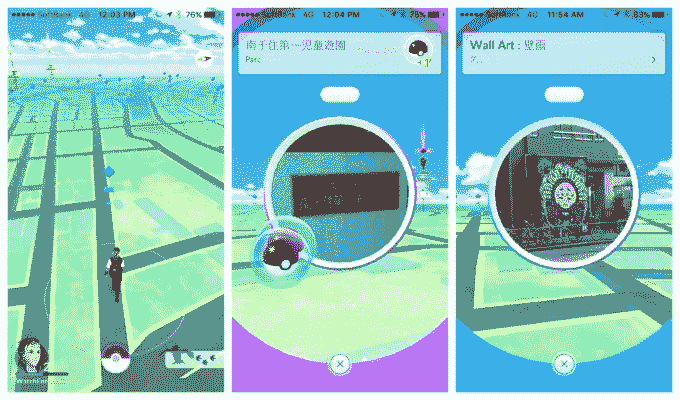

# Pokémon Go 终于在日本上线，麦当劳成为第一个赞助地点 

> 原文：<https://web.archive.org/web/https://techcrunch.com/2016/07/21/pokemon-go-is-finally-available-in-japan/>

# 《精灵宝可梦 Go》终于在日本上线，麦当劳成为第一个赞助地点

《精灵宝可梦 Go》终于在日本推出了，这是《精灵宝可梦》的发源地。麦当劳是这款游戏的第一家赞助商，正如我们本周早些时候报道的，T2 将这家快餐公司在该国的 3000 家商店变成神奇宝贝 Go“健身房”。

至少对日本粉丝来说，发布会已经过去了很长时间。两周前，这款红极一时的游戏首次登陆美国，并于上周登陆欧洲和加拿大的大部分地区。这让许多日本粉丝感到失望，因为他们不得不观看比赛，却不能参与其中。

即使是今天的发布会也不是没有戏剧性。正如我们之前报道的那样，这款游戏已经准备好在日本发布几天了，但是内部分歧和漏洞阻碍了事情的进展。周二，[我们报道了这款游戏将于周三](https://web.archive.org/web/20230121171539/https://techcrunch.com/2016/07/19/pokemon-go-is-finally-launching-in-japan-tomorrow/)首次亮相，直到最后 11 个小时[一封来自麦当劳的泄露邮件让 Niantic、任天堂和神奇宝贝公司改变了主意](https://web.archive.org/web/20230121171539/https://techcrunch.com/2016/07/19/pokemon-go-launch-in-japan-postponed-after-email-leak/)，情况似乎一直如此。一位接近发布会的消息人士告诉 TechCrunch，周三的发布时间原本是上午 9 点，后来被推迟到下午 2 点，然后完全取消了。

那都是过去的事了，今天的发行也恰逢日本的学校假期——你可能会怀疑这是故意的——这很可能会给游戏带来进一步的推动。最大的问题是，这些服务器是否能够应对日本神奇宝贝迷蜂拥而至的压力。对于世界各地的许多用户来说，这些服务器已经不稳定了。

Pokémon Go 的成功[在活跃用户数量上超过了 Twitter 和 Tinder](https://web.archive.org/web/20230121171539/https://techcrunch.com/2016/07/13/pokemon-go-tops-twitters-daily-users-sees-more-engagement-than-facebook/)，[使得任天堂的估值翻倍](https://web.archive.org/web/20230121171539/https://www.theguardian.com/technology/2016/jul/19/nintendo-market-value-doubles-on-pokemon-go-mania)。本周的游戏延迟见证了任天堂股价自 Pokémon Go 发布以来的首次下跌，但是，随着游戏终于在本土推出，这个游戏巨头肯定会看到其市值再次上升，因为其已经令人印象深刻的收入受到新玩家过剩和麦当劳交易的推动。

麦当劳是第一家与 Pokémon Go 合作的公司，作为赞助商的位置有助于吸引顾客前往分店，预计美国、欧洲和其他地方的其他交易也将同样有利可图。

Pokémon Go 现在的下一步是什么？

Niantic 的一位消息人士告诉我们，日本将是《光环》在亚洲的首发地，所以我们可以预计这款游戏将在未来一周左右的时间里推广到该地区的其他市场。我们不知道具体是哪一次，什么时候，但是 Niantic 已经暗示中国可能是一次棘手的发射，所以可能会推迟。首席执行官约翰·汉克上周公开表示，他希望这款游戏尽快在 200 个国家上线。

[https://web.archive.org/web/20230121171539if_/https://www.youtube.com/embed/hdpYBEJMfy0?feature=oembed](https://web.archive.org/web/20230121171539if_/https://www.youtube.com/embed/hdpYBEJMfy0?feature=oembed)

视频

*感谢 P'Watch 游戏截图*