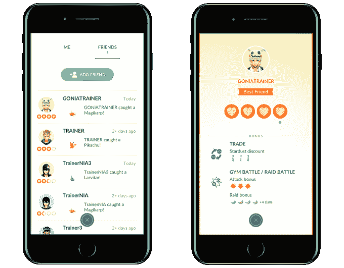
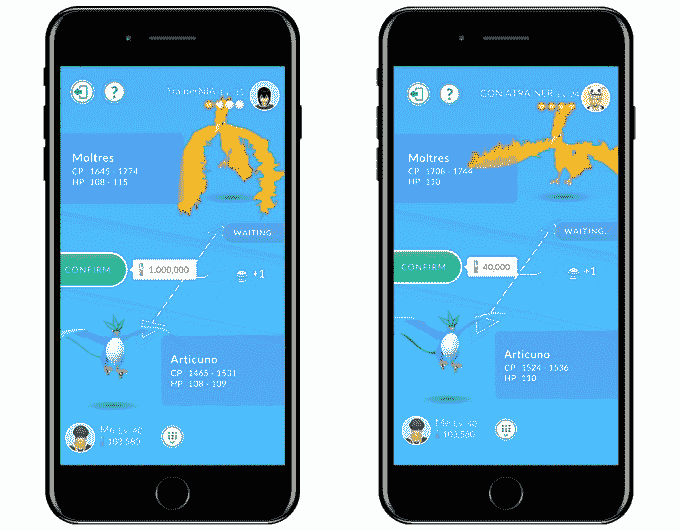
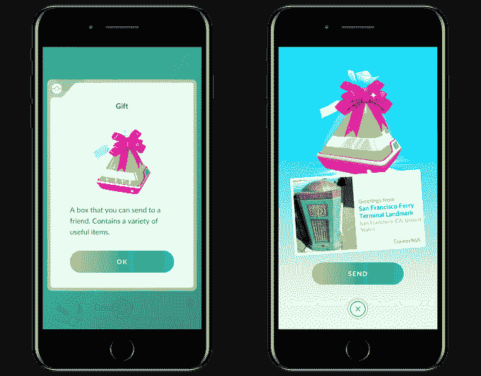

# 神奇宝贝 GO 终于要让玩家交易神奇宝贝了 

> 原文：<https://web.archive.org/web/https://techcrunch.com/2018/06/18/pokemon-go-is-finally-going-to-let-players-trade-pokemon/>

# 神奇宝贝 GO 终于要让玩家交易神奇宝贝了

在推出不到两年后，Pokémon GO 终于要推出它最明显缺失的功能之一:神奇宝贝交易。

作为该系列的一个主要部分，交易让玩家在永无止境的追求中与另一个玩家交换他们的神奇宝贝，嗯，把它们都抓住。

交易机制将被捆绑到一个新的朋友系统中；朋友系统将于本周晚些时候推出，交易机制将“很快”上线(不过 Niantic 不想透露更多细节，大概是以防出现问题)。

**这就是它的工作原理:**

*   *   要与某人进行交易，你必须是他们游戏中的朋友，并且在 100 米(约 320 英尺)范围内。)的。
    *   为了成为朋友，你交换你独特的教练代码。
    *   一旦成为朋友，您将获得一起玩游戏的游戏内奖励。举例来说，当你和健身房一起战斗时，你的神奇宝贝会得到攻击奖励——当你一起突袭时，你会得到额外的神奇球。

*   *   你们一起玩得越多(袭击、战斗体育馆等)，你们的关系水平就越高。
    *   某些神奇宝贝(传说、闪光和任何你还没有的神奇宝贝)被认为是“特殊交易”你只能和你达到更高友谊等级的玩家进行特殊交易。换句话说，他们最想让你和经常和你一起玩的人交易——而不是在易贝卖神奇宝贝的随机骗子。
    *   你每天只能做一笔特殊交易。
    *   交易成本星尘(游戏中的资源，否则需要启动神奇宝贝)。神奇宝贝越稀有，交易的成本就越高。然而，拥有更高的友谊等级会抵消一点(例如，注意下面的例子，它是如何开始于一百万星尘的相当疯狂的要求，并随着友谊等级的增加而下降到更容易管理的 40，000，如右上角所示)。

同时，他们还引入了另一个全新的概念作为朋友系统的一部分:礼物。每隔一段时间，旋转一个神奇宝贝会给你一个“礼物”物品。你不能自己打开它——相反，你应该把它发给朋友让他们打开。它会在到达时标上你捡到它的车站的照片——一张小小的神奇驿站明信片，和一些“有用的物品”捆绑在一起。Niantic 没有确切地说这些“有用的物品”可能是什么，尽管他们指出它们可能包括含有 Alolan Pokémon 的鸡蛋(其中大部分尚未在游戏中提供)。

虽然交易/朋友系统可能看起来有点复杂，有星尘要求、每日限制和友谊要求，但理论上它有助于限制自由交易系统可能面临的一些问题。很容易想象有人在世界各地来回欺骗，在稀有神奇宝贝出现时养殖它们，在易贝(或任何地方)以几美元一只的价格出售，然后欺骗到一个商定的地点开始交易。要求玩家在交易好东西之前有一些一起玩/袭击/战斗健身房的历史，这使得这变得更具挑战性。