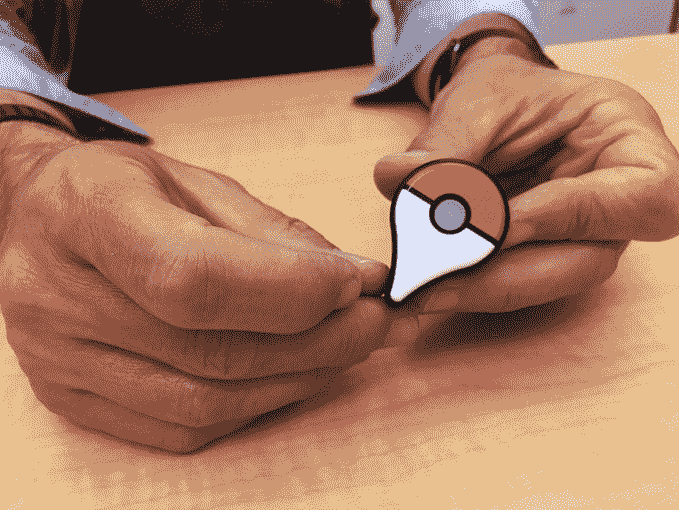

# Pokémon Go 今天在 iOS 和 Android 上发布 

> 原文：<https://web.archive.org/web/https://techcrunch.com/2016/07/06/pokemon-go-is-launching-on-ios-and-android-today/>

# Pokémon Go 今天在 iOS 和 Android 上发布

惊喜！看起来，任天堂支持的备受期待的增强现实游戏【Poké mon Go 今天将登陆你身边的 Android 和 iOS 设备。

这款游戏于 5 月份在美国发布了测试版，今天它似乎正在向许多其他国家的 iOS 和 Android 用户推出。最初，这款应用仅限于新西兰，当一些应用在全球推出时，这是常见的第一步，也是即将扩张的迹象。在撰写本文时，这款应用尚未在美国和英国这两个主要市场上市，但我们可以预计它将在今天(周三)的某个时候上市。

[TechCrunch 的 Greg Kumparak 今年早些时候花时间玩了这个游戏](https://web.archive.org/web/20230121171539/https://techcrunch.com/2016/06/10/i-played-the-new-pokemon-go-for-iphoneandroid-and-its-awesome/)，总而言之，他觉得这个游戏“棒极了”

如果你是在神奇宝贝战斗游戏中长大的——或者现在仍然玩这些游戏——那么你肯定会喜欢 Go，它使用你的智能手机将神奇宝贝角色和神奇宝贝战斗带到现实生活中的地点和城市的地标。这款游戏可以免费下载，但是可以在应用内购买来解锁一些角色。一款伴随游戏的 35 美元可穿戴设备将于本月晚些时候上市。

这款游戏与 Niantic Labs 的旗舰游戏 Ingress 非常相似，Niantic Labs 是去年从谷歌剥离出来的【Poké mon Go 的幕后公司。Ingress 本质上是两个不同团队之间的全球战争，他们竞争在世界各地夺取旗帜和领土。与网络游戏不同，AR 通过将世界变成游戏的战场来点亮 Ingress。

《口袋妖怪 Go》可以在 iOS ( [这里](https://web.archive.org/web/20230121171539/https://itunes.apple.com/nz/app/pokemon-go/id1094591345?mt=8) —目前仅在新西兰)和 Android ( [这里](https://web.archive.org/web/20230121171539/https://play.google.com/store/apps/details?id=com.nianticlabs.pokemongo))上下载。当该应用在更多国家可用时，我们将更新这些链接。