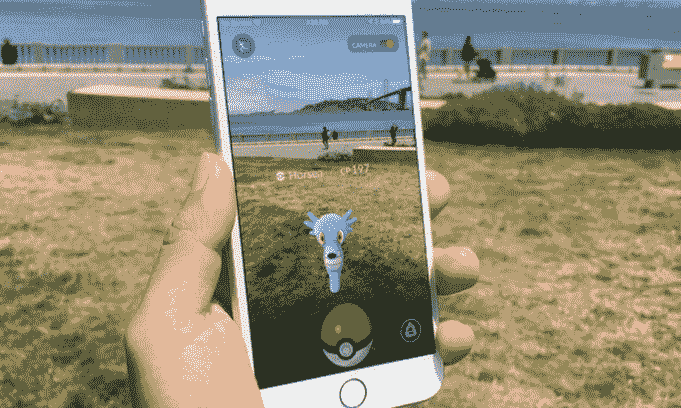

# 《口袋妖怪 Go》现已在美国推出 iOS 和 Android 版 

> 原文：<https://web.archive.org/web/https://techcrunch.com/2016/07/06/pokemon-go-is-now-available-in-the-us-for-ios-and-android/>

# 《口袋妖怪 Go》现已在美国推出 iOS 和 Android 版本

AAAA 就是这样:Pokemon Go 在美国的 iOS 和 Android 上都有。

如果你想在今天早些时候为世界部分地区推出[时搞些账户诡计，你可以早点得到它——但如果这看起来太麻烦，美国人现在可以在](https://web.archive.org/web/20230121171625/https://techcrunch.com/2016/07/06/pokemon-go-is-launching-on-ios-and-android-today/) [iOS 这里](https://web.archive.org/web/20230121171625/https://itunes.apple.com/us/app/pokemon-go/id1094591345?mt=8)和 [Android 这里](https://web.archive.org/web/20230121171625/https://play.google.com/store/apps/details?id=com.nianticlabs.pokemongo)找到它。

前进吧，亲爱的朋友，成为有史以来最好的。