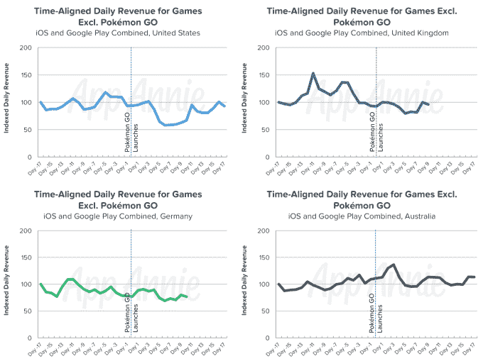
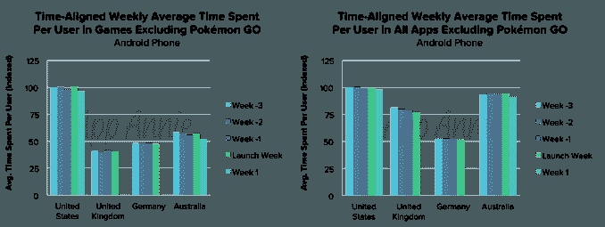

# Pokémon Go 周末安装量突破 1 亿

> 原文：<https://web.archive.org/web/https://techcrunch.com/2016/08/01/pokemon-go-passed-100-million-installs-over-the-weekend/>

Pokémon Go 用户可能会对第三方追踪器的关闭和最近取消游戏中附近追踪功能的更新感到愤怒，但这些问题似乎都没有阻止该应用的病毒式传播。根据应用商店情报公司 App Annie 的新数据，本周末 Pokémon Go 在全球的安装量达到了 1 亿。这比 7 月底[7500 万的下载量有所上升。](https://web.archive.org/web/20230402230612/https://techcrunch.com/2016/07/25/pokemon-go-75m-downloads/)

这款游戏之前已经在 19 天内达到了 5000 万的安卓下载量。第二快的是 Color Switch 和 Slither.io，分别是 77 天和 81 天。苹果报告称，Pokémon Go [在发布周期间获得了 App Store 上最多的下载量。](https://web.archive.org/web/20230402230612/https://www.buzzfeed.com/craigsilverman/most-toronto-pokemon-ever?utm_term=.lfq58ao9J#.ogoVorMdE)

App Annie 表示，Pokémon Go 的日收入也超过了 1000 万美元，这促使它研究这款游戏如何影响其他顶级应用和游戏的日收入和应用参与度。

App Annie 发现，尽管用户长时间玩游戏并重复使用，但《精灵宝可梦 Go》对更大的应用经济产生了附加效应。

换句话说，这款游戏并没有对 iOS 或 Google Play 上的其他游戏的日收入产生有意义的影响。其他游戏的日收入在游戏发布后不久在美国出现短暂下降，但几天后又恢复到正常水平。与此同时，在澳大利亚，Pokémon Go 推出后，其他游戏的收入略有增加。在日本，同样的指标与 7 月 22 日在该国发布前 10 天的平均水平相差不到 5%。

App Annie 还表示，在 Pokémon Go 推出后，像 Mobile Strike、Clash of Clans 和 Candy Crush Saga 这样的票房收入最高的游戏也没有出现明显的收入下降。

“总的来说，这并不特别令人惊讶，因为大部分游戏收入来自一小部分用户，这些玩家不太可能深度参与大量高票房游戏，”[报道称](https://web.archive.org/web/20230402230612/https://www.appannie.com/insights/mobile-strategy/pokemon-go-an-opportunity-not-a-threat/)。

另一个值得注意的指标是，Pokémon Go 在美国发布安卓系统后，其每位用户花费的平均时间和打开率超过了脸书。App Annie 认为，这意味着 Pokémon Go 能够获得相当大一部分以前“非移动”的时间——也就是说，人们在做其他活动时打开应用，例如购物或遛狗。

至于更长期的影响，App Annie 认为 Pokémon Go 可能会鼓励其他开发者尝试在自己的游戏中构建 AR 体验。当然，这些可能不在 Pokémon Go 的水平上——App Annie 指出，该应用受益于 Niantic Labs 的第一款 AR 游戏 Ingress 的多年数据和数百万用户提交的数据。

然而，开发者可能会想出新的体验来将他们的游戏与当地企业联系起来，这些企业可以为增加的客流量付费，而企业可能会自己尝试在他们的商店里举办虚拟寻宝活动——西尔斯已经在其应用程序中尝试了这种做法。

在当今的应用经济中，发现和定期使用应用变得越来越困难，Pokémon Go 最有意义的长期影响是，它可以通过应用开发者可能选择建立的在线到线下体验，为他们带来新的收入流。