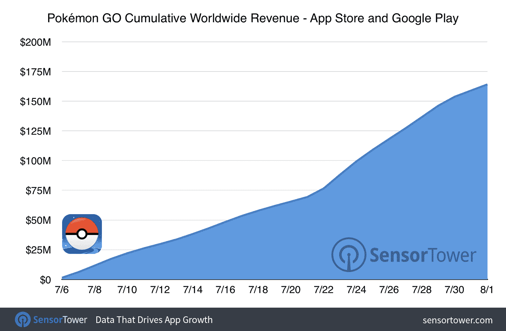

# Pokémon Go 全球收入突破 1.6 亿美元，应用内花费时间居高不下

> 原文：<https://web.archive.org/web/https://techcrunch.com/2016/08/02/pokemon-go-tops-160m-in-global-revenue-time-spent-in-app-remains-high/>

# Pokémon Go 全球收入超过 1.6 亿美元，花在应用上的时间仍然很长

我还在试图解决失去神奇宝贝视觉的问题，但是 Niantic 最近对游戏的修改似乎还没有影响到玩家的兴趣——来自分析公司 Sensor Tower 的新数据显示，美国用户平均每天仍在该应用上花费约 26 分钟，与更新前一周的平均游戏时长相比，实际上略有增加。

是的，用户打开应用程序的时间也是一样的——大部分情况下，每天大约六次。

Sensor Tower 对最新更新的情绪分析也显示了我所听到的趣闻:人们普遍对这些变化并不感到兴奋。但是请记住，在有大量用户的应用程序中，你做了正确的事情的一个最确定的标志是，任何改变都会受到大量的，主要是负面的抗议。

与此同时，在不到 30 天的时间里，用户也在各种口袋装备上花了一大笔钱:Sensor Tower 估计总收入约为 1.6 亿美元，这是有道理的[，因为 App Annie](https://web.archive.org/web/20230315003339/https://techcrunch.com/2016/08/01/pokemon-go-passed-100-million-installs-over-the-weekend/) 现在表示，它每天从其用户群中获得约 1000 万美元的净收入，自推出以来，随着新市场的增加，用户群已大幅增长。

虽然任天堂只会从这一净收入数字中看到相对较小的直接增长，但它在其他方面受益于 Go 的持续成功:自 Go 首次亮相以来，该平台最近一期神奇宝贝系列的 3DS 销售额已经翻了一番。