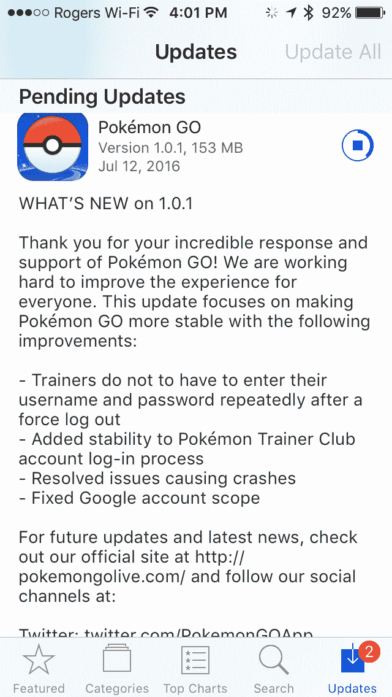

# Pokémon Go 更新以解决隐私问题 

> 原文：<https://web.archive.org/web/https://techcrunch.com/2016/07/12/pokemon-go-update-addresses-privacy-concerns/>

# Pokémon Go 更新以解决隐私问题

在用户和媒体注意到 iOS 上的 [Pokémon Go 在注册时要求“完全访问”一个用户的谷歌账户](https://web.archive.org/web/20221210063502/https://beta.techcrunch.com/2016/07/11/pokemon-go-shouldnt-have-full-access-to-your-gmail-docs-and-google-account-but-it-does/)后， [Niantic 承诺更新](https://web.archive.org/web/20221210063502/https://beta.techcrunch.com/2016/07/12/pokemon-go-promises-to-fix-the-bug-that-let-it-access-all-your-google-data/)以修改所需的权限。现在，在 Niantic 做出这一承诺后不到 24 小时，更新就开始了，并限制询问信息只能是“在谷歌上知道你是谁”和“查看你的电子邮件地址”

新的谷歌权限设置意味着游戏的创作者现在可以看到你的谷歌个人资料信息，其中包括你的性别和年龄等基本信息，如果你提供这些信息的话。你可以在“谷歌个人资料”标题下查看你正在分享的[信息。](https://web.archive.org/web/20221210063502/https://www.google.com/settings/u/0/ads/authenticated?hl=en)

Niantic 在早些时候的声明中表示，该公司并不打算在账户注册过程中要求完全的账户权限，而且 Pokémon Go 实际上只会访问你的谷歌用户 ID 和电子邮件地址。该公司还表示，一旦发现他们的错误，他们已经立即开始纠正工作，这次 1.01 更新似乎支持这一点。今天的帐户访问更新甚至降低了现有玩家的权限，因此用户不需要采取进一步的行动。

早期的报告，包括在 1.01 发布前通过测试版使用 1.01 更新的来源，也表明此更新提高了整体稳定性。Pokémon Go 虽然显然非常受欢迎，但自上周推出以来，一直容易出现包括随机崩溃和游戏状态冻结在内的问题，因此任何改进都肯定是受欢迎的。

下面是新版本的完整更新说明:

