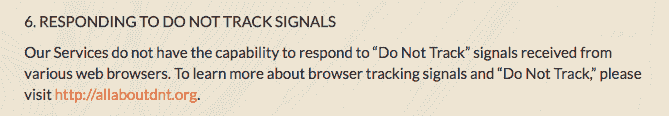

# Pokemon Go 想抓住(几乎)你所有的应用权限

> 原文：<https://web.archive.org/web/http://techcrunch.com/2016/07/11/pokemon-go-wants-to-catch-almost-all-your-permissions/>

老实说，Pokemon Go 的玩家不会在乎在他们的街区漫游所需的应用程序权限，因为他们会向玫瑰花丛扔看不见的扑克球，从而获得老年人的否定目光。

但也许他们应该——考虑到该应用程序需要一长串权限才能运行其增强现实和现实生活活动的地理藏宝游戏，正如 Twitter 用户和安全工程师 [Jason Strange](https://web.archive.org/web/20230403200555/https://twitter.com/0xdade/status/752349663747989504) 所标记的那样……

https://twitter.com/0xdade/status/752349663747989504

正如斯特兰奇继续指出的那样，权限几乎和谷歌早期基于位置的多人游戏一样广泛

https://twitter.com/0xdade/status/752356681925816320

鉴于制作 Ingress 的谷歌部门 Niantic Labs 也是 Pokemon Go 的制造商，这两个权限列表的相似性并不令人惊讶。Niantic 去年从谷歌剥离出来——尽管山景城仍是该公司的支持者。

尽管如此，Ingress([至少最初是针对成年人的。口袋妖怪是一款儿童游戏，至少在理论上是这样。](https://web.archive.org/web/20230403200555/https://www.reddit.com/r/Ingress/comments/1urdpo/minimum_age_to_play/)

当进行数据采集的表面实体拥有一个通过对其用户进行数据挖掘来驱动的商业模式时，广泛的数据采集权限似乎更加令人毛骨悚然。这是一种商业模式，通过挖掘用户对他们小时候玩过的游戏的怀旧之情来驱动。

但实际上，在 Pokemon Go 的情况下，不一定有很大的差异——鉴于谷歌仍然是 Niantic 的第三方支持者。

Niantic 为 Pokemon Go 制定的[隐私政策指出，它可能会与第三方共享“聚合信息和非识别信息，用于研究和分析、人口统计分析和其他类似目的”。](https://web.archive.org/web/20230403200555/https://www.nianticlabs.com/privacy/pokemongo/en/)

因此，谨慎的做法是，预计你的一些位置数据最终会落入谷歌手中。我们已经就此直接询问了 Niantic，并将根据任何回复更新这篇文章。

该公司还指出，它可能会披露用户信息(包括父母授权使用该应用程序的 13 岁以下儿童)

> ……在我们自行判断认为必要或适当时，向政府或执法官员或私人方披露:(a)对索赔、法律程序(包括传票)作出回应；(b)保护我们的财产、权利和安全以及第三方或公众的财产、权利和安全；以及(c)识别并阻止任何我们认为非法、不道德或可依法起诉的活动。

因此，将上述声明与游戏的精确位置跟踪和执行音频指纹识别的能力(由于它可以访问摄像头/麦克风)结合起来，你就有了一个可以轻松被传唤来跟踪/窥探感兴趣的人的应用程序，正如其他人所指出的那样…

https://twitter.com/da_667/status/752381770767687680

《口袋妖怪 Go》的玩家会担心自己正在同意的一长串权限吗？可能大多数人会注意到/关心的是持续位置跟踪对他们设备电池寿命的影响。

防止手机睡眠和吸 GPS 连续会做到这一点。

它仍然是作为一种选择加入服务的持续位置跟踪——为基于位置的 AR 游戏提供动力。它至少需要这些权限中的一部分才能运行。但另一方面，你可能会因为想玩游戏而交出大量的个人数据——外加强大的跟踪能力。

称之为一堆穿着口袋妖怪*卡哇伊的相当激进的权限。浮士德式的契约从未如此可爱。*

(旁注:Pokemon Go 在 Android 上要求的一些应用权限在 iOS 上不可用——但这款游戏仍然可以在苹果的移动生态系统中运行，所以……)

Pokemon Go 的受欢迎程度至少暂时加剧了另一个隐私/安全风险，这是由于其迄今为止有限的地理发布(在美国、澳大利亚和新西兰正式推出)——这意味着在该应用尚未通过标准渠道下载的国家，Pokemon 粉丝可能会试图下载它。

是的，已经有一个[的后门 Pokemon Go 安卓应用出现了](https://web.archive.org/web/20230403200555/https://www.proofpoint.com/us/threat-insight/post/droidjack-uses-side-load-backdoored-pokemon-go-android-app)。

因此，从想要“一网打尽”到实际上抓住一个恶意的远程访问工具，这可能只是一小步。很明显这不是你要找的口袋妖怪。

后门的《口袋妖怪 Go APK》包括比合法的 APK 更广泛的应用权限——包括打电话和发送短信的能力(应用程序可以在后台收取额外费用)，以及录制音频、阅读你的网络历史记录等能力。和 Ingress 一样，它也要求在启动时运行。

但当你比较许可列表时，后门恶意软件版本看起来与真实交易没有太大区别。

为了记录，这里是我们在美国 Android Play 商店上传的当前版本(官方)Pokemon Go 应用程序的应用程序权限列表:

[gallery ids="1350708，1350707"]

(真正的)口袋妖怪 Go 隐私政策的最后一个花絮:

