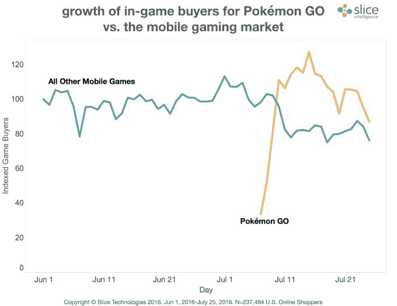
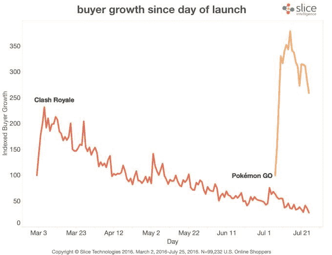
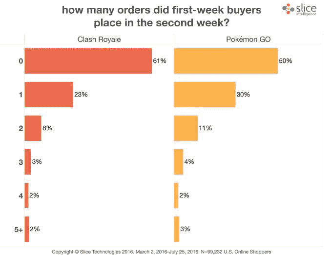
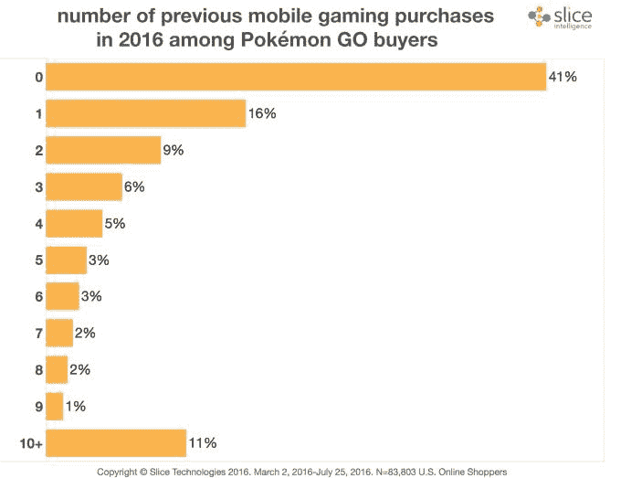

# Pokémon Go 的付费用户群已经达到一个平台期 

> 原文：<https://web.archive.org/web/https://techcrunch.com/2016/07/29/pokemon-gos-paying-user-base-has-reached-a-plateau/>

Pokémon Go 可能是有史以来发布后第一周下载量最大的应用程序，据说仅在 iOS 上每天就能在 T2 获得约 160 万美元的收入，但周五发布的一份新报告表明，这款流行游戏的付费用户群可能已经萎缩。根据[来自 Slice Intelligence](https://web.archive.org/web/20221006173126/https://intelligence.slice.com/pokemon-go-caught-em/) 的数据，该应用的付费用户在 7 月中旬达到顶峰，当时该游戏的付费玩家比所有其他手机游戏的总和多 56%——这是一个了不起的数字。但报告称，自 7 月 15 日以来，这款游戏的付费玩家群体已经缩减了 32%。

玩家在 Pokémon Go 中花费真实的钱来购买 PokéCoins，这允许他们购买可以在游戏中使用的物品，像 Poké Balls，Lure Modules，幸运蛋，熏香等等。

由于 Pokémon Go 的巨大足迹和牵引力，截至 7 月 15 日，这些 poké币的购买量占整个移动游戏市场收入的 52%，这使得 Pokémon Go 有可能成为有史以来最赚钱的游戏。

也就是说，手机游戏在推出后的某个时候购买人数下降是很常见的。

即使 Pokémon Go 可能已经达到了这一点，如果 Slice 的数据是准确的，它仍然比其他任何手机游戏坚持得更久。例如，Clash Royale 的付费用户在推出后的第四天达到顶峰，而 Pokémon Go 在达到稳定状态之前增长了整整一周。

作为背景，Slice 的数据是从电子收据中提取的，包括那些提到在 iTunes 和谷歌 Play 上应用内购买的收据。在这项研究中，该公司表示，它查看了 237484 名玩家的收据数据。

此外，Slice 发现这款游戏在回头客中很受欢迎——同样，也比它的同行更受欢迎。在游戏第一周购买物品的付费用户中，有一半人在第二周返回，平均每人花费 20 美元。另一方面，皇家冲突只有 39%的玩家重复购买。

同样值得注意的是，Pokémon Go 已经成功利用了历史上没有在手机游戏上花钱的用户群——至少在 2016 年没有。该报告发现，超过 40%的 Pokémon Go 用户一整年都没有购买过其他手机游戏。

Slice 的报告除了指出游戏在推出后付费是很常见的以外，并没有过多说明为什么 Pokémon Go 可能已经达到了付费玩家的平台期。

然而，与已经上市的其他游戏不同，由于其病毒式传播，Pokémon Go 看到了大量更休闲的玩家加入。这些玩家中的一些人可能已经检查了游戏，并积极地玩了几天，包括花钱，然后下降到不那么强迫性的参与水平。然而，这并不意味着它们永远消失了。

另一个可能发挥作用的因素是，这款游戏的受欢迎程度下降，服务器不堪重负，[崩溃](https://web.archive.org/web/20221006173126/http://www.bustle.com/articles/174979-how-to-stop-pokemon-go-from-crashing-so-you-dont-lose-your-rare-pokemon)和冻结，导致[在其他地区推迟发布](https://web.archive.org/web/20221006173126/https://beta.techcrunch.com/2016/07/19/pokemon-go-launch-in-japan-postponed-after-email-leak/)。这可能会影响用户在应用程序中消费的能力，如果不是他们的愿望。

与支出无关，Slice 还研究了 Pokémon Go 用户的人口统计数据，发现其男女比例接近 60:40，就像总游戏人口的性别构成一样。玩家也主要是千禧一代(现在 44%的用户)和 x 世代(三分之一是。)

[gallery size = " full " ids = " 1361342，1361341"]