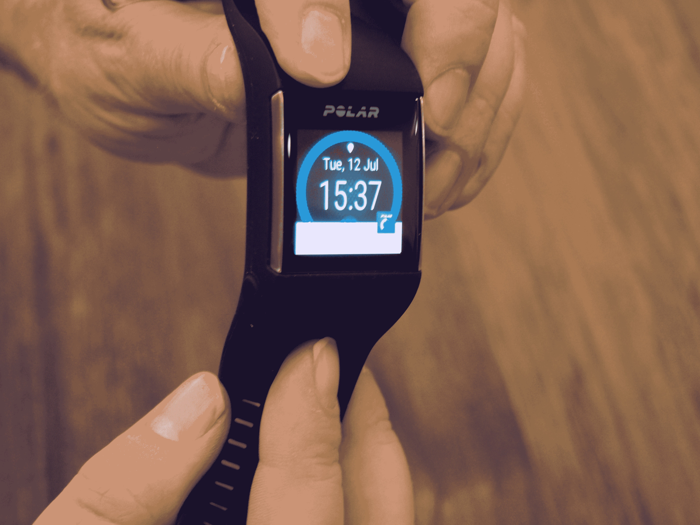
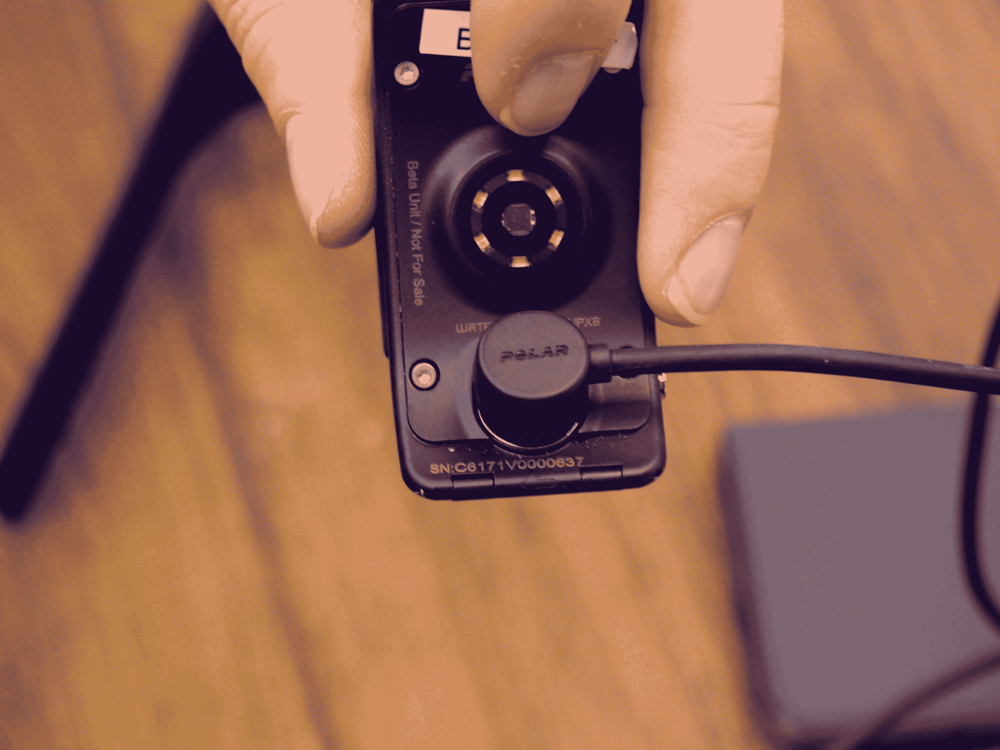
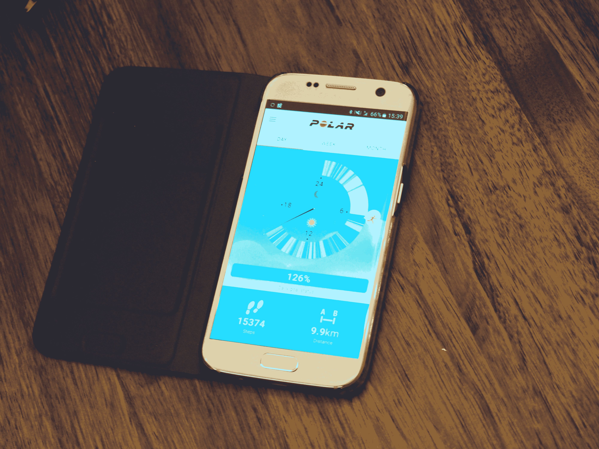

# Polar 通过 M600 TechCrunch 将其健身重点引入 Android Wear

> 原文：<https://web.archive.org/web/https://techcrunch.com/2016/08/03/polar-m600-hands-on/>

# Polar 通过 M600 将其健身重点引入 Android Wear

极地可以追溯到。很久很久以前。追溯到 80 年代初，当时这家芬兰公司推出了第一款便携式心率监测器，即运动测试仪 PE 2000。回到可穿戴健身设备还不流行的时候。

当然，成为第一并不意味着你将永远处于领先地位。虽然该公司与职业运动员有着长期的关系(从很早的时候就与奥运会有联系)，但十年前当主流健身追踪的大门打开时，该公司很快发现自己被竞争对手挤满了，从 Fitbit 和 Jawbone 到苹果和三星。

凭借 M600 ，该公司希望将 30 年的健身专业知识引入 Android Wear。它看起来并不糟糕，但毫无疑问，它比“智能手表”更大声地尖叫着“健身带”——考虑到该公司的根源，这并不奇怪。尽管该设备本身是模块化的，但 Polaris 无疑更注重锻炼而不是时尚前沿，尽管该设备被设计为“一直佩戴”

这意味着，除其他外，坚固和防水的设计。这也意味着 GLONASS 和 GPS 功能，以及 Polar 的面包和黄油:心率监测。用户还可以将其与该公司的胸带监视器配对，以获得更准确的结果。

这款可穿戴设备具有 Polar 通过 Android wear 应用程序进行智能教练的功能，以及标准健身(不过没有楼梯计数)和睡眠功能，并具有该公司已经提供了一段时间的无活动警报功能。新的极地跑步应用程序也有助于根据从 5 公里到马拉松的跑步制定训练计划。

M600 采用 1.2 英寸(240 x 240)触摸屏显示器，内置 Cortex-A7 ARM 处理器。它有黑色和白色两种颜色，稍后还会有红色的可更换腕带(尽管目前腕带都是一种尺寸)。它将于今年晚些时候上市，价格为 330 美元，比 Fitbit Blaze 更接近苹果手表，这可能是一个很难克服的障碍。