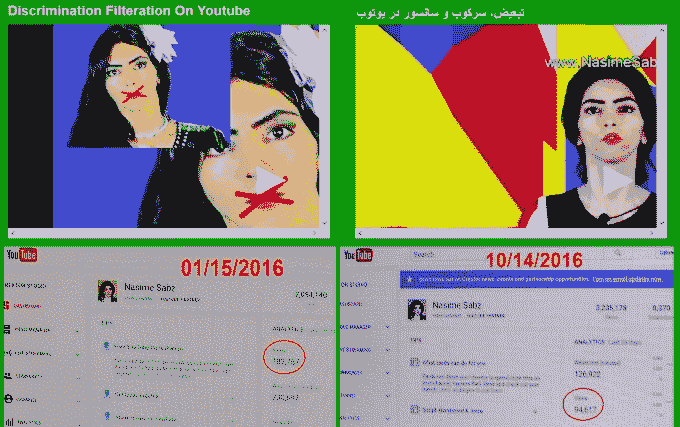

# 警方称，枪手对 YouTube 政策的愤怒“似乎是动机”

> 原文：<https://web.archive.org/web/https://techcrunch.com/2018/04/04/police-say-shooters-anger-over-youtube-policies-appears-to-be-the-motive/>

昨天袭击 YouTube 圣布鲁诺总部的女人可能是出于对网站内容政策的愤怒。“在调查的这一点上，据信嫌疑人对 YouTube 的政策和做法感到不满。这似乎是这起事件的动机，”圣布鲁诺警察局长埃德·巴伯里尼在周三上午的新闻发布会上说。

警方确认枪手是圣地亚哥居民纳西姆·纳杰菲·阿格达姆；警方表示，他们认为她是单独行动的。她的家人于 3 月 31 日报告她失踪。

Aghdam 经常使用 YouTube，直言不讳，发布了几十个不同主题、不同语言的视频。她的个人网站和视频清楚地表明，她认为该公司故意限制一些用户的接触，包括她自己。

属于 Aghdam 的社交媒体内容

嫌疑人还在其他网站上有视频，包括 vid.me 上一个名为“YouTube 上的歧视过滤”(原文如此)的视频，该网站包括她的 Youtube 仪表盘的图像，显示 2016 年期间浏览量下降。

具体来说，Aghdam 似乎担心她会因为自己的纯素食主义而受到歧视，她对这种做法的感受非常强烈，而不是基于(例如)她的种族、性别或其他特征。她声称，一个视频被一名反素食主义的 YouTube 员工限制了年龄，随后该公司“开始过滤我的视频以减少浏览量和收入来压制我！”

阿格达姆通过 YouTube 个人资料的评论

这种对 YouTube 政策的不满是如何发展成选择实施昨天的袭击的，目前尚不清楚，警方也没有进行推测；调查才刚刚开始。在现场一名记者的提问中，圣布鲁诺警察局也没有详细说明阿格达姆当天可能与山景城警察局有过什么事先联系。

**更新**:山景城警方代表[告诉水星报](https://web.archive.org/web/20221025222056/https://www.mercurynews.com/2018/04/03/youtube-shooters-father-says-she-was-angry-at-company/)他们在那天早些时候遇到了睡在一辆车里的阿格达姆。“在她的汽车牌照与南加州的一名失踪人员的牌照相匹配后，我们的官员与该女子取得了联系。这位女士向我们确认了她的身份，并回答了随后的问题。在我们的讨论结束时，她的家人被告知她已被找到。”

据报道，嫌疑人通过停车场进入 YouTube 大楼，她从那里进入院子，开始胡乱开枪。她袭击了三个人，然后将枪支转向自己，这是一把经过许可和注册的 9 毫米手枪。

“在这一点上，我们没有迹象表明她在选择个人开火，”Barberini 说。“我们绝对没有发现我们的嫌疑人和事件发生时在现场的任何人之间有任何联系或关系。我们知道她对 YouTube 很不满；这是否会上升到恐怖主义的程度，有望在未来几周内确定。”

他还称赞了 YouTube 及其员工的快速反应:

“YouTube 对这一重大事件的反应也非同寻常。他们做好了充分准备，以迅速及时的方式为所有员工提供服务。如果没有他们的帮助，我们会面临更大的挑战。”

该公司曾与警方合作，专门研究对付活跃枪手的政策和措施。YouTube 首席执行官苏珊·沃西基昨天在推特上提到了枪击事件: