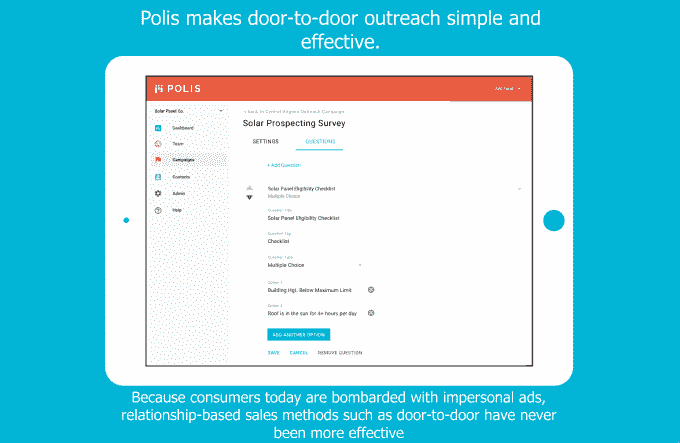

# Polis 正在重塑上门推销员 

> 原文：<https://web.archive.org/web/https://techcrunch.com/2017/03/24/polis-is-reinventing-the-door-to-door-salesman/>

政治游说和挨家挨户的推销之间真的没什么区别。初创公司 [Polis](https://web.archive.org/web/20230129224628/http://www.polisapp.com/) 正在利用其竞选经验，帮助大公司通过个人接触来吸引客户，这一点非常重要。

自威利·罗曼(Willie Loman)和上门推销的时代以来，美国消费者已经走过了漫长的道路，但尽管有所有的在线和零售选择，但对公司创始人肯德尔·塔克(Kendall Tucker)来说，没有什么比敲门更重要。

塔克第一次参与竞选活动是在 2008 年总统大选期间(她不会说是为谁)，然后为州代表工作。

塔克说:“我最喜欢挨家挨户的宣传。”。“有了正确的数据和规划，挨家挨户的宣传就像建立一个销售漏斗。如果一个活动的获胜人数是 6000，他们需要敲开 35000 扇门，因为他们将进行 7000 次对话，他们将说服 6000 人支持他们。”

但是竞选活动敲开任何一扇门的日子已经一去不复返了。如今，政治活动使用分析来瞄准可能的选民，这些选民在拉票人外出时可能在家，并且会接受政治信息。

塔克在一封电子邮件中写道:“当我开展竞选活动时，支持挨家挨户宣传的技术已经过时了。”。“我不得不为我的每一个拉票人手工绘制路线。这一过程每天花费我两到四个小时，我无法监督我的游说者在做什么。”

进来吧，波利斯。

该公司最初专注于家庭安全、太阳能、电信和保险等行业。

但是[不同于世界](https://web.archive.org/web/20230129224628/https://www.youtube.com/watch?v=XqSYC_vwhDg)的内德·赖尔森，波利斯的代表通常只在他们知道自己被需要时才来。塔克说，利用从网上来源或搜索中收集的信息，只有当有人在寻找 Polis 代表可以推销的服务时，Polis 员工才会上门。

对于公司代表来说，Polis 应用程序提供了理想的路线图，因此销售人员可以花时间推销合适的房子。

该应用程序还提供沿线每个家庭的数据，因此公司的宣传人员可以定制他们的方法，并向个人房主推销，而不是照本宣科。

尽管存在摔门的房主或院子里凶猛的攻击狗的神话，塔克认为大多数人都接受面对面的推销(这听起来像是我的噩梦)。

塔克的应用程序已经在政治世界经过了实地测试，在那里成功绝对是一场零和游戏，并产生了足够强大的结果，鼓励她将这个想法作为一项业务来追求。

塔克写道:“我们在 2015 年底的 7 场竞选中测试了这款应用，他们都以超过 20%的得票率赢得了选举。”

然后，在 2016 年，该公司在各种政治活动中敲开了超过 300 万扇门。

客户被 Polis 的价值主张说服了，尽管该应用程序仍然专注于政治用例，但该公司还是能够找到第一个客户(与一家未披露的安全公司合作)。

投资者在听到这个提议后也开始报名。该公司最近完成了一轮 130 万美元的种子投资，投资者包括 Techstars 和波士顿的天使投资人 Chris Jenny。

塔克认为总部设在波士顿的 Polis 可以在全国推广。挨家挨户推销的市场大约有 12 亿美元，现在有近 190 万个组织在敲每个人的门。

塔克坚信个人接触是有效的。

“我经常挨家挨户地培训销售代表和政治游说者，新来的总是很紧张。我告诉他们的是，100 次中有 99 次，当他们在门口看到你时，他们会很友好，”她说。“通过电子邮件或电话很容易变得粗鲁，但当你看着某人的眼睛，意识到他们非常关心某件事，以至于来敲你的门时，就很难变得粗鲁了。我一生中敲了成千上万扇门，我宁愿在任何一天都这样做，而不是打电话或发电子邮件。”