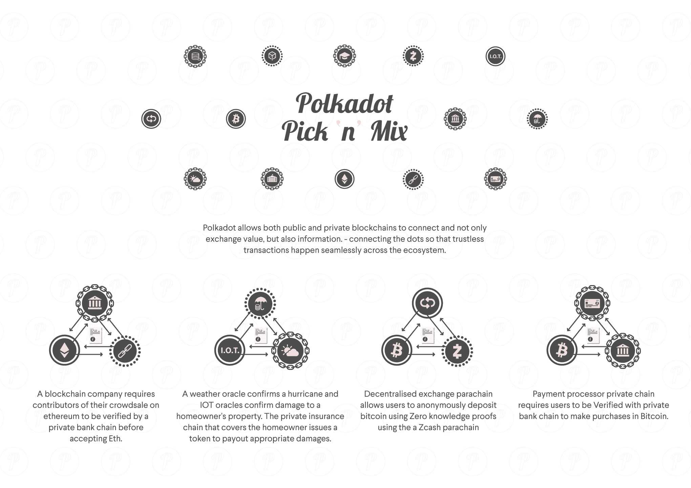

# Polkadot 筹集的资金突破 1.4 亿美元大关，将区块链的私人和公共部门联系起来

> 原文：<https://web.archive.org/web/https://techcrunch.com/2017/10/17/polkadot-passes-the-140m-mark-for-its-fund-raise-to-link-private-and-public-blockchains/>

Polkadot 是一个从区块链世界中脱颖而出的项目，旨在做一些越来越重要的事情。

实际上，Polkadot 是多个区块链之间的交换和转换器，使用以太坊区块链的开发人员一直在寻找这个平台，以便建立大量的新项目和基础设施。

随着公司开发自己的侧链，他们需要以某种方式将这些项目连接到以太坊的公共区块链。问题是，怎么做？这就是波尔卡多特的用武之地。例如，现在一家银行可以派生以太坊，定制它的某些方面，然后使用 Polkadot 将其与以太坊的公共区块链连接起来。

对于你们当中有技术头脑的人来说，中继链位于 Polkadot 协议的中心。接下来，开发人员在它的基础上建立“副链”,从而连接到这个中继链中。这与“桥链”不同，它不是建立在波尔卡多特上的。波尔卡多特意味着你可以链接公共和私人区块链。

还有很多其他的用途。有人说，它有可能从根本上改变以太坊，而且会变得更好。[一个人甚至观察到](https://web.archive.org/web/20230124082057/https://twitter.com/nara___narayana/status/918832953051901952)这是“在传统机构试图吸收加密货币之前，Cryptarchy 的最后一口气”你想怎么做就怎么做。

截至周末，波尔卡多特首先推出了象征性的私下销售，然后在周日，它的公开销售。在这一轮私人融资中，它筹集了 8300 万瑞士法郎。截至周二欧洲午餐时间，加上公开募股，以太坊已经筹集了相当于 1.4 亿美元的资金(超过 429，000 Eth)。销售正在进行中。

私人投资者之一 Polychain Capital 的合伙人 Ryan Zurrer 告诉 TechCrunch:“Polkadot 是 Gav Wood 对 Web3 愿景的一个关键基础设施元素，代表了我们在区块链见过的最具技术雄心的努力。实际上，只有由尤塔·施泰纳(Jutta Steiner)领导的来自 Parity 的深度和非凡才华的团队，才有技术能力完成这样的事情。”

除了这个故事的“ICO 炒作”方面，Polkadot 是一项至关重要的技术，它将通过解决几个大问题来帮助解决主流区块链的采用:互操作性、可伸缩性和共享安全性。[光纸](https://web.archive.org/web/20230124082057/https://github.com/w3f/polkadot-light-paper/blob/master/Polkadot-lightpaper.pdf)有更多关于波尔卡多特背后的功能细节，以及它对区块链空间发展的重要性。

尽管 Polkadot 创始人加文·伍德(Gavin Wood)在 Techcrunch 看到的一个公共论坛上发表了这样的评论:“以太坊推动了实验，(到目前为止)让我们探索高价值的 ETH-for-share-in-a-project(“ICO”)合约交换。Polkadot 通过引入新的状态转换引擎来扩展通用性和效率，并允许它们安全地互操作，而不必做构建安全区块链的所有常见工作。在我看来，这一切都是为了建立一个“创作共用”，人们可以在这个基础上进行 21 世纪的社会实验；在这个词的两种意义上，它都应该尽可能地自由。”

另外，我问他，他认为波尔卡多特最大的创意是什么。他说:“信任的基础——自由支撑着人、企业和组织之间的经济活动；就像谷歌、脸书和维基百科改变了电话、图书馆和邮局的运作一样，改变了官僚机构、贸易和工业的面貌。”

所以，不要小问。但是，如果关于区块链技术的预言成真，波尔卡多特有一个清晰的镜头有这种程度的影响。

以下是关于这一切的更多信息:

[https://web.archive.org/web/20230124082057if_/https://www.youtube.com/embed/s75_OZ7vtk8?start=2&feature=oembed](https://web.archive.org/web/20230124082057if_/https://www.youtube.com/embed/s75_OZ7vtk8?start=2&feature=oembed)

视频