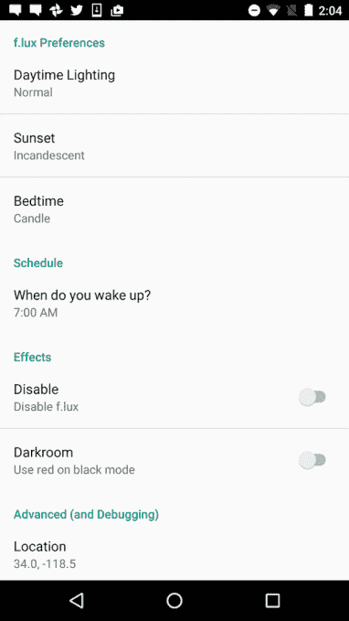

# 广受欢迎的“蓝光”减排应用 F.lux 登陆 Android 

> 原文：<https://web.archive.org/web/https://techcrunch.com/2016/03/15/popular-blue-light-reducing-app-f-lux-arrives-on-android/>

F.lux 是一款流行的电脑和移动设备色彩调节应用，可以减少蓝光辐射，提高夜间使用效果，现在已经在安卓系统上推出。不幸的是，该应用程序(目前)需要用户有一个根电话，以便利用其功能。然而，这次发布值得注意，因为它发生在主要平台制造商正在他们的操作系统中建立夜间模式的时候，包括 [iOS 9.3 的“夜班](https://web.archive.org/web/20221209174058/http://www.apple.com/ios/preview/)、[亚马逊 Fire 平板电脑的“蓝色阴影”](https://web.archive.org/web/20221209174058/https://beta.techcrunch.com/2015/12/02/amazon-fire-tablets-get-expanded-parental-controls-plus-a-blue-shade-feature-for-better-nighttime-reading/)和 [Android N](https://web.archive.org/web/20221209174058/https://beta.techcrunch.com/2016/03/09/google-surprises-with-early-preview-of-android-n/) 的[夜间模式](https://web.archive.org/web/20221209174058/http://www.androidcentral.com/night-mode-back-and-we-hope-its-here-stay)

这给 F.lux 在这个日益移动化的世界中的未来留下了一些疑问。

这些可选的亮度和色调调节功能的想法是为用户提供一种在晚上使用他们的设备而不干扰他们的睡眠模式的方法。大量研究表明，蓝光会阻止人们的松果体释放褪黑激素——这种激素会降低警觉性，并向身体发出该睡觉的信号。几个小时后盯着我们的手机和平板电脑，我们在玩弄那些自然的节奏。

F.lux 的制造商多年来一直致力于解决这个问题，最初是在计算机上。它的应用程序设计于 2009 年，现在可以在 Mac OS X、Windows、Linux 和越狱的 iOS 设备上运行。

不幸的是，由于平台制造商的限制，F.lux 很难实现移动转型。

例如，[去年 11 月，它发布了](https://web.archive.org/web/20221209174058/https://beta.techcrunch.com/2015/11/12/you-can-now-install-screen-brightness-app-f-lux-on-your-ios-device-without-jailbreaking-it/)一个开源版本的 iOS，可以在不越狱的情况下被下载到你的设备上，但它不得不[将其下架，](https://web.archive.org/web/20221209174058/https://beta.techcrunch.com/2015/11/12/f-uxd-apple-says-screen-brightness-app-violates-developer-agreement/)因为它违反了苹果的开发者协议。随着苹果“夜班”的首次亮相，[恳求](https://web.archive.org/web/20221209174058/https://beta.techcrunch.com/2016/01/15/f-lux-asks-apple-to-let-its-screen-brightness-app-back-into-app-store/)该公司重新考虑让它回到应用商店。

同样，Google Play 版本的应用程序不是任何人都可以安装和运行的——你还需要通过 not 对你的设备进行管理控制。

F.lux 将当前版本称为仍处于“测试质量”的“预览版”。

此外，该应用程序不能在所有手机上运行——例如，许多三星 Galaxy 5.x 设备都不能运行。相反，你需要一个有根的棒棒糖或棉花糖(5.x 或 6.x)设备来获得良好的拍摄效果，尽管一些有根的 KitKat (4.x)设备也可能工作。该公司要求用户在其[论坛](https://web.archive.org/web/20221209174058/https://forum.justgetflux.com/topic/2304/preview-version-in-google-play-store)的评论中告诉他们什么有效，什么无效。

与其他版本的应用程序一样，F.lux 将允许你控制一天中你想切换到不同模式的时间，以及你想使用的色温方案。

然而，鉴于其对根设备的要求，它可能很难在 Android 上找到广泛的受众，因为已经有许多第三方应用程序[声称提供蓝光减少](https://web.archive.org/web/20221209174058/https://play.google.com/store/search?q=blue%20light&c=apps&hl=en)。虽然其中许多通过使用彩色叠加进行更改，但新手用户可能不知道其中的区别。F.lux 需要 root，因为它在系统级别更改色温，以提高精确度。

F.lux 是[在 Google Play 上的免费下载。](https://web.archive.org/web/20221209174058/https://play.google.com/store/apps/details?id=com.justgetflux.flux)