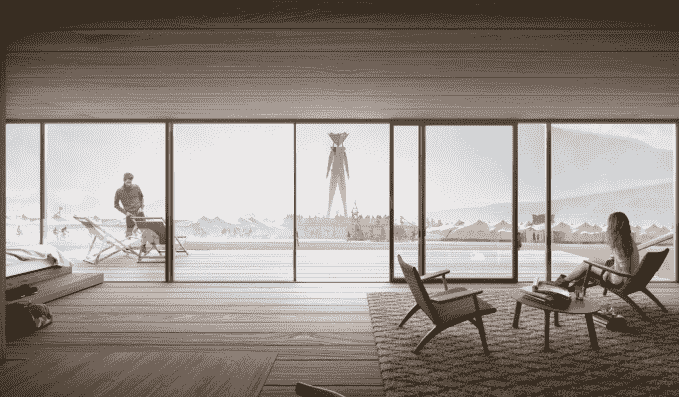

# Poshtel 推出豪华弹出式集装箱套件国际网络

> 原文：<https://web.archive.org/web/https://techcrunch.com/2017/09/19/poshtel-shipping-containers-techcrunch-disrupt-startup-battlefield-2017/>

丹麦初创公司 [Poshtel](https://web.archive.org/web/20230326183911/http://poshtel.io/) 在 Disrupt 2017 初创公司战地舞台上发布，非常非常喜欢海运集装箱。有充分的理由。从为无家可归者提供永久住所，到为预算有限的背包客提供一个过夜的地方，模块化、工业化的火车车厢式结构是未来住房的一个多功能想法。

尽管 Poshtel 听起来对这两种情况都感兴趣，但它打算从后者开始。该公司将推出“一系列可通过 Airbnb 出租的设计师套房”，但该公司将其兴趣描述为一场“运动”，而不仅仅是一个度假租赁引擎。

正如你在发布视频中看到的，该公司雄心勃勃:

> “如果建筑物能在你需要的地方突然出现，那会怎么样？如果一个城市从未在一个月内解决住房危机会怎样？如果一个空地可以在一夜之间变成一个设计师酒店会怎么样？如果你能突然住在没人住过的地方，会怎么样？”

Poshtel 由 [Morten Lund (CMO)、](https://web.archive.org/web/20230326183911/https://www.crunchbase.com/person/morten-lund)Soren Henning sen(首席财务官)、O Koo(首席执行官)和 Bjarke Ingels 创建，迄今已从联合创始人 Ingels(著名建筑师和 Bjarke Ingels 集团创始人)、联合创始人 Lund 和 Scandic Hotels 董事长 Vagn Sø rensen 处筹集了 50 万美元。你可能听说过 Lund，他是一位经验丰富的连续创业者，在 2005 年 Ebay 收购 Skype 时，他成功地将对该公司的早期 5 万美元投资变成了 5000 万美元。(他后来失去了它，但他有一个[的好复出故事](https://web.archive.org/web/20230326183911/https://techcrunch.com/2014/10/08/early-skype-investor-morten-lund-who-lost-it-all-but-came-back-speaks-at-disrupt/)。)

古永锵向 TechCrunch 解释说:“我们推出的第一批产品更接近奢侈品，”他将“低收入视角”和“住房视角”描述为第二阶段。“我们想先证明我们的第一个模型。”像这样一个项目的豪华优先模式是有意义的，鉴于该团队在住房方面的经验，听起来这种兴趣不会随着项目进入第一阶段而消退。“我们的技术工程团队实际上已经完成了与低收入住房相关的项目，”辜说。“没有什么新的……只是我们提供的执行力和商业模式。”

虽然它的一个宣传图片是一个穿着毛衣的家伙向外看着燃烧的人的海滩，揭示了它的直接目标人口，但事实上，小房子是无家可归者的一个令人信服的短期答案——或者至少是一个非常有意义的权宜之计。今年早些时候，在奥兰治县，一个名为 [Potters Lane](https://web.archive.org/web/20230326183911/https://www.fastcompany.com/40401771/can-tiny-houses-in-peoples-backyards-help-alleviate-the-homelessness-crisis) 的由 16 个单元组成的集装箱建筑开放给无家可归的退伍军人居住。像俄勒冈州的波特兰这样的城市已经在试验小型住宅了。在波特兰，一个创新的[试点项目](https://web.archive.org/web/20230326183911/http://www.oregonlive.com/portland/index.ssf/2017/03/multnomah_county_wants_to_ince.html)为愿意为无家可归家庭提供五年住房的房主提供减税和一个小房子，他们将拥有这些房子，并能够在期限结束后出租。

正如该公司解释的那样，“一个弹出式旅馆被组装、运输、安置和安装，然后出租。”Poshtel 将监督这个弹出式集装箱网络，理论上，它可以在地主或城市需要它们去的任何地方移动。Poshtel 不留下任何足迹的意图可能低估了人类玷污它所接触的任何东西的能力，但它的结构将完全升级，并准备好移动到新的位置，如果他们在一个地方的时间到了。该公司使用环保设计和材料，并将在其建筑中储存当地的可持续产品。

该公司巧妙的概念设计显示，一个内部称为“第五元素”的服务结构可以为 10 个 Poshtel 单元提供电力、水、污水和 wifi。虽然大多数 Poshtel 单位可能仍未接入电网，但其他单位可以接入政府提供的服务以简化事情。这个想法以一种非常建筑呆子的方式可扩展:一个单元可以作为一个“弹出单元”独立存在，但是 10 个单元使它成为一个弹出的“村庄”，而超过 100 个单元是一种配置，Poshtel 认为这是“Poshtel 生活”如果你对极简概念设计情有独钟，你会对他们的原型大开眼界。虽然许多华丽的概念几乎没有机会转化为现实，但 Poshtel 已经开始挖掘其结构系统的合作伙伴关系和物流方面，直到一些不那么迷人的问题，如“污水流向哪里？”

法规和物流可能会大大减缓 Poshtel 多管齐下的路线图，但他们正在以现实的方式应对这一挑战。“实际上，我们有这个想法已经有三四年了。我们无法跨越如何做到这一点的障碍，”辜说。在“意识到我们必须在世界各地都有本地合作伙伴”之后，以一种可能对 Poshtel 及其合作伙伴都有用的方式克服这些监管障碍似乎是可能的。“我们找到世界各地的土地所有者，然后五五分成，”胡博士说。预计这些合作伙伴将与地方政府联络。该公司已经在与中国政府就其拥有的土地进行谈判，讨论波斯特尔如何在提供住房的同时，在需要的地方创造就业机会。

目前，这家 15 人的公司已经在与哥本哈根(2 个 100 单元的综合体)、柏林(一个 50 单元的综合体)、泰国(一个 50 单元的综合体)以及里斯本、希腊、哥伦比亚、意大利和伊比沙岛的一些较小地块的土地所有者合作。该公司正在新加坡、马来西亚、印度尼西亚、泰国、韩国、日本、丹麦、葡萄牙和黎巴嫩进行特许经营。

这一愿景正在顺利实现。Poshtel 目前在哥本哈根有一个运营机构，还有 20 个正在建设中，将于 2018 年 1 月投入使用。

“[poshtel](https://web.archive.org/web/20230326183911/https://www.lonelyplanet.com/travel-tips-and-articles/the-irresistible-rise-of-the-poshtel/40625c8c-8a11-5710-a052-1479d27609b4)”——一个“豪华”和“旅馆”的组合词——的概念似乎在 2015 年左右在[兴起](https://web.archive.org/web/20230326183911/http://www.businessinsider.com/poshtels-are-the-new-travel-trend-2015-7)，它对于旅馆就像野营对于露营一样。这个想法是一种精品旅馆，它为旅行者提供了一种超越简单的宿舍式住宿的游戏，提供了一些感觉独特和舒适的东西，同时保持远低于更豪华的预订率。作为一名旅行者，我会说，旅社和精品酒店之间的甜蜜点往往是我发现最佳价值的地方，这种空间往往感觉与他们的社区相连，而没有将 25 名喝醉的女学生塞进摇摇晃晃的双层床的恐惧。Poshtel 的近期愿景是将在 Airbnb 上推出，实际上似乎是面向小写版本的 poshtel。是的，这是一个非常实用的旅行方式的愚蠢的名字。

凭借低端豪华租赁和设计第一的理念，Poshtel 正从一个非常初创的地方起步。尽管如此，鉴于其现实主义和对细节的关注，该公司更具人道主义和公民意识的想法似乎不是不可能的。小房子，大梦想。

**战场判官 Q &答:**

问:它是如何工作的？你卖单位吗？

“我们实际上并不出售我们的单位，我们与土地所有者合作。我们不想绕过市政当局和政府。

“对土地所有者来说风险很低”，因为 Poshtel 负责施工和维护。

问:我假设它的资本相当高？

**答:**“资本挺高的。在融资方面，丹麦政府实际上为我们提供了一个很好的选择。”

**问:**单位成本是多少？

**答:**“我们的住房成本结构将是平均每晚 200 美元。但那是一个四口之家。”

问:什么是成功，你正在解决什么问题？

**答:**“…酒店业对环境造成了很大的破坏…为这些(酒店)提供电力所需的资源非常多。对我们来说，我们能够将土地与单元整合在一起。”

问:“土地所有者协议花了多长时间谈判？”

答:“土地协议……相当快。当我们 7 个月前开始这个项目时…有些开发商其实不知道拿土地怎么办。他们喜欢这样，因为我们实际上是在为建设(和维护)融资。实际获得许可取决于他们。(因情况而异)但完成所有的许可大约需要 5 个月的时间。”

“这将是政府管制的。每个国家都有很大不同。”

问:你们有没有想过在密集的城市环境中工作的 Poshtel 系统？

**答:**“我们未来可能会涉足的几个领域是学生住房和潜在的低收入住房。我们还考虑了这种特殊的离网电力公司的灾难救助。我们可以把它放进去，提供淡水。”

**问:**预订是如何进行的？

我们还没有开放预订。我们还有另外 25 台设备将于今年年底在丹麦投入使用。”

**问:**多暂时是暂时？

**答:**“对我们来说，与地主相处越久越好。只要我们不影响环境，我认为我们可以做 7 年、10 年。”