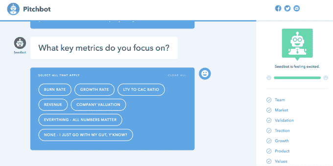
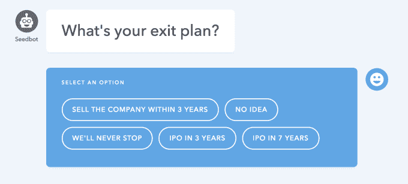
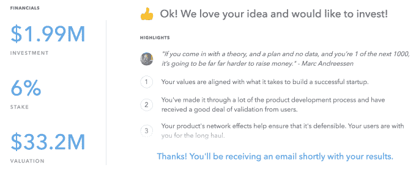

# 了解如何用 pitch bot . VC TechCrunch 推介你的创业公司

> 原文：<https://web.archive.org/web/https://techcrunch.com/2017/01/18/practice-your-startup-pitch/>

牵引力有多大？市场规模有多大？还有谁投资了？你是目标用户吗？这些是每个投资者都会问你的问题，所以你最好用正确的答案建立一个企业，并准备背诵它们。这就是 [Pitchbot.vc](https://web.archive.org/web/20230201014309/https://pitchbot.vc/) 帮你练的。

Pitchbot 模拟了与天使、孵化器、种子基金或风险投资公司的推介会议。当你试图给投资者留下深刻印象时，你要回答关于你的产品、团队、成长和价值观的多项选择问题。如果你的答案表明你知道如何建立一个伟大的创业公司，你就赢得了一份模拟的融资条款清单。看起来像一个被误导的想要的老板，你会被扫地出门。

Pitchbot 非常有趣，但也极具教育意义。这是因为它是基于 20 位顶级投资者的博客，如红杉和 Y Combinator，以及他们对创始人的要求和他们在寻找什么。你将了解到天使们是如何非常关心其他投资者的，因为几乎没有关于新创业公司的数据可供判断，而后期阶段的风投希望确保你获得数十亿美元的退出，并且不会为了一份轻松的招聘工作而卖空。

Pitchbot 的开发者、天使投资人和 Gigster 首席执行官罗杰·迪基说:“我已经被投资和被投资了几百次了。”。事实证明，面试是可以预测的，所以企业家可以通过准备常见的问题来获得很大的优势。

Dickey 在展示自己的初创公司可以做什么的同时，开发了这个工具来帮助初创公司社区。Gigster 让任何有想法的人付费获得一个由 T4 概念化、编码和设计的应用。他委托 Gigster 创建 Pitchbot 来演示任何人都可以创建一个有用的应用程序。Gigster 的全方位服务开发商店已经从著名投资者 Andreessen Horowitz 那里筹集了 1000 万美元的 A 轮融资，所以显然 Dickey 知道什么会吸引资金。

“有很多神秘和恐惧，这种感觉是你需要第一次就把事情做好，否则你可能会过河拆桥。迪基说:“这就是为什么通常的智慧是先推销‘友谊赛’，然后利用他们的反馈来完善推销，然后再去推销真正的产品。”"这个工具对每个人来说都是一个友好的投资者."

那么，你的推介会让你从顶级风投那里获得巨额估值吗？还是需要从头开始？ [Pitchbot](https://web.archive.org/web/20230201014309/https://pitchbot.vc/) 在你走进投资者的办公室之前让你知道——在真正的困境中。