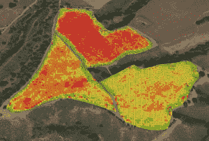

# PrecisionHawk 筹集 1800 万美元将无人机安全带入美国领空 

> 原文：<https://web.archive.org/web/https://techcrunch.com/2016/04/20/precisionhawk-raises-18-million-to-bring-drones-safely-into-u-s-airspace/>

美国已经在进行强制性的无人机注册和庞大的无人机所有者国家数据库，但是仅仅知道谁拥有什么不会阻止无人机相撞或成为公害。

北卡罗来纳州罗利的一家名为 [PrecisionHawk Inc.](https://web.archive.org/web/20230130001558/http://precisionhawk.com/) 的公司在 C 轮风险投资中筹集了 1800 万美元，以帮助公司在美国将无人机用于不同的商业目的，而不进入它们无法安全或合法飞行的空域。

PrecisionHawk 的新投资者包括:[威瑞森风险投资](https://web.archive.org/web/20230130001558/http://www.verizonventures.com/)(TechCrunch 母公司 Verizon Communications Inc .的投资部门)、保险巨头 [USAA](https://web.archive.org/web/20230130001558/http://usaa.com/) 、 [NTT Docomo 风险投资](https://web.archive.org/web/20230130001558/https://www.nttdocomo-v.com/en/)和[雅马哈汽车风险投资。](https://web.archive.org/web/20230130001558/https://www.ymvsv.com/)

Precision Hawk 的早期支持者也投资了 C 轮融资，包括[英特尔投资](https://web.archive.org/web/20230130001558/http://intelcapital.com/)、[千禧技术价值伙伴](https://web.archive.org/web/20230130001558/http://mtvlp.com/)和[创新印第安纳基金。](https://web.archive.org/web/20230130001558/http://iufund.iu.edu/)

据 PrecisionHawk 首席执行官鲍勃·扬(前开源软件公司 Red Hat Inc .首席执行官)称，这家初创公司希望成为商用无人机行业数据和安全服务的顶级提供商。

PrecisionHawk 于 2010 年在加拿大成立，早年以制造用于农民的 [Lancaster](https://web.archive.org/web/20230130001558/http://media.precisionhawk.com/topic/hawkeye-lancaster-mark-iii-field-launch-demo/) 固定翼无人机而闻名。兰开斯特无人机使用农民想要安装的任何传感器，无论是视觉传感器、热传感器还是激光雷达传感器，收集农民土地和作物的空中数据。

然而，PrecisionHawk 的首席执行官鲍勃·扬说，“制造和销售飞机可能是我们业务中最小的一部分。我们最大的机会和业务增长最快的部分是我们为航空数据服务构建的平台。”

使用农业无人机和 PrecisionHawks 的数据映射服务创建的土壤地图。

对于农民来说，无人机收集的数据产生了热图和其他可视化信息，可以指导他们只在需要水分的地方灌溉，或者精确地施用农药、化肥或除草剂。

PrecisionHawk 的[数据映射器](https://web.archive.org/web/20230130001558/https://www.datamapper.com/)服务允许用户上传他们使用任何制造商的无人机收集的数据，将其存储在云中，管理和分析这些数据，并应用数据映射器市场的算法来从中获得不同的见解。

有免费的 DataMapper 版本，但 PrecisionHawk 现在对高级“白金”账户每月收费 95 美元，用户可以在那里存储和分析高达 750 的航空数据。

该公司还在开发和测试一种空中交通控制系统，以引导商业和消费无人机安全进入美国领空，并与美国联邦航空管理局、美国宇航局以及包括威瑞森、数字全球和哈里斯在内的私营部门合作伙伴合作。

[PrecisionHawk 的 LATAS](https://web.archive.org/web/20230130001558/http://flylatas.com/) 或低空交通和空域安全系统，让无人机操作员基本上可以获得飞行许可，跟踪和验证他们自己的飞行操作，并向联邦航空局报告他们的飞行路线，而没有太多的麻烦。

LATAS 还为飞行员提供了识别地面或空中危险的工具，以及社交分享和直播功能。

有了这笔资金，PrecisionHawk 将在商业农业业务内外扩张，进入不同的领域，包括:石油和天然气、采矿和地质、保险、搜索和救援、林业和电信。

雅马哈汽车风险投资公司的普通合伙人[乔治·凯勒曼](https://web.archive.org/web/20230130001558/https://www.ymvsv.com/people/george-kellerman)表示，他对 PrecisionHawk 进行了战略性投资，以帮助雅马哈的 R-MAX 无人直升机等硬件市场的增长。

2015 年，无人机技术投资打破了纪录，部分原因是该领域的硬件制造商获得了巨额投资，包括 E-Hang、3DRobotics、CyPhy Works 等。

最值得一提的是，生产 Phantom 系列无人机的深圳 DJI 科技有限公司在两轮风险投资中筹集了 5.75 亿美元。

凯勒曼预测，2016 年，软件和服务公司周围将出现更多交易，如果不是美元的话，因为许多硬件公司已经站稳脚跟。