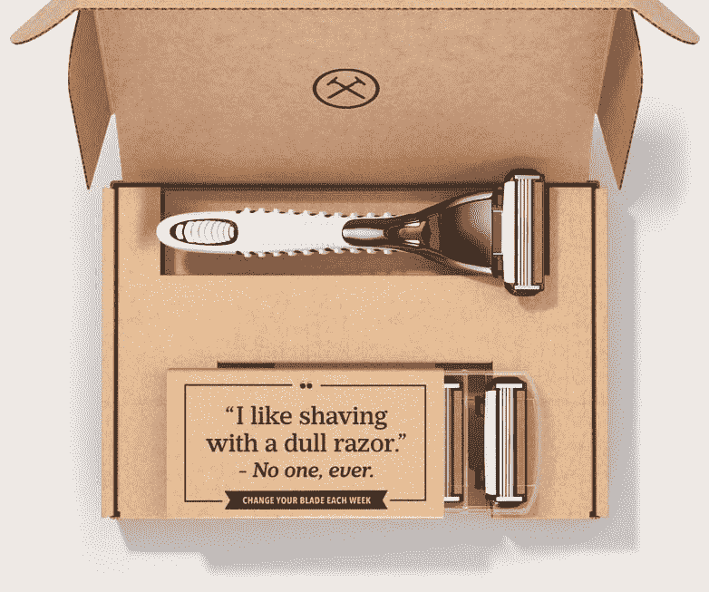
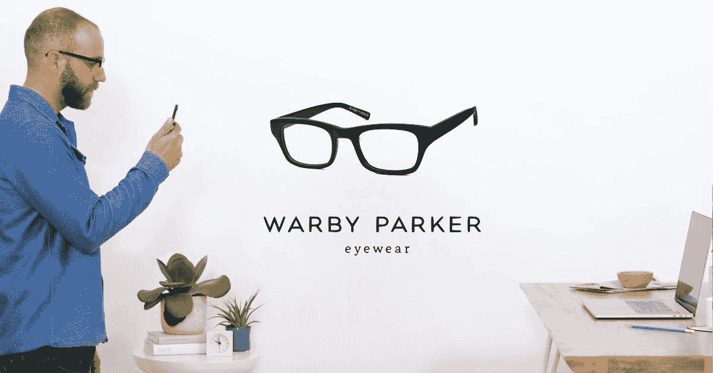
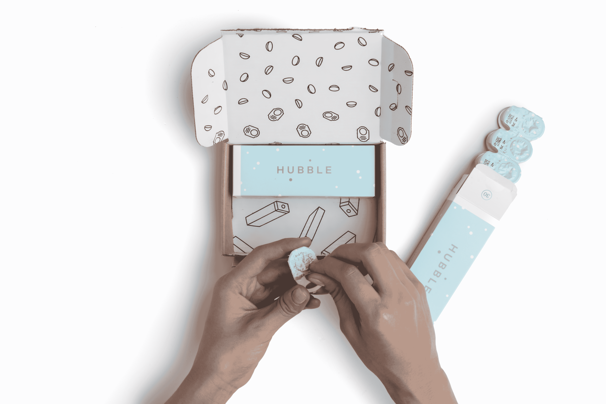
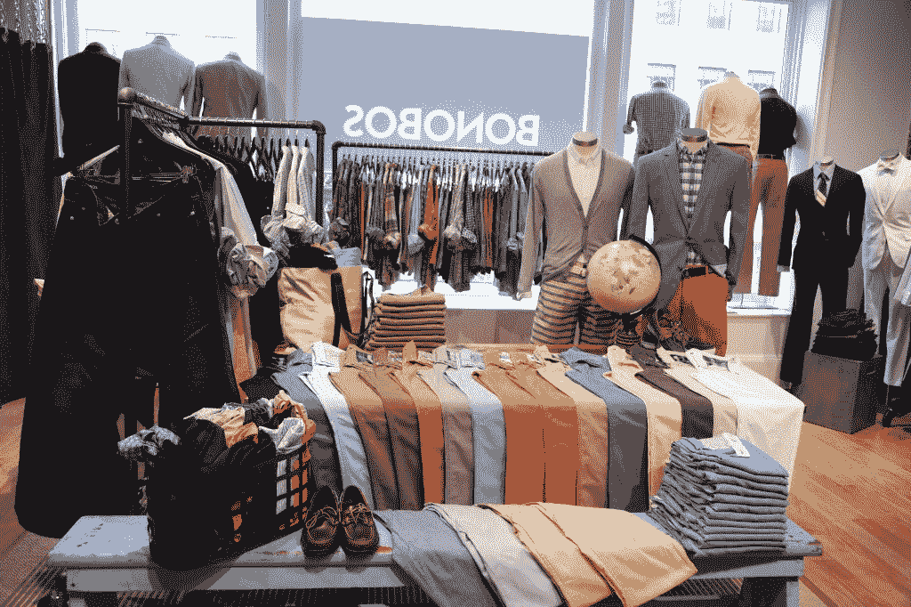
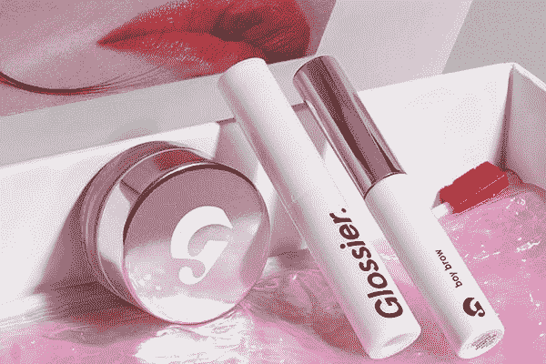

# 预测初创消费品牌的成功 

> 原文：<https://web.archive.org/web/https://techcrunch.com/2017/11/26/predicting-success-in-startup-consumer-brands/>

马特·海曼是

[CRV](https://web.archive.org/web/20221015193631/https://www.crv.com/team/matt-heiman/)

.

More posts by this contributor

大约三年前，萨尔·古尔和我写了一篇关于早期消费品公司如何被风险资本家忽视，但却有潜力创造突破性成功的文章。当时，风投们很大程度上放弃了这个类别，指出消费者垂直市场缺乏可观的成果，以及预测哪些品牌会成功的难度。

在那篇文章之后，联合利华以 10 亿美元收购了[美元剃须俱乐部](https://web.archive.org/web/20221015193631/https://www.dollarshaveclub.com/)，沃尔玛以 3.1 亿美元收购了[倭黑猩猩](https://web.archive.org/web/20221015193631/https://bonobos.com/)，家乐氏以 6 亿美元收购了 [RXBar](https://web.archive.org/web/20221015193631/https://www.rxbar.com/) ，紫色床垫[以 10 亿美元有效上市。这些公司都没有庆祝他们的十周年纪念日。其他公司包括](https://web.archive.org/web/20221015193631/https://onpurple.com/)[沃比·帕克](https://web.archive.org/web/20221015193631/https://www.warbyparker.com/)、[丹尼尔·惠灵顿](https://web.archive.org/web/20221015193631/https://www.danielwellington.com/us/)、 [Glossier](https://web.archive.org/web/20221015193631/https://www.glossier.com/) 和 [Allbirds](https://web.archive.org/web/20221015193631/https://www.allbirds.com/) 仍然保持独立，但据报道，在市场上短短几年后，销售额已达到数亿美元。

这些初创公司不仅利用了千禧一代消费者不断变化的习惯，还利用了通过未充分利用的数字营销渠道接触这些消费者并建立品牌知名度的能力。随着亚马逊取代实体商店货架，社会影响力取代电视明星，新品牌不仅利用这些渠道，还围绕这些渠道设计自己的产品和商业模式。

不足为奇的是，该领域的成功催生了一些公司，攻击几乎所有可以想象的垂直产品。然而，并非所有产品都非常适合科技初创公司的颠覆。安迪·邓恩写了一篇精彩的文章，概述了数字化本土垂直品牌的崛起，但是人们怎么知道哪些“DNVBs”最有可能成功呢？

**现有渠道的摩擦和独特的数字支持**

DNVBs 的一个显著特点是它们在网上销售。当通过现有的线下渠道购买存在固有的摩擦时，在线销售最有意义。

例如，Dollar Shave Club 利用了这样一个事实，即剃须刀和刀片在便利店中可以买到，但通常放在保护性塑料后面或柜台后面，需要店员的参与。沃比·帕克的成功在于眼镜店经常不得不拒绝或推迟没有处方的病人。Nurx 和 Roman[在获取人们有时不愿意谈论的药物处方方面产生了摩擦。](https://web.archive.org/web/20221015193631/https://www.getroman.com/)

价格的不合理可能是购买摩擦的另一种形式。例如，当从线下商店购买床垫时，几乎不可能进行价格比较，因为制造商将其产品线分割开来，每个商店的 SKU 略有不同。像卡斯帕和紫床垫这样的初创公司能够利用这种低效率。

处方痤疮药物是另一个相对于生产成本定价过高的产品的例子，这主要是因为药物的处方、购买和支付方式。 [Curology](https://web.archive.org/web/20221015193631/https://curology.com/) 能够在网上提供他们自己产品中相同的活性成分，而价格只是一小部分。

数字化实现的一个明显部分是产品的出货能力。要在网上销售东西，它的物理尺寸和经济性需要与运输相结合。卡斯帕成功的一个重要但被忽视的原因是，他们的床垫由泡沫制成，并压缩成一个相对标准和紧凑的盒子。同时，顾客不需要做任何工作，因为床垫暴露在空气中就会成形。相反，如果 Casper 必须运输完全成型的床垫，运输物流将更加复杂，需要更高的销售价格。

另一种思考数字化实现的方式是，当通过互联网直接销售给消费者时，允许一种在传统渠道中不可行的产品设计或经济学。

例如， [Grove Collaborative](https://web.archive.org/web/20221015193631/https://www.grove.co/) 以浓缩形式(即不含水)销售家用清洁产品，以大幅降低运输重量和成本。像 Windex 这样的现有竞争对手是围绕优化实体零售店的货架空间而设计的，因此不可能进行相同的产品创新。

**购买频率或高平均订单价值**

就像软件一样，成功的消费者业务通常具有很高的客户终身价值(LTV)。有两种方法可以获得高 LTV:一次大而有利可图的购买，或者多次小而有利可图的购买。

具有重复或高度重复购买行为的消费品尤其令人感兴趣。这些企业可以花更多的钱来获得新客户，因为一旦获得了新客户，公司将在很长一段时间内持续获得收入。过去十年中，许多非常成功的消费品牌初创公司都具备这一特征。像[礼](https://web.archive.org/web/20221015193631/https://ritual.com/)、[迪亚& Co](https://web.archive.org/web/20221015193631/https://www.dia.com/) 这样的订阅或高额回头客。、[萝拉](https://web.archive.org/web/20221015193631/https://www.mylola.com/)和[哈勃](https://web.archive.org/web/20221015193631/https://www.hubblecontacts.com/)只是最近的几个例子。

然而，有许多品牌初创公司出售极不常见的商品。家具和珠宝就是很好的例子。相反，这些初创公司专注于拥有高平均订单价值和相关利润，这样他们就可以在第一次销售中收回营销投资。虽然可能，但追求一次性高订单价值通常是建立大企业的一种更具挑战性的方式，因为缺乏随后与客户的互动，没有机会介绍其他产品。

哈勃隐形眼镜每月供应价格为 30 美元。

**产品和零售商的高利润**

另一个需要考虑的重要特征是该类别的产品利润。构成“高”的因素因类别而异。但一般来说，毛利润超过 70%的产品特别有吸引力，因为它们表现出许多与软件企业相同的特征，特别是当它们也有如上所述的高购买频率时。事实上，销售这类产品的公司的损益表很容易被误认为是软件公司的损益表。大多数消费品的毛利率为 30-50 %,但也有一些类别的毛利率可持续达到 70%,如护肤品、化妆品和维生素。

因为 DNVBs 通常直接面向消费者销售，所以考虑零售毛利率也很重要。一些品类，如杂货，零售利润非常低，而其他品类，如箱包、服装和眼部护理，利润则高得多。

一个常见的神话是，新品牌可以通过直接面向消费者取得成功，因为它们削减了零售利润。没有什么比这更偏离事实了。品牌只是自己承担分销的负担，而不是把它卸给更大的零售商，因为规模经济，零售商通常可以更有效地管理分销。

因此，消费品牌初创公司将不得不承担零售成本，例如管理电子商务平台、客户服务，以及最重要的客户获取。这些初创公司不应该指望毛利率长期高于现有公司，因此需要进入一个利润率从一开始就足够高的类别，以支持营销成本。

**通过社交媒体分享或获得媒体的倾向**

最好的品牌是那些让顾客为与他们联系在一起而感到自豪的品牌，当一个品牌与顾客的身份联系在一起时，这种情况就会发生。消费者有效地代表他们营销的品牌——无论是通过口头传播还是最近通过社交媒体——有一个内在的优势，即大幅降低客户获取成本。

丹尼尔·惠灵顿现在有 350 万 Instagram 粉丝，这是一个很好的例子，表明该品牌利用社交媒体分享而不是传统广告在短短几年内建立了 2.5 亿美元的收入业务。Glossier 是另一个例子，它声称 70%的在线销售来自同行推荐。

即使客户自己不发布使用某个产品的自拍照，挣来的媒体也能填补空白。赢得媒体是指记者和博客写手对产品的报道。对于合适的产品来说，这可能是一个成本有效的营销渠道。有着令人信服的使命和创始故事的公司通常能够获得巨大的媒体收入。 [Toms](https://web.archive.org/web/20221015193631/http://www.toms.com/) 是一家鞋类和服装品牌，每购买一双鞋，就向一名有需要的儿童捐赠一双鞋，这家公司不断接受媒体的采访，因为它肩负着重要的社会使命。让名人参与到公司中是另一种产生超大收入媒体的方式。

评估是否有可能实现这种营销优势的一种方法是考虑品牌在一个类别中的历史重要性。例如，品牌在鞋和服装等产品中的重要性由来已久，但在床垫和家具等垂直行业中的重要性就没那么大了。但是假设未来会和过去一样也是危险的。一些最好的消费者创业公司是那些能够在以前没有品牌的类别中创造了一个重要品牌的公司。

Glossier，化妆品牌 from Into Gloss，拥有完美的自然造型。

**产品的永恒性**

某些类别，如服装，会受到快速变化的时尚周期的影响。开始或投资这些类型的企业是特别困难的，因为一个人必须保证当前一代产品的成功，同时不断预测消费者未来的偏好。如果偏好的转变违背了品牌精神，代表某些东西的品牌很可能会发现很难有效发展。

波动性和预测偏好变化的难度是投资者不投资早期消费品的一个常见原因。但是，在许多类别中，消费者的偏好是稳定的，只在几十年的时间里而不是随着季节的变化而变化。例如，家庭用品、个人护理和非处方药等产品保持一致。

**结论**

以上并没有全面地审视消费品创业公司成功的驱动因素。当然，也有一些例子违反了许多——如果不是全部的话——这些规则，但还是取得了巨大的成功。Allbirds 是最近的一个例子，它不完全符合上面的许多标准，但似乎取得了巨大的成功。

从历史上看，在每一代人中，总会出现一些新的消费品牌，这些品牌后来成为家喻户晓的名字。我们当前环境的独特之处在于，新品牌现在有可能不受批发渠道的限制，直接接触到目标客户，因此可以快速扩张。

当然，很多新的消费品牌创业公司是不会成功的。这就是游戏的本质。但现在机会更大了，对于那些能够突破的人来说，奖金已经足够大，创始人和投资者应该注意了。