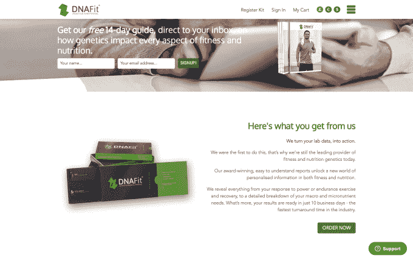

# 基因检测初创公司 Prenetics 收购英国 DNAFit，进军消费者服务领域 

> 原文：<https://web.archive.org/web/https://techcrunch.com/2018/04/19/prenetics-buys-dnafit/>

为患者提供基因检测服务的香港初创公司 Prenetics ，在[收购了](https://web.archive.org/web/20221207214148/https://www.businesswire.com/news/home/20180417006274/en/ADDING-REPLACING-Alibaba-Backed-Prenetics-Acquires-UK-Based-DNAFit)伦敦公司 [DNAFit](https://web.archive.org/web/20221207214148/https://www.dnafit.com/) 后，正在向亚洲以外的消费者领域扩张。

一位消息人士告诉 TechCrunch，这笔交易价值 1000 万美元，不仅见证了 Prenetics 进入新的地理区域，还扩大了其服务范围。Prenetics 的支持者包括中国电子商务巨头阿里巴巴，它直接与保险公司和医生合作，这些公司为客户和患者提供测试服务，但 DNAFit 直接面向消费者。

五岁的 DNAFit 出售一种测试，它可以描述一个人的 DNA，帮助他们找出最适合他们的健康和营养设置。DNAFit 的试剂盒——售价高达 249 英镑(350 美元)，需要 10 天才能出结果——在网上和通过员工套餐出售。

该公司表示，已经向大约 10 万人出售了产品，公司客户包括 LinkedIn、Talk Talk 和 Channel 4。高调的支持者包括奥运会金牌得主英国运动员格雷·卢瑟福德，他说这个结果帮助他对他的训练体制做出了“清晰、明智的决定”。

Prenetics 考虑全球扩张方案已经有一段时间了，这次收购在进入新市场的同时也解决了消费者健康市场的问题。

“我们肯定计划在欧洲投资并扩大 DNAFit 业务的覆盖范围。此外，Prenetics International 将专注于与保险公司和企业的 B2B，”Prenetics 首席执行官 Danny Yeung 通过电子邮件告诉 TechCrunch。

“与此同时，DNAFit 是[健身公司]Helix 在美国的合作伙伴，因此我们计划进一步投资于客户获取，并扩大我们在美国的影响力，”Yeung 补充道。“我们对将 DNA 检测带入全球市场的潜力感到非常兴奋，这对许多人的生活产生了影响。”

在另一项主要针对美国的合作中，[对 23andMe 客户的报价](https://web.archive.org/web/20221207214148/https://www.dnafit.com/us/23andme/)允许他们使用他们的结果，并为 DNAFit 支付 79 美元。

根据这项交易，DNAFit 首席执行官 Avi Lasarow 将成为新成立的业务部门 Prenetics International 的首席执行官，而母公司 Prenetics Group 的首席执行官是 Yeung。两家公司都证实，DNAFit 本身将继续使用现有品牌。

这标志着 Prenetics 的第一笔收购，Prenetics 去年完成了由 Beyond Ventures 和 Alibaba Hong Kong Entrepreneurs Fund 牵头的 4000 万美元 B 轮融资。Yeung 当时告诉我们，这笔资金的一部分将用于有意义的收购，因为这家初创公司的目标是超越其早期对中国大陆、香港和东南亚的关注。杨说，在 10 月份获得资助时，Prenetics 已经处理了 20 万份 DNA 样本。

2009 年，Prenetics 从香港城市大学(City University of Hong Kong)扩展出来时，名为“Multigene”。 [Yeung 于 2014 年加入该公司担任首席执行官](https://web.archive.org/web/20221207214148/https://techcrunch.com/2014/12/03/prenetics-raises-2-65m-to-bring-safe-accurate-dna-based-prenatal-testing-to-asia/)，在 Groupon 收购其香港初创公司优步易购(uBuyiBuy)后离开该公司，此后该公司一直处于初创模式。Prenetics 已经从投资者那里筹集了超过 5200 万美元，除了阿里巴巴，还包括 500 Startups，Venturra Capital 和中国保险巨头平安。