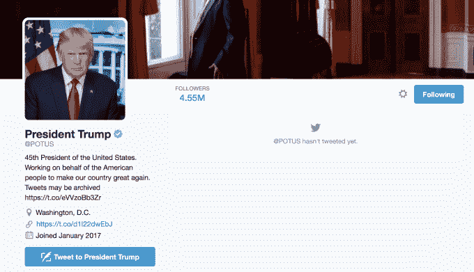

# 特朗普总统已经正式接管@ POTUS 

> 原文：<https://web.archive.org/web/https://techcrunch.com/2017/01/20/president-trump-has-officially-taken-over-potus/>

# 特朗普总统已经正式接管@POTUS

这是正式的。大约一小时前，唐纳德·特朗普成为美国第 45 任总统。

关于过渡的一个问题是，即将离任的前总统奥巴马和特朗普总统之间的社交媒体交接将如何进行。

现在大约一个小时后，一些账户开始转换。

最重要的一个可能是 Twitter 上的[@ POTUS](https://web.archive.org/web/20221207080934/https://twitter.com/POTUS)，它现在重定向到特朗普总统的新页面。虽然它只说他现在有大约 400 万粉丝，[一旦 Twitter 完成迁移，这个数字最终会回升到前总统奥巴马在@POTUS 上的近 1400 万粉丝。](https://web.archive.org/web/20221207080934/https://twitter.com/hadas_gold/status/822126950378602497)

值得注意的是，特朗普总统还没有从@POTUS 账户发任何微博，但在过去的一个小时里，他从他的个人 [@realDonaldTrump](https://web.archive.org/web/20221207080934/https://twitter.com/realdonaldtrump?lang=en) 账号发了大约 10 条微博。他告诉我们这是意料之中的事，因为他的个人账号比@POTUS 多了 1000 万粉丝。

如果你在寻找老总统，奥巴马总统的新 Twitter 是[@ POTUS 44 on Twitter](https://web.archive.org/web/20221207080934/https://twitter.com/POTUS44)——他仍然有他的旧 Twitter 和他的旧帐户的追随者。所以，如果你关注了@POTUS，你仍然会关注奥巴马总统的新@POTUS44 账户。他也有一个你可以关注的个人账户[@巴拉克·奥巴马](https://web.archive.org/web/20221207080934/https://twitter.com/barackobama)，这个账户实际上有超过 8000 万的关注者——比他在@POTUS 账户上的关注者多得多。

同样的事情也发生在前第一夫人米歇尔·奥巴马身上——她的 [@FLOTUS](https://web.archive.org/web/20221207080934/https://twitter.com/FLOTUS) 手已经交给第一夫人梅兰妮·特朗普，前第一夫人的推文和关注者已经转移到 [@FLOTUS44](https://web.archive.org/web/20221207080934/https://twitter.com/FLOTUS44?lang=en) 。她还要求粉丝关注她的新个人账户 [@MichelleObama](https://web.archive.org/web/20221207080934/https://twitter.com/MichelleObama) 。

同样，副总统迈克·彭斯已经取得了对 [@VP](https://web.archive.org/web/20221207080934/https://twitter.com/VP) 的控制权，乔·拜登现在拥有了 [@VP44。](https://web.archive.org/web/20221207080934/https://twitter.com/vp44)

对于一家目前还不是最有组织性的公司(至少在产品部门)，Twitter 在管理这一转变方面做得相当不错——尤其是因为这是前所未有的。