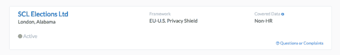

# 脸书-剑桥分析公司数据丑闻曝光后，EU-美国隐私保护系统面临更大压力

> 原文：<https://web.archive.org/web/https://techcrunch.com/2018/06/12/pressure-mounts-on-eu-us-privacy-shield-after-facebook-cambridge-analytica-data-scandal/>

然而，岌岌可危的[【EU-】美国隐私保护网](https://web.archive.org/web/20221217072131/https://techcrunch.com/tag/privacy-shield/?_ga=2.26457147.747343177.1528704454-931137423.1528704454)面临更多压力:欧盟议会公民自由委员会[呼吁](https://web.archive.org/web/20221217072131/http://www.europarl.europa.eu/news/en/press-room/20180611IPR05527/eu-us-privacy-shield-data-exchange-deal-us-must-comply-by-1-september-say-meps)在 9 月 1 日之前暂停数据传输安排，除非美国完全遵守。

尽管委员会本身没有权力中止这项安排。但是增加了欧盟执行机构欧盟委员会的政治压力。

在昨天晚些时候的投票中，Libe 委员会同意，目前应用的机制没有为欧盟公民的个人信息提供足够的保护——鉴于最近的脸书剑桥分析公司丑闻，强调需要更好的监控，该公司在 4 月份承认，多达 8700 万用户的数据在 2014 年被不正当地传递给第三方(包括[270 万欧盟公民](https://web.archive.org/web/20221217072131/https://techcrunch.com/2018/04/06/facebook-data-scandal-eu-citizens/))。

脸书是目前 3000 多家注册隐私盾的组织之一，隐私盾可以让他们更容易地将欧盟用户的数据转移到美国进行处理。

尽管剑桥分析公司的丑闻发生在隐私盾牌之前——隐私盾牌于 2016 年中期正式采用，取代了长期存在的安全港安排(2015 年被欧洲最高法院推翻，此前一项法律挑战成功证明美国政府的大规模监控行为正在破坏欧盟公民的基本权利)。

欧盟现在也有了一个更新的数据保护框架——GDPR(T10)，于 5 月 25 日全面生效，进一步加强了对欧盟数据的隐私保护。

Libe 委员会表示，它希望美国当局毫不拖延地对脸书剑桥分析公司的崩溃等隐私丑闻采取行动，如果需要，将滥用个人数据的公司从隐私保护名单中删除。欧洲议会议员还希望欧盟当局调查此类案件，并在适当情况下暂停或禁止隐私保护下的数据传输。

尽管有一连串的隐私丑闻——有些是最近的，还有[联邦贸易委员会的最新调查](https://web.archive.org/web/20221217072131/https://techcrunch.com/2018/03/26/ftc-confirms-probe-into-facebook-data-misuse-scandal/)——脸书仍然在隐私保护名单上；剑桥分析公司(Cambridge Analytica)的子公司 SCL 选举公司(Japan Elections)声称，鉴于媒体围绕丑闻的报道，该公司将关闭其业务，但根据隐私保护名单，该公司显然仍有资格将人们的数据带出欧盟，并为其提供“足够的保护”……

该委员会的欧洲议会议员还对美国最近通过的《澄清合法海外使用数据法案》( [Cloud Act](https://web.archive.org/web/20221217072131/https://techcrunch.com/2018/03/22/cloud-act-omnibus-bill-house/) )表示担忧，该法案允许美国和外国警方跨境访问个人数据——该委员会指出，美国法律可能与欧盟数据保护法相冲突。

公民自由委员会主席兼报告员克劳德·莫赖斯(Claude Moraes)在一份声明中表示:“尽管在改善安全港协议方面取得了进展，但当前形式的隐私保护并没有提供欧盟数据保护法和欧盟宪章所要求的足够保护水平。因此，美国当局有责任有效地遵守协议的条款，委员会也有责任采取措施，确保它完全遵守 GDPR。”

隐私盾是由欧盟委员会与美国同行谈判达成的，作为安全港的替代物，旨在当欧盟公民的数据被带到美国时，为他们提供“基本等同”的数据保护，当然，美国没有基本等同的隐私法。因此，我们的目标是试图弥合两种截然不同的法律制度之间的差距。

然而，这一努力的可行性从一开始就受到了质疑，批评者认为核心的法律差异并没有消失——并将 Privacy Shield 称为“猪身上的口红”。

在起草框架的整个过程中[以及从](https://web.archive.org/web/20221217072131/https://techcrunch.com/2017/06/13/europes-dp-chiefs-fire-warning-shots-ahead-of-first-eu-us-privacy-shield-review/)开始也表达了关注:欧盟的影响力 WP29 集团(现在演变为[欧洲数据保护委员会](https://web.archive.org/web/20221217072131/https://edpb.europa.eu/))，由成员国数据保护机构的代表组成。

它的关注既包括框架的商业因素，也包括执法/国家安全考虑。我们已经联系了 EDPB 进行评论，并将根据任何回应更新这份报告。

在采用隐私盾之后，委员会也表达了一些公众的担忧，尽管欧盟的执行机构通常遵循“等着瞧”的方法，并试图利用该机制向美国同行施加政治压力——例如，利用隐私盾第一次年度审查的时机推动美国监控法的改革。

然而，改革并没有实现。[完全相反](https://web.archive.org/web/20221217072131/https://techcrunch.com/2018/01/16/senate-fisa-section-702-cloture-vote-wyden-paul/)。因此，随着第二次年度评估日期的迅速临近，这一安排陷入了紧迫的困境——欧盟委员会试图缓解隐私保护免受批评的进展为零。

按照该框架的要求，隐私保护监察员仍然没有固定的职位。另一个引起关注的问题是美国隐私和公民自由监督委员会缺乏成员——该委员会仍然奄奄一息，只有一名成员。

如果判断隐私保护协议没有按预期发挥作用，威胁暂停隐私保护协议只有在实际执行的情况下才是可信的。

尽管欧盟委员会也希望不惜一切代价避免终止一个目前有 3000 多个组织在使用、许多企业也在依赖的机制。因此，最有可能的是，它将再次被留给欧洲最高法院来实施任何无效的打击。

欧盟委员会发言人告诉我们，他们知道欧洲议会正在讨论一项关于 EU-美国隐私保护的决议草案。但他强调了与美国同行接触以改善协议的方法。

"委员会的立场是明确的，并在第一份年度审查报告中阐明。他告诉 TechCrunch:“第一次审查表明，隐私保护功能运行良好，但在实施方面还有一些改进的空间。”

“欧盟委员会正在与美国政府合作，希望他们能够解决欧盟的担忧。茹瓦洛夫委员上一次在美国是在 3 月份，与美国政府就后续行动进行了接触，并讨论了美国方面在秋季下一次年度评估之前应该做些什么。

“Jourová专员还致函美国国务卿蓬佩奥、商务部长罗斯和司法部长塞申斯，敦促他们尽快进行必要的改进，包括在监察员问题上。

“我们将继续努力保持隐私盾的运行，并确保欧洲的数据得到良好的保护。目前有超过 3000 家公司在使用它。”

虽然委员会发言人没有提到，但 Privacy Shield 现在正面临几项法律挑战。

具体来说，包括[一系列关于其充分性的法律问题](https://web.archive.org/web/20221217072131/https://techcrunch.com/2018/04/13/privacy-shield-now-facing-questions-via-legal-challenge-to-facebook-data-flows/)，这些问题[已被爱尔兰高等法院移交给 CJEU](https://web.archive.org/web/20221217072131/https://techcrunch.com/2018/05/02/facebook-denied-a-stay-to-schrems-ii-privacy-referral/) ，作为对不同欧盟数据传输机制的单独隐私挑战的结果，该机制也被组织用来授权数据流。

从 CJEU 处理类似问题的速度来看，在宣布该协议无效之前，该协议最多还有一年的操作宽限期。

如果欧盟委员会自行采取行动，对该机制的第二次年度评估将于 9 月份进行，事实上，如果美国国内的改革没有进展，Libe 委员会正在推动在 9 月 1 日之前暂停该机制。

欧盟议会作为一个整体也将在下个月就委员会关于隐私保护的文本进行投票，如果他们支持 Libe 的立场，这将对欧盟委员会施加进一步的压力。尽管只有一个使协议无效的法律决定才能强制采取行动。