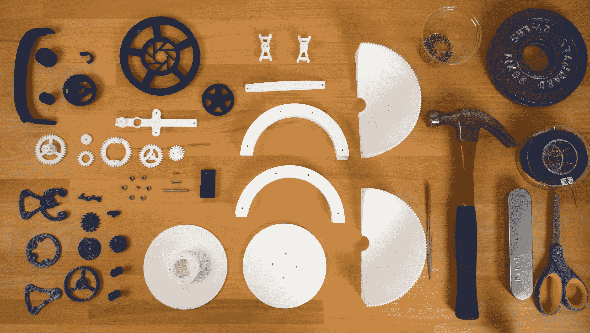

# 打印自己的三轴陀飞轮(相信我，会很酷)

> 原文：<https://web.archive.org/web/https://techcrunch.com/2016/07/21/print-your-own-triple-axis-tourbillon-trust-me-itll-be-cool/>

# 打印你自己的三轴陀飞轮(相信我，它会很酷)

【YouTube = https://www . YouTube . com/watch？v=zdR57-fh0Fo]

在钟表界，很少有比 tourbillion 更精美的东西，也很少有比三轴腕表更精美的东西。tourbillion 最初由亚伯拉罕·路易·宝玑(Abraham Louis Breguet)发明，是一款经过改良的手表，旨在确保手表在任何位置都能保持准确的时间——在口袋里、在桌子上或在包里推来推去。它通过旋转摆轮来实现这一点，摆轮是机械表的核心。

然后是三轴陀飞轮，一种真正稀有的鸟。现在你可以用 ABS 或 PLA 塑料打印你自己的。

这款陀飞轮由制造商亚当·里格利(Adam Wrigley)打造，就像一个由十亿个陀飞轮组成的陀飞轮。它不仅在一个轴上旋转摆轮，而且实际上在三维空间旋转整个摆轮。正是这种机械上的过度使用使得一块手表的价格高达 25 万美元。

现在你可以 3D 打印你自己的了！文件[在这里](https://web.archive.org/web/20221025222601/http://www.thingiverse.com/thing:1624844)可以找到，由 99 个独立的部分组成。陀飞轮并不真正显示时间，但它确实显示了一个真正的三轴陀飞轮是如何工作的，尽管尺寸要大得多。你可以把它想象成一个昂贵的钟表小玩意的[可见马达模型](https://web.archive.org/web/20221025222601/https://www.youtube.com/watch?v=XQVciy5ObMg)。

Wrigley 在 Frog Design 工作，他说他的这个项目是基于一些在线资源。最难的部分是制造擒纵机构，即在摆轮来回旋转时释放和抓住摆轮的齿状“叉子”。

对于有钟表爱好的人来说，这是一个有趣的周末项目，看起来很容易打印，不需要支架。然而，对于 99 个零件，我会为复杂且非常有益的组装过程留出大量时间。

【YouTube = https://www . YouTube . com/watch？v=Z5eEgUTiwqU]