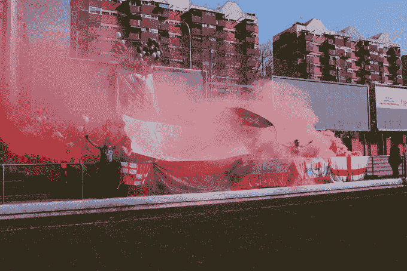

# Prisma 为超级用户添加了风格商店和定制工具来制作艺术滤镜 

> 原文：<https://web.archive.org/web/https://techcrunch.com/2017/03/01/prisma-adds-styles-store-and-custom-tool-for-superusers-to-make-art-filters/>

风格转移应用程序 [Prisma](https://web.archive.org/web/20221205160823/https://beta.techcrunch.com/tag/prisma/) 正在增加另外几个新功能，以保持其社区的参与:一个风格商店和一个让用户通过上传图像和调整各种过滤器来创建自己风格的工具。

该公司表示，后者是 2M+每日用户提出的最受欢迎的功能要求。

虽然该商店听起来像是一条通过付费内容赚钱的途径，但至少目前情况并非如此。这是一种帮助用户在 Prisma 发布新风格时导航的方式，而不是用太多的选项淹没应用程序。用户可以浏览商店找到他们喜欢的，下载并删除他们不喜欢的。

“目前有 44 种款式可供选择。这让人们感到困惑，因为他们必须滚动浏览许多他们不喜欢的风格，才能找到最喜欢的风格。现在人们可以下载并保留他们真正喜欢的风格，”它指出。

“在不久的将来”，用户还可以在商店里评价和与朋友分享款式。

虽然该功能被称为“商店”,但所有内容都是免费的——至少目前是这样，尽管增加一个商店确实有可能在未来通过一些付费下载来赚钱。

“目前，我们不考虑从用户身上赚钱，”联合创始人 Aram Airapetyan 告诉我们。

今天，Prisma 也发布了一个桌面工具，让用户创建自己的风格——尽管它只让最活跃的用户接触到它，他们需要相当大的耐心来完成这个过程。

TechCrunch 在公开发布之前测试了一个版本的样式创建工具，从上传照片到查看其他图像的样式，整个过程花费了几天时间。

不是因为它*字面上的*需要几天，而是因为等待时间(上传/处理/审查)是如此不透明，以至于让它继续工作并定期检查它本质上更容易。(嘿，这周是 [MWC](https://web.archive.org/web/20221205160823/https://beta.techcrunch.com/events/mobile-world-congress-2017/) ，所以特别忙。)

Prisma 声称创造一种风格需要“一个小时左右”，但警告说“如果队伍很大”，等待时间可能会更长。而且在发布后，排队的人显然会更多，即使只是让少数用户使用这个工具。

这一点上的界面也非常不受欢迎，有大量未标记的幻灯片可以调整，以设置“内容权重”和“样式权重”的规则——但没有明显的方法来查看调整将如何影响最终结果。就目前而言，这是一个试错加耐心的问题。

下面是我用作样式源的照片(尽管工具只裁剪出了一个中心正方形):

以下是一些风格转移的结果:

鉴于界面缺少任何指针，我选择将滑块留在原来的位置——所以这是默认结果。

“它现在是一个桌面产品，”Airapetyan 说。“接口不是最终确定的。我们将在那里添加一些提示和有用的注释。但人们肯定能够在移动设备上创造自己的风格。我们是一家移动公司。”

他随后解释说，第一个滑块用于形状，第二个用于颜色，第三个用于大对象，第四个用于小对象，最后一个用于小细节——所以你可能会通过更多的调整来实现不太逼真的风格转换效果。

“理解这一点并不容易。但我们会让它非常简单，这样每个人都可以毫无问题地使用它，”他说，并补充说:“最好的建议是用幻灯片和图片进行实验。”

12 月，Prisma 团队[推出了自己的社交共享平台](https://web.archive.org/web/20221205160823/https://beta.techcrunch.com/2016/12/20/prisma-launches-a-social-feed-to-see-if-style-can-transfer-into-a-platform/)，试图将当时只是一个很酷的照片编辑工具转变为一个更加自治的社区，而不是仅仅依赖于其他内容共享网络。

为用户添加更多选项来定制他们可以选择和使用的风格，应该有助于扩展分享到 Prisma 平台的内容的外观和感觉。一个更大的风格选择是否足以围绕这个概念建立一个持久的社区还有待观察。