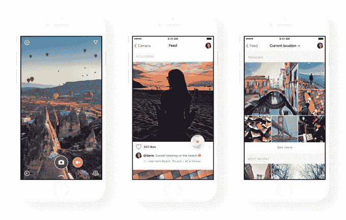

# Prisma 推出了一个社交 feed，看看时尚是否可以转移到一个平台上

> 原文：<https://web.archive.org/web/https://techcrunch.com/2016/12/20/prisma-launches-a-social-feed-to-see-if-style-can-transfer-into-a-platform/>

在[于今年夏天](https://web.archive.org/web/20230403165736/https://techcrunch.com/2016/06/24/prisma-uses-ai-to-turn-your-photos-into-graphic-novel-fodder-double-quick/)发布后，Prisma 这款应用推广了 style transfer，将艺术风格的滤镜应用于照片和视频，它最终试图将自己变成不仅仅是一个很酷的工具。在今天发布的对其 [iOS](https://web.archive.org/web/20230403165736/https://itunes.apple.com/us/app/prisma-free-photo-editor-art/id1122649984?mt=8) 和 [Android](https://web.archive.org/web/20230403165736/https://play.google.com/store/apps/details?id=com.neuralprisma&hl=en) 应用的重大更新中，它添加了自己的社交流，专注于基于位置的共享。

上个月晚些时候，这家初创公司告诉 TechCrunch，它正在开发一个社交功能，此前它访问脸书直播 API 的权限被切断，关闭了它通过脸书平台推出的直播功能。现在 Prisma 希望建造自己的围墙花园。他们称这种新的社交功能为 Feed，让用户分享他们与其他 Prisma 用户一起风格化的照片。

基于位置的变化是，共享的照片是按邻近度组织的，所以默认情况下，你会看到更近的图像。所以[的色调](https://web.archive.org/web/20230403165736/https://techcrunch.com/2011/03/23/color-looks-to-reinvent-social-interaction-with-its-mobile-photo-app-and-41-million-in-funding/)，那么——又名照片分享应用未能在 2011 年建立基于位置的社交分享的势头。尽管如此，从技术角度来看，五年是几个冰河期，所以也许今天追求新奇的移动用户可以确信基于邻近的图像共享的价值，因为他们现在更习惯于从全球网络上观看内容。

尽管在我看来，地理位置作为一个纯粹的社会连接器的力量是相当值得怀疑的。还有待观察的是，用同一套算法过滤器风格化的照片的整个社交馈送是否能够将用户从他们能够并且已经分享东西的地方拉出来——例如 Instagram、Snapchat、脸书、Twitter 等。(更不用说所有较少使用的社交分享选项了，比如 Ello、Google+、Path 等等)

Prisma 表示，它已经在几个国家测试了新的社交 Feed，大约有 15，000 名用户，并声称迄今为止的反馈“令人惊讶”。但这种积极性掩盖了它面临的巨大挑战，即试图让它的艺术效果作为一个成熟的社交平台自立，而不是像迄今为止那样，作为一个为其他更受欢迎的平台注入一点视觉新鲜感的工具。

Prisma 如此吸引人的部分原因也可以说是它的简单性——现在它牺牲了一些简单性，因为它试图通过要求用户注册来转变为平台，以便他们可以进入它希望建立的社区。

这款应用最初在今年夏天引起了人们的关注，当时它引人注目的效果吸引了数百万 Instagram 用户的眼球，因为人们在现有的网络上分享了它的艺术过滤照片。不过，虽然搭载其他社交平台为 Prisma 带来了早期动力，使其在几个月内获得了超过 7000 万次下载，并获得了一些 2M+日活跃用户，但这也导致了快速跟进的模仿猫——[包括脸书](https://web.archive.org/web/20230403165736/https://techcrunch.com/2016/10/25/facebook-video-filters/)，它在今年秋天开始推出自己的风格转移功能。

所以 Prisma 被夹在岩石和坚硬的地方之间；如果它坚持把编织仅仅作为一个很酷的工具，它就有成为多余的风险，因为其他人会克隆它的 USP。但是，在一个由如此多资源丰富的社交巨头主导的数字世界中，将一个很酷的功能转变为一个社交平台是一项让西西弗斯出汗的任务。

然而，值得称赞的是，Prisma 团队扛着巨石，踏上了山路——所以你不得不佩服他们的勇气。他们希望通过建立病毒式奖励来迅速点燃 Prisma 共享者社区。因此，这意味着分享到 feed 的内容可以被其他人喜欢——正如他们所说，照片收藏者喜欢的越多，它通过“进一步增加其在人们 Feed 上的出现范围”而获得的潜在可见性就越大。

“理论上，一个用户可以发布一张图片，获得赞，然后看着他或她的帖子传播并覆盖整个世界，”该团队说。

受欢迎程度也会延续，所以分享的图片越受欢迎，用户对下一次分享的印象就越深刻。因此，它旨在鼓励分享。但他们确实需要尽可能创造所有重要的“网络效应”的捷径。

除了通过算法被纳入基于邻近度/位置的订阅源之外，共享内容还可以通过 Prisma 应用程序中的交互式地图进行查看，因此用户将能够浏览埃菲尔铁塔等地标附近的共享内容。但在我在发布前测试的版本中，地图只显示了世界上喜欢的人来自哪里，因此在地图上浏览共享内容的能力还没有到来。

“目前，该地图显示了来自世界各地的喜欢，Prisma Labs 正计划扩展其功能，”该团队说。

我还发现这款应用的测试版漏洞百出——许多 Prisma 的过滤器无法显示或正常工作。这是一个令人担忧的发展；如果你的 USP 是一个快速风格化内容的工具，那么任何挡路的东西都可能很容易激怒你的用户群，并鼓励他们转向另一个正在使用的风格转换应用程序和选项。

但 Prisma 社交策略的真正大问题无疑是缺乏在应用程序内分享的动力。在鼓励用户投资建立追随者社区方面，位置似乎是一个相当弱的纽带。虽然你和其他人一样使用相同的滤镜来分享图像的事实首先破坏了 Prisma 图像的视觉吸引力，使在这里分享比在其他地方分享显得毫无意义，在其他社交平台上，Prisma 的效果可能会产生更大的影响，因为它们更有可能在其他分享的内容中脱颖而出。

其他较小的问题包括，当原始图像较大时，照片会自动裁剪为正方形以在 Feed 中共享，以及字幕细节被删除/不显示。

该 Feed 目前还不支持视频共享，尽管 Prisma 表示这是他们的下一个目标。新的照片裁剪工具似乎也没有正常工作。

在这一点上，它显然是一个 MVP，但即使忽略早期的问题(它说它正忙于为今天的发布及时“打磨”)我也不相信这是一个可以扩展到社交平台的分享概念——我是 Prisma 核心风格转移技术的超级粉丝。正如联合创始人阿列克谢·莫伊谢恩科夫在 6 月份的一次采访中向我承认的那样:“现在有很多平台，我们不需要任何其他的社交网络。”

Moiseenkov 还将“简单”作为 Prisma 的关键 USP。但六个月后，这个团队彻底改变了早期的想法，这突显出从一个“简单的应用程序”(正如他当时对 Prisma 的描述)创造一个可持续发展的业务是多么棘手——即使你已经获得了广泛的认可；获得苹果和谷歌的“年度最佳应用”奖；获得了几百万活跃用户。而且他们说*硬件*硬…

“Prisma 的 Feed 是不同的，”当我问及是什么让该团队有信心将其 style effects 应用程序转变为一个社交共享平台时，联合创始人 Aram Airapetyan now 说道。“主要想法是让人们尝试和分享令人惊叹的艺术品。只有分享一张漂亮的图片，用户才能获得大量的喜欢，并让他或她的帖子传播到全世界。而是要尽可能地覆盖更多的人。”

“我们为此创造了一种独特的算法，在我们发布并看到第一批结果后，我们会让它变得更好，”他补充道。

Prisma 今天发布的另一项重大更新——首先是其 iOS 应用程序——是能够将其效果应用于自由纵横比和全屏摄像头，而不是之前的方形裁剪格式。该团队表示，这是“我们所有用户的第一要求”。

他们还将 Prisma 艺术品的分辨率提高了一倍，以改善视觉质量。

这是他们分享的一张图片样本:

另一个是我用这个程序做的:

风格化自由宽高比照片的能力肯定是非常受欢迎的——尽管要获得它，你需要更新到新的 Prisma 平台应用程序，并通过注册过程。这意味着失去了早期版本的应用程序的简单性…所以在那里摇摆和回旋。**更新:** Prisma 已经证实不需要登录仍然可以使用该应用程序——它说只有当你想访问 Feed 时才需要注册。

接下来，该团队表示，他们将致力于为 Prisma Android 应用程序带来离线视频处理和新的自由纵横比功能。他们表示，他们还将继续努力提高 Prisma styles 和 resolution 的质量——以及 biggie:在他们的新社交平台上流汗——兜售更多的东西。“这只是一个开始。还有这么多令人瞠目结舌的事情来了！”Airapetyan 说。

毫无疑问，这是一场战斗，但时间会证明 Prisma 的平台是否有腿，无论它制作得多么巧妙。