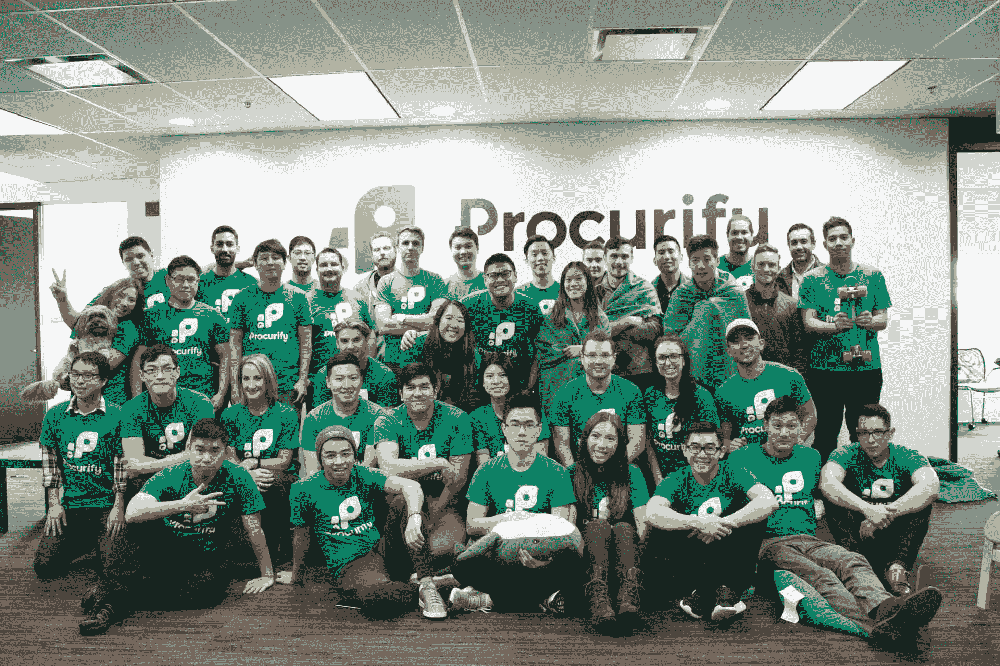
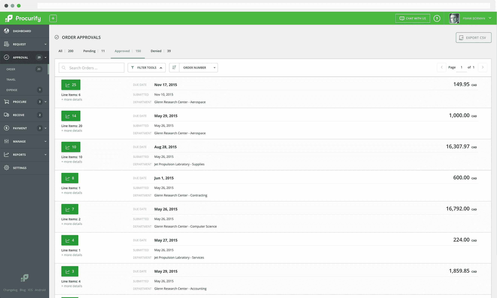

# Procurify 为其采购平台 TechCrunch 融资 700 万美元

> 原文：<https://web.archive.org/web/https://techcrunch.com/2016/11/15/procurify-raises-7m-series-a-round-for-its-purchasing-platform/>

# Procurify 为其采购平台 A 轮融资 700 万美元

采购一点也不性感，但它是几乎任何企业、非营利组织和学校日常生活中的一项基本任务。总部位于加拿大温哥华的 Procurify 希望借助其在线和移动的[采购](https://web.archive.org/web/20221206153602/https://www.procurify.com/purchase-order-software/features)和[应付账款](https://web.archive.org/web/20221206153602/https://www.procurify.com/ap-automation-software/features)平台，减轻这一过程中的一些痛苦。正如该公司今天宣布的那样，它已经筹集了 700 万美元的 A 轮融资，由 Runa Capital 牵头，Point Nine Capital、Nexus Venture Partners 和加拿大商业发展银行参与，以帮助它推进其愿景并扩大其服务规模。

Procurify 希望提高组织内部的采购流程的效率，并围绕这些组织中的员工如何看待他们如何花费公司的“钱”来改变文化。毕竟，在许多企业中，采购流程仍然是一项手工任务。Procurify，类似于上个月上市的 Coupa [工具，承诺它的工具将为采用它的组织带来显著的节约。](https://web.archive.org/web/20221206153602/https://beta.techcrunch.com/2016/10/06/coupa-up-87-in-software-ipo/)

“投资者和高管们已经开始问一个根本性的问题:我们知道我们有什么样的消费文化吗？Procurify 首席执行官阿曼曼说。“从被动支出到主动支出的关键转变造就了更明智的支出文化。Procurify 有责任引导这种转变。”

这项服务成立于 2012 年，提供了采购平台的所有常见功能。这些范围从基本的预算管理到欺诈检测和实时支出跟踪。这项服务集成了 QuickBooks、Netsuite 和企业目前已经在使用的其他账户系统。

该公司现在计划使用新的资金来扩大其服务。安吉拉·巴尔多内罗已经聘请了一位经验丰富的新首席运营官来帮助指导公司。

