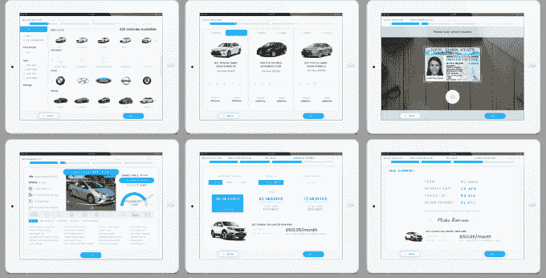

# Prodigy 筹集 540 万美元统一店内和网上购车体验

> 原文：<https://web.archive.org/web/https://techcrunch.com/2018/02/01/prodigy-raises-5-4m-to-unify-the-in-store-and-online-car-buying-experience/>

如果你曾经试图购买一辆汽车，很有可能你的许多研究已经转移到了网上，因为弄清楚你到底想要什么样的汽车变得越来越容易——而不是去经销商那里。

至少，这是米歇尔·罗森正在考虑的问题。他和他的联合创始人创办了一家名为 [Prodigy](https://web.archive.org/web/20230307142249/https://getprodigy.com/) 的公司，其基础是将你在网上研究汽车的经验延伸到实际的经销商那里。Prodigy 的目标不是走进一家经销商那里就知道你到底想要什么，而是通过创造一种客户在线使用、销售人员现场使用的服务来帮助买家找到适合他们的汽车，从而使这种体验成为一部分。例如，客户可能想进来尝试一些东西，然后回家继续研究。Prodigy today 表示，它已经在由 8VC、Battery Ventures、SV Angel 和 CrunchFund 牵头的种子轮融资中筹集了 540 万美元。

“购车习惯正在改变——顾客光顾的经销商从 6 家减少到 1.6 家，”Rohrssen 说。“这些客户在进入之前平均要做 18 到 20 个小时的研究。当他们到达那里时，他们已经做了很多研究，他们知道的可能比销售人员还多。在过去的 5-10 年里，消费者发生了巨大的变化，但经销商却没有太大的变化。我们从第一天起的使命就是，我们希望开发软件，为经销商提供他们处理这些客户变化和交付所需的技术。”

像许多其他创业公司一样，Prodigy 的到来更多的是一个发现过程，它开始时只是专注于在线。Rohrssen 表示，这为经销商的销售组件提供了一个利基中的利基部分，但他们发现，一些经销商在内部的 iPads 上运行它，并有点弯曲服务，以朝着现在的方式工作。所以他们带着这些信息回到绘图板，最终得到了这个结果。

另一个目标是将整个销售流程统一到一个单元中，而经销商习惯于从六种服务跳到八种服务。为了测试这一点，经销商请来了不习惯传统流程的新销售人员，并给他们配备了 iPads，看看是否有效。到目前为止，结果至少激起了一些经销商的兴趣，Rohrssen 说，

“现在情况更糟，因为(顾客)花时间在网上购物，但一切都不同步，”他说。“车还没准备好。我们发现，如果你想帮助经销商发展并在零售业取得成功，你必须支持店内和网上。销售人员可以在这些 iPads 上从头到尾完成一笔交易。客户也可以通过我们的在线销售平台在线完成。这两者是完全相关的。这是一个很大的优势——您可以从网上开始，到店内结束。”

如此深入复杂的体验，Prodigy 最终可能会遇到缩放问题。Rohrssen 说，该团队必须亲自进去部署这些工具，并教育销售人员和经销商如何使用它们。因为它看起来像是唾手可得的果实，所以总是有抵御潜在竞争对手的持续挑战。但是，随着购车者希望将他们的大部分行为转移到网上，找出协调店内体验与新的购车习惯的最佳方式是经销商一段时间以来一直试图解决的一个棘手问题——和许多行业一样，经销商行业对人员来说是一个非常紧张的行业，他说，这意味着该公司有机会利用口碑。

当然，如果几年后整个亲临经销商处的体验都将不复存在，那么所有这些都将毫无意义。这是一些公司的承诺，比如 Shift，你可以在网上做所有的研究，然后通过这个平台购买汽车。但与此同时，像 Beepi 这样的大型创业公司[关闭了](https://web.archive.org/web/20230307142249/https://techcrunch.com/2017/02/16/car-startup-beepi-sold-for-parts-after-potential-exits-to-fair-and-then-dgdg-broke-down/)，这似乎是一个利用与专家面对面交流的机会，并使其更有效的机会，Rohrssen 说。

“这可能与大多数软件即服务公司一样，总会有竞争对手，总会有人宣布资助和大牌，”Rohrssen 说。“会有竞争对手脱颖而出，我认为最终对于这些软件即服务业务来说，决定成功的是客户满意度，并强调满意的客户和参考客户。这是经销商行业的独特之处之一，尽管它相当分散，每个人都互相认识。”