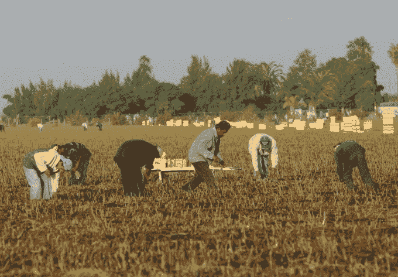

# ProducePay 通过债务和股权融资 7700 万美元，彻底改变农业融资方式 

> 原文：<https://web.archive.org/web/https://techcrunch.com/2017/03/14/producepay-raises-77-million-in-debt-and-equity-to-revolutionize-farm-financing/>

当 Pablo Borquez Schwarzbeck 长大时，他总是喜欢他家农场周围的工作。但由于没有这方面的天赋，施瓦茨贝克选择了商学院这条路。现在，随着他在洛杉矶的创业公司 [ProducePay](https://web.archive.org/web/20230217033534/https://producepay.com/) ，施瓦茨贝克说他正在回报养育他的社区。

他的公司刚刚筹集了 7700 万美元的股权和债务，为易腐商品的农民提供融资。尽管针对某些类型的农田有各种各样的金融工具——包括针对林地的数十亿美元的投资基金，以及某些类型的不易腐烂的作物——但大多数水果和蔬菜被认为不是贷款的好前景。

ProducePay 提出了一种模式，这种模式适用于那些农作物无法储存的农民。

对于施瓦茨贝克来说，这是为 2050 年 T2 农业挑战尽自己一份力量的一种方式。科学家估计，农业产量和耕作方法将需要改变，以支持预计到 2050 年达到 90 亿的全球人口。对于一些投资者来说，比如 2014 Farm 2050 计划背后的集团[(](https://web.archive.org/web/20230217033534/http://www.farm2050.com/#index)[创新努力](https://web.archive.org/web/20230217033534/http://www.innovationendeavors.com/)和[伟创力的实验室 IX](https://web.archive.org/web/20230217033534/https://www.flex.com/insights) )，这意味着对技术的投资。

但是施瓦茨贝克认为，融资是任何提高农业产量的战斗的关键组成部分。“许多人没有意识到的是，农业供应增长的最大障碍之一是将资金适当分配给那些有办法开始耕作或增加当前产量的人，”施瓦茨贝克说。

ProducePay 与农场联系，以公司预先设定的价格购买他们的作物，然后出去在市场上出售这些作物。如果公司收支平衡，农民一分钱也不欠。如果公司盈利，利润会返还给农民，但扣除佣金或 ProducePay 收取的利润百分比。

施瓦茨贝克说，对农民来说，这是保证前端收入的一种方式，这样他们就可以投资于基础设施项目，最终将进一步提高产量和农场经营。

通过使用农作物作为抵押，Schwarzbeck 的公司设法避免强迫农民将他们的农场作为抵押——这种现象在 80 年代迫使许多农民破产，而[加速了工业化农业的出现](https://web.archive.org/web/20230217033534/http://www.ucsusa.org/our-work/food-agriculture/our-failing-food-system/industrial-agriculture#.WMgJahLytE4)。

首席投资者 CoVenture 对该公司创新的融资方式[留下了深刻的印象，加倍了其在 ProducePay 的初始种子投资](https://web.archive.org/web/20230217033534/https://techcrunch.com/2016/06/29/producepay-seed-funding/)。CoVenture 承诺了 700 万美元股权融资中的约 500 万美元，并为该公司安排了 7000 万美元的债务融资。其他股权投资者包括之前的投资者 Menlo Ventures、Arena Ventures、CoVenture、Red Bear Angels 和 Social Leverage。

“这几乎就像一个(软件即服务)公司，附带一个财务部门，”CoVenture 合伙人兼 ProducePay 董事会董事阿里·哈迈德(Ali Hamed)说。“我们 CoVenture 喜欢向那些传统上完全被金融体系搞砸了的人提供信贷……而拉丁美洲的农民几乎是这一名单的首位。”

获得资本作为社会流动工具的重要性怎么强调都不为过。Hamed 说，通过向农民提供额外的融资渠道——而没有失去生计的风险——ProducePay 可以让农场取得重大进展(呼应 Schwarzbeck 的观点)。

施瓦茨贝克在给我的一封电子邮件中写道:“新鲜农产品种植和收获实践是非常劳动密集型的，这意味着需要大量的前期资本，许多拥有自然资源和倾向去从事农业或投资基础设施改善以获得更高产量的人，由于缺乏资本，无法继续他们的项目。”

对农民来说，差别是巨大的。

Hamed 说:“现在有一种公平的贷款产品，让他们能够最大限度地扩大业务，而不是每年一次拿他们的生计和家人的生计冒险，而不是担心他们是否会在今年或明年左右。”