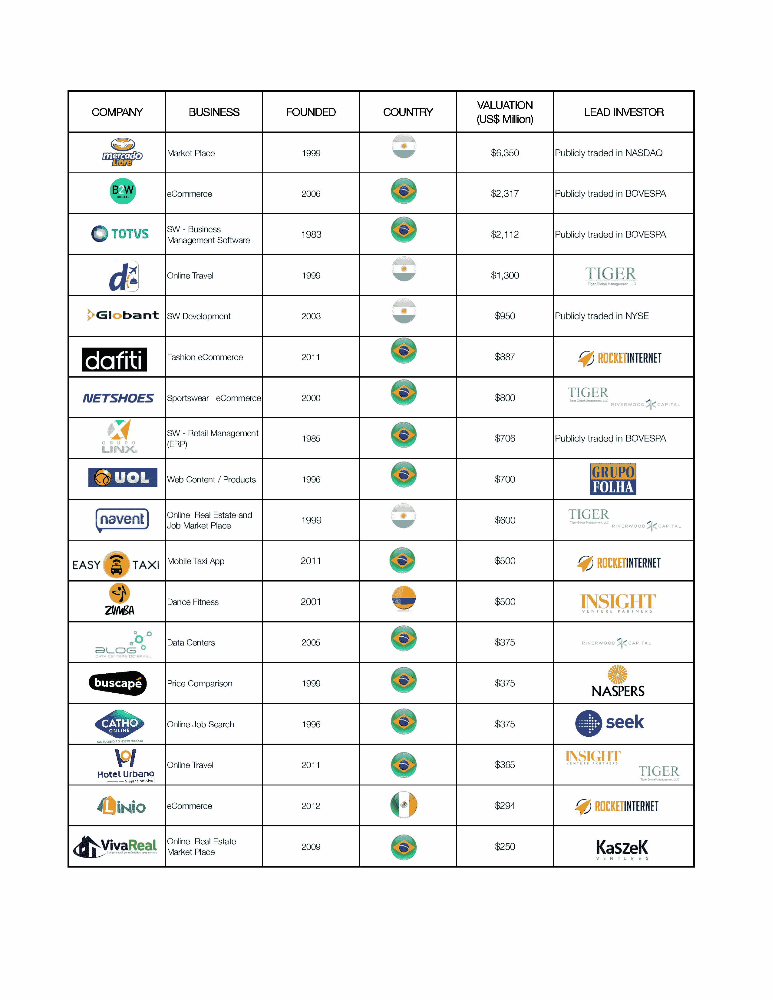

# 在菲特波尔、桑巴和黄金国生产独角兽 

> 原文：<https://web.archive.org/web/https://techcrunch.com/2015/06/06/producing-unicorns-in-the-land-of-futbol-samba-and-el-dorado/>

Omar Téllez 是位于拉美和硅谷的几家科技公司的私人投资者。作为 Niantic 管理团队的一员，他曾担任

[Moovit](https://web.archive.org/web/20230129214311/http://moovitapp.com/)

.

More posts by this contributor

不久前，居住在美国的拉美裔人只能在他们的原籍国找到两家成功的互联网/软件创业公司:Mercado Libre 和 Despegar/Decolar。虽然这些公司非常成功，但我们很难解释为什么拉丁美洲没有其他创业公司蓬勃发展。

这两家公司都是在互联网早期(即 1999 年)成立的，之后很少发展。此外，对于我们这些(像我一样)有着巴西自尊和传统的人来说，这两家公司都是阿根廷人是一种额外的侮辱。事实上，正如 1969 年洪都拉斯和萨尔瓦多因为一场资格赛而爆发的战争所表明的那样，在世界的这一地区，体育竞争超越了赛场。

在这些公司成立后的四届世界杯(拉丁美洲的一个重要时间单位)，几个因素，无论是供应还是需求方面，都动摇了这个创业生态系统，并为其复兴埋下了种子。

**政府对国内外光纤部署进行了大量投资**

在 2010 年 2014 年巴西世界杯之前，在卢拉·达席尔瓦总统的领导下，巴西[采纳了一项计划](https://web.archive.org/web/20230129214311/http://www.wsj.com/articles/SB10001424052748703625304575115531659338038)，以可承受的价格向巴西所有城镇提供高速服务，以此实现经济现代化，并创造该国竞争所需的技术基础设施。

例如，当时一些住宅宽带客户每月支付超过 250 美元的 1Mbps，而在美国，用户每月不到 30 美元就可以获得 10 倍的速度。

今天，该国超过 40%的家庭拥有平均 2.6Mbps 的宽带连接

**低价智能手机技术推动市场采用**

随着韩国和中国设备制造商通过增加产量来克服成本曲线，低于 100 美元的设备进入了市场。这导致智能手机渗透率出现拐点，达到 25%至 35%的水平。此外，Telefónica、TIM、Portugal Telecom 和 Millicom 等欧洲运营商以及克拉罗和 Oi 等本地运营商在数据计划方面的竞争加剧，进一步增强了技术的可负担性。

这些发展使拉丁美洲成为世界上无线普及率最高的地区之一。例如，巴西的 2 亿人口和超过 2.4 亿的 SIM 卡连接，使其在移动渗透率方面领先于世界，并拥有最高的 SIM 卡用户比率(目前为 2.1 比 1)。这些因素将继续影响采用率，预计到 2018 年智能手机普及率将超过 50%。

**拉丁美洲人消费社交媒体就像没有明天一样**

有了便宜的手机、便宜的数据计划和非常合群的 DNA，拉丁美洲人证明了他们对社交媒体和信息的贪得无厌。众所周知，圣保罗、里约热内卢、布宜诺斯艾利斯和波哥大的脸书、Skype 或 Whatsapp 用户和使用量都超过了纽约。此外，巴西人平均每天在社交媒体上花费 3.8 小时，而美国为 2.7 小时。难怪《华尔街日报》称巴西为“全球社交媒体之都”

**新智能资本到来**

外国聪明的风险资本被一个非常庞大的不断增长的中产阶级的潜力所吸引，他们是技术的早期采用者，在互联网上花费了大量的时间。

2005 年开始的一些资本市场退出进一步强化了这种看法。同年 3 月，Submarino.com(后来与 Americanas.com 合并成为 B2W 数码公司)在圣保罗证交所上市:BOVESPA。不久之后，Submarino.com 加入了 TOTVS–bo vespa 2006 年 3 月，然后是自由市场–NASDAQ 2007 年 8 月

惊讶于他的两家公司 Kazaa 和 Skype 在拉丁美洲的采用和使用，[尼可拉斯·曾斯特罗姆](https://web.archive.org/web/20230129214311/http://en.wikipedia.org/wiki/Niklas_Zennstr%C3%B6m)很快意识到在这一领域投资有相当大的收益，2010 年他的风险投资公司 Atomico 在圣保罗开设了办事处。

部分由于这些发展，其他大型风险投资/私募股权公司如 Tiger Global Management、Insight Venture Partners、Riverwood Capital、Naspers、Rocket Internet 和 Accel Partners 等进入了这个市场。正如 Accel Partners 的 Kevin Efrusy 最近所说的那样:“我们中的一些人去了那里，对市场充满热情。我们一头扎进去，对此感到兴奋不已。”

此后不久，像 Monashees 和 Kaszek 等地方风投开始出现。

随着这些破坏性因素的加入，拉丁美洲国家迅速加快了步伐，今天可以声称拥有 17 家估值超过 2.5 亿美元的纯互联网/软件公司。

这些公司中有一半是在新千年之后成立的，近 40%是在过去 10 年中成立的。所以很明显，我们看到这些公司的创建和加速增长。

其中近四分之三的公司位于巴西，四分之一位于阿根廷。只有一个在墨西哥，一个在哥伦比亚。其中五家已经上市:自由市场(NASDAQ)、B2W 数码(BOVESPA)、TOTVS、Globant (NYSE)、Linx (BOVESPA)。除了 UOL 之外的私有公司，100%都得到了外国风险投资/私募股权投资的资助。

我们还有很长的路要走。在拉丁美洲，只有四家公司的估值超过 10 亿美元，而在 perspective，[美国有 87 家独角兽公司，仅在纽约州](https://web.archive.org/web/20230129214311/http://www.atomico.com/explore-d3)就有八家。

为了推进 LATAM 生态系统并产生更多的独角兽，需要迅速解决两个明显的差距:更多的智能资本和做生意的便利性。

对于拉丁美洲的所有国内风险投资/私募股权公司来说，当地企业家正在走向国际获取资本，这一点应该很有说服力。除了莫纳希(圣保罗)和卡斯泽克(蒙得维的亚/布宜诺斯艾利斯)，我想不出在 LATAM 有一个管理着超过 1.5 亿美元的当地风险投资基金(非 PE)。

将其与以色列相比，那里至少有三只本地风险投资基金管理着超过 10 亿美元的资金。然而，可以理解的是，这些国际公司在投资的学习曲线上走得更远，因为他们从事投资的时间更长(即更擅长挑选赢家)，而且他们对风险/上行等式比国内公司更满意。我们应该预料到这种情况会很快改变。

无论哪种方式，我们都应该密切关注哥伦比亚以及 T2 银行资本基金的创建和运作，以此加速智能资本流入太平洋联盟国家(2.06 亿人口，3.4 万亿美元的国内生产总值；墨西哥、哥伦比亚、智利、秘鲁)。

具体而言，哥伦比亚国有开发银行 Bancoldex 正在建立拉丁美洲第一个基金，旨在通过将外国智能风险投资/私募股权投资引入该地区，重点关注成长型公司，同时建立一个由国际和当地风险投资和智能企业家组成的生态系统，促进动态增长。该基金预计将管理 5 亿美元，以在未来 10 年筹集 50 亿美元。

尽管哥伦比亚、智利、秘鲁和墨西哥在世界银行的“T4 营商环境指数”中名列前茅，但巴西这个该地区迄今最大的经济体，国内生产总值为 2.3 万亿美元，人口为 2 亿，在这方面又一次表现不佳，在 189 个国家中排名第 120(新加坡排在第一，厄立特里亚排在最后)。对许多人来说，收入和员工社会保障的高税率，加上创办一家公司所需的大量官僚机构(根据你问谁需要 6-9 个月)，可能会令人瞠目结舌。

全球化的世界要求拉丁美洲拥有高水平的创新，为其人民创造大量附加值，而不仅仅依赖前景不确定的商品(即石油、煤炭、农产品)。每桶低于 60 美元的油价对该地区的影响是巨大的，因此，拉丁美洲和加勒比地区的政府和企业家应该寻求一种竞争优势，不仅能为自己，也能为该地区带来强劲的增长。

拉丁美洲拥有超过 17 家价值超过 2.5 亿美元的纯互联网/软件公司，其中许多是在过去四年中发展起来的，拉丁美洲已经证明它能够胜任在这个新的 2.0 世界中竞争的任务。让我们确保我们不必再等四届世界杯来指向一个庞大、有价值和繁荣的数字经济。