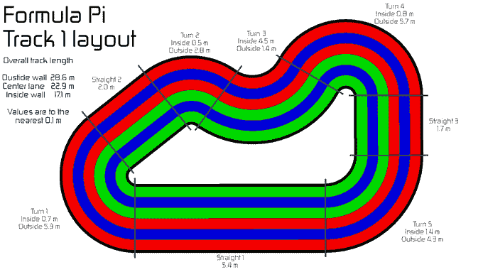

# 使用 FormulaPi TechCrunch 设计您自己的自动驾驶赛车

> 原文：<https://web.archive.org/web/https://techcrunch.com/2016/07/26/program-your-own-self-driving-racer-with-formulapi/>

# 用 FormulaPi 为你自己的自动驾驶赛车编程

自动驾驶赛车还有几年的时间，但为什么不用一点树莓派的魔法来模拟机器人一级方程式赛车的轰鸣声呢？

皮堡的人们正在为黑客和制造商提供机会，在一场集中的比赛中尝试驾驶他们自己的自动驾驶汽车大脑。他们已经推出了 [Kickstarter](https://web.archive.org/web/20230206155714/https://www.kickstarter.com/projects/frobotics/formula-pi-self-driving-robot-racing-with-the-rasp) ，他们正在寻找人们下载自主赛车代码，修改它，然后与其他基于 Raspberry Pi 的车辆进行比赛。

【40 美元可以让你得到一个可定制的“盖子”，里面会装着汽车的大脑。你的任务是设计赛车尽可能快地跑完比赛，同时避开其他赛车。来自世界各地的多辆汽车的程序完成了一套令人兴奋的，书呆子比赛。

赛车在 Zeroborg 马达平台上运行，并将在一条配有激光控制终点线的专用赛道上比赛。

Formula Pi 是一个令人兴奋的新比赛系列和俱乐部，旨在让人们开始使用自动驾驶机器人。目的是给几乎没有硬件或软件经验的人一个平台，让他们入门并了解自动驾驶汽车的工作原理。

我们提供硬件和基本软件来加入竞赛系列。参赛者可以随意修改软件，到了比赛日，一张准备好的带有你的软件的 SD 卡将被放入我们的机器人俱乐部，比赛将开始！

显然，这并不像在 Robo La Mans 将大型汽车撞在一起那样令人兴奋，但我怀疑在这些迷你比赛中获胜的人很快就会设计出更大更好的汽车。