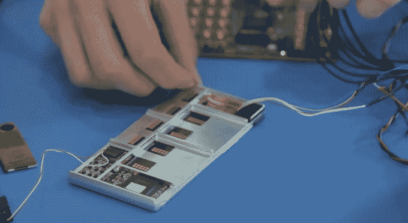
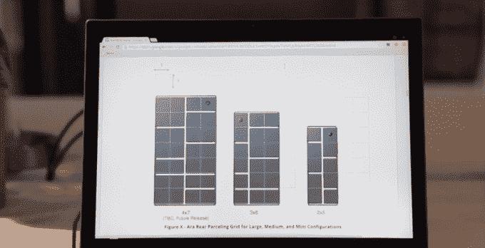
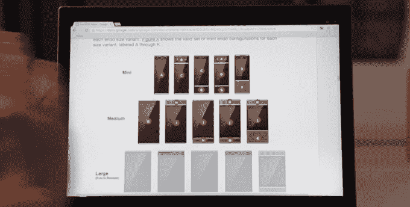
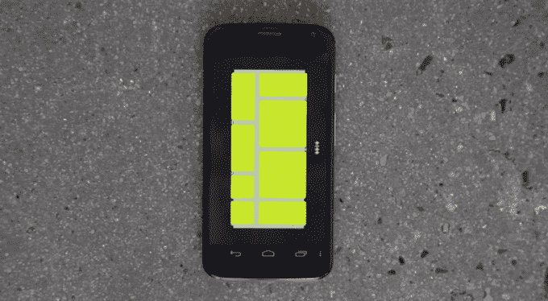

# 谷歌展示了其模块化手机 Moonshot 的进展

> 原文：<https://web.archive.org/web/https://techcrunch.com/2014/04/04/project-ara-video-update/>

谷歌发布了一段视频(嵌入在下面)，展示了 Project Ara 幕后发生的事情，这是其高级技术和项目(ATAP)的硬件 shunkworks 项目之一。ATAP 集团也在研发一款 3D 地图手机，谷歌在二月份展示了这款手机，名为 [Project Tango](https://web.archive.org/web/20221007121414/https://beta.techcrunch.com/2014/02/20/google-launches-project-tango/)

[项目 Ara](https://web.archive.org/web/20221007121414/https://beta.techcrunch.com/2014/02/27/googles-project-ara-50-modular-smartphone-could-change-the-way-we-buy-phones-starting-next-year/) 是摩托罗拉在开发的[模块化手机概念的代号，谷歌在](https://web.archive.org/web/20221007121414/https://beta.techcrunch.com/2013/10/29/motorola-wants-to-make-modular-smartphones-a-reality-with-project-ara/)[将摩托罗拉移动的剩余部分出售给联想](https://web.archive.org/web/20221007121414/https://beta.techcrunch.com/2014/01/29/lenovo-to-buy-motorola-mobility-from-google/)时保留了这一概念。

就谷歌的登月计划而言，与 Project Loon 的连接气球相比，Project Ara 相对温和。或者最重要的是，谷歌试图黑掉死神。

但是，解构智能手机的复杂性，并将其改造为一堆可更换的组件，用户可以通过各种定制组合将它们插在一起，显然不是一件容易的事情。

让人们从硬件上理解自己手机的概念也不容易。(虽然，真的，当你仔细想想，模块化硬件概念很像用户现在非常熟悉的模块化软件——也就是应用程序。)

设计一个向用户解释模块化智能手机概念的界面是视频涉及的内容，Ara configurator 应用程序显示正在工作中。“我们真的试图让这个界面尽可能简单，尽可能直观，”搜搜有限公司的联合创始人埃里克·冈瑟说，这家互动设计工作室正在与谷歌的 ATAP 合作设计这款应用程序。

【YouTube = http://www . YouTube . com/watch？v=_Q1JzJadgHY&w=640&h=360]

谷歌将用来绑定每个模块化设备中所有手机模块的连接力是磁力。视频中称之为“电永磁”，大概意思是，当你想让设备保持在一起时，磁力会开启；当你想更换组件时，磁力会关闭。

确保这些连接对于日常使用足够健壮将是 Ara 项目的一个关键要求。事情分崩离析，当然；但是智能手机用户不希望他们的手机放在上衣口袋里。

该视频还包括金属外骨骼的视图，ATAP 团队正在测试原型模块:

此外，从最终用户设计的角度来看，模块化设备的不同尺寸配置可能会有所不同——平板手机、标准手机和小型手机都有所不同——尽管在这个新生阶段还处于渲染阶段:

这个视频最有趣的地方在于，谷歌显然继续在 Project Ara 背后投入营销力量，试图让外界对模块化设备的前景感到兴奋。这个视频很有可能是 Kickstarter 或 Indiegogo 上的众筹视频。

本月它正在为这款设备举办为期两天的开发者大会，这可能解释了这段视频的发布时间。

该会议是今年计划的一系列会议中的第一个，第一个活动专注于 Ara 模块开发人员工具包(MDK)的 alpha 版本——让开发人员构建 Ara 模块。更多的事件正在计划中，所以期待更多关于 Ara 的细节不断下降，一点一点。

来源: [Engadget](https://web.archive.org/web/20221007121414/http://www.engadget.com/2014/04/03/project-ara-video-update/)