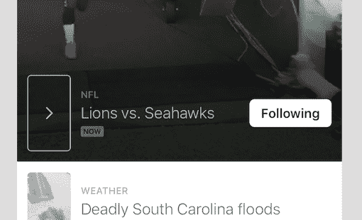

# Twitter 首次亮相时刻

> 原文：<https://web.archive.org/web/https://techcrunch.com/2015/10/06/project-glacier/>

杰克·多西已经重返推特。伴随着他而来的是向更多人展示平台价值的希望。也许他们永远不会发微博。也许他们永远不会跟踪任何人。但希望他们能在一两分钟内赶上。或者数百万人。

如果你听过这句话，请打断我:Twitter 必须[启动其增长](https://web.archive.org/web/20230407053116/https://techcrunch.com/2015/07/28/twitter-monthly-active-users-crawl-to-316m-up-just-15-year-over-year/)。但是怎么做呢？挑毛病容易，想出解决办法就不那么容易了。今天， [Twitter 推出了一个名为 Moments](https://web.archive.org/web/20230407053116/https://blog.twitter.com/2015/moments-the-best-of-twitter-in-an-instant-0) 的功能，它认为这是解决问题的第一步。在 iOS 和 Android 应用程序以及美国的桌面网站上，它是一个新的标签。

## 其他人的推特🐥⚡️

大多数铁杆 Twitter 用户体验这项服务的方式是通过他们的时间线，时间线显示了按顺序发布的内容。如果有人分享了一条推文，那么它也会通过转发显示在你的时间线上。但这意味着习惯性地检查 Twitter，保持应用程序打开或一天多次打开，以确保你不会错过任何东西。抓住瓶子里的闪电——比如一个正在展开的新闻故事——真的很难。但是长期用户已经训练自己去做了。

> **这是一扇前门。这不是新房子。mad Hu Muthukumar**

普通人没有兴趣在任何应用上花那么多时间。句号。因此，成长的需要和时刻如此重要的原因。

正如我所概述的，[大多数人通过实际 Twitter 平台之外的方式消费推文](https://web.archive.org/web/20230407053116/https://techcrunch.com/2015/10/04/this-is-how-most-of-the-world-uses-twitter/)。你可以在 CNN 上看到 Trump 发的推特，或者你可以听到洋基队在 ESPN 获得季后赛席位的消息。当一个监管漏斗(人、算法等)正在消除噪音并向你展示为什么某件事是有趣的，并给出它的完整背景时，很容易从 Twitter 中获得价值。这就是 Moments 要做的——从混乱中创造环境。

## 项目~~闪电~~冰川🐥⚡️

这个项目的内部代号是[“闪电”](https://web.archive.org/web/20230407053116/https://techcrunch.com/2015/06/18/lightning-is-twitters-plan-to-be-event-central-for-users-and-non-users-alike/)，指的是以一种快速有效的方式整合 Twitter 的优势。我喜欢称它为“冰川”，因为它让一切都慢下来，让你有能力环顾四周，而不会感受到一千件其他事情同时发生的压力。Twitter 几个月前测试的“新闻”标签中的少数几个不会受到产品中时刻位置的影响。

您会立即注意到桌面网站上的“瞬间闪电”标签:

和移动:

在移动设备上点击它，您将获得与此类似的体验:

见过 Twitter 趋势列表吗？真的是让人应接不暇。这一切意味着什么？这个标签是干什么的？

有了 iOS 和 Android 的 Moments，所有 Twitter 的脏衣服都不见了。你会看到一个更漂亮的演示文稿，滚动起来很有趣。不是上下，而是左右。它需要更少的互动，实际上根本不需要，这是人们首先会犯错的地方。不一定要关注个人账户，但如果你愿意，可以关注一会儿。

跟随某个时刻会在事件开始时通知您，然后将属于该时刻的内容注入您的时间线。基本上，关注 NHL 的比赛，而不是 NHL 的球队。得到同样的内容。分享一个时刻，而不是一条可能缺乏背景的推文。周围的混乱减少了。

如果 Twitter 知道它现在所知道的，这是它几年前就会推出的功能。幸运的是，用户数据、反馈和轶事让他们现在扣动了扳机。

我最喜欢的一种方式是让你知道你正在讨论的话题的最新进展。如果这个时刻更新了，你可以返回去看看添加了什么。这非常类似于雅虎新闻摘要中的一个功能(披露:我在雅虎工作过一段时间)，这是我最喜欢的应用程序的一部分…你得到了反馈，让你知道你已经完成了。你觉得你完成了一些事情。

时刻可以包含推文、视频、藤蔓和 gif。全力以赴。这是超级推特的开端。我确实注意到潜望镜流不见了，但是你必须相信它们正在路上。此外，如果我们要看到“全文”功能，这也将是它弹出的地方。想[脸书即时文章](https://web.archive.org/web/20230407053116/https://techcrunch.com/2015/05/12/facebook-instant-articles/)。

我喜欢推特，因为我喜欢把我在平台上发现的故事拼凑在一起……我想这就是我想成为一名记者的原因。Moments 的产品经理 Madhu Muthukumar 说，Twitter 已经雇佣了一些具有相同才能的人，但还没有整个新闻编辑室。Muthukumar 补充说，这个功能是为那些尝试过一两次 Twitter 的人准备的，无论出于什么原因，他们都不会坚持使用 Twitter。他还分享了一个有助于指导团队开发产品的趣闻:

> 你必须了解你的观众。我们设计师的一个未婚妻是爱国者队的忠实粉丝。他有周日票，想在 Twitter 上获得所有最佳爱国者的东西。要是每个喜欢爱国者的人都能看到他所看到的就好了。我们开始问自己“怎样才能让每个人都拥有他所拥有的体验？”

这种体验是瞬间的。

首先，该公司将与发射合作伙伴 Bleacher Report、BuzzFeed、娱乐周刊、福克斯新闻频道、Getty Images、Mashable、MLB、美国宇航局、纽约时报、Vogue 和华盛顿邮报一起发布精彩瞬间。发布高质量内容的主流媒体。

值得指出的是，这些东西看起来很容易赚钱，所以新上任的首席运营官·亚当·贝恩最终应该会有机会销售促销商品。

*更多关于时刻对新用户、广告商和出版商意味着什么的信息，请阅读我们的后续报道:
**[关于 Twitter 时刻的 9 大未解问题](https://web.archive.org/web/20230407053116/https://techcrunch.com/2015/10/06/lightning-round/)***

## 公司得救了？🐥⚡️

没那么快。虽然 Moments 是一个巧妙的功能，但它不是银弹…没有什么是银弹。Twitter 将不得不做一些繁重的工作，让人们重新尝试他们可能在很多个月前就已经放弃的产品。

Muthukumar 说这是一个前门；这不是新房子。

换句话说，这是一个好的开始。然而，如果 Twitter 不能足够快地发布新闻，或者他们的合作伙伴因为错误的信息而让他们失望，在政治上倾向于这样或那样，或者不够有趣，它可能会在他们面前爆炸。因为新的前门将开始欢迎人们回来，它也可能关上大门，因为它会给人留下不好的第一印象。

说到不太好的第一印象，桌面网页上的[瞬间](https://web.archive.org/web/20230407053116/https://twitter.com/i/moments)一片混乱。该团队试图以一种视觉上引人注目的方式显示内容，但它无法与移动设备提供的从右到左的流畅滚动相媲美。

虽然我意识到大多数用户将会从他们的手机中出来，但是让你所有的“门”都以同样的方式被描绘仍然是必要的。如果我多年来第一次回到 Twitter，看到上面这些乱七八糟的东西？我要离开那里，再也不回来了。基本上是三条推文被堵在一起，感觉没有意义，这需要我采取行动，点击，才能看到更多。在手机上，我可以看到这一切。

话虽如此，还是有一些东西会把你的目光吸引回桌面网络，比如这些微妙的移动媒体:

## 现在怎么办？🐥⚡️

[杰克·多西重新成为他所创建的公司的首席执行官。](https://web.archive.org/web/20230407053116/https://techcrunch.com/2015/10/05/twitter-names-jack-dorsey-ceo-adam-bain-becomes-coo-dick-costolo-steps-down-from-board/)我们被告知，他从一开始就参与了闪电计划，所以他作为领导者的遗产就像 Twitter 作为一家成长中的公司一样岌岌可危。这里每个人都需要胜利。

最终，是时候让人们在实际平台上消费推文*；暂时忘掉订婚吧。我认为这个版本的 Twitter 已经可以做电视广告了，就像脸书现在做的那样。他们真的把服务人性化了，Twitter 需要做很多。*

我觉得有时候，我不需要解释服务的来龙去脉，Twitter 的员工也一样。人们会看到一个“成品”，这是一个时刻，然后立即明白，有一堆人在背后创造它。事故现场的人们，记者，新闻机构，摄影师等等。

是的，这是一个与 [Snapchat Stories](https://web.archive.org/web/20230407053116/https://techcrunch.com/2013/10/03/snapchat-gets-its-own-timeline-with-snapchat-stories-24-hour-photo-video-tales/) 类似的概念，这里也有[雅虎新闻摘要](https://web.archive.org/web/20230407053116/https://techcrunch.com/2014/01/07/yahoo-launches-news-digest-its-first-app-based-on-summly/)和 [Circa](https://web.archive.org/web/20230407053116/http://www.techmeme.com/150624/p14#a150624p14) 的元素……但没关系，这意味着 Twitter 在过去几年里一直关注内容消费，特别是在移动设备上。因为[下一个](https://web.archive.org/web/20230407053116/https://techcrunch.com/2015/05/26/worldwide-smartphone-growth-to-slow-in-2015-as-china-reaches-saturation/#.m6iein:wzHT)(T8 实际产品的)3 . 16 亿全球用户将来自那里。