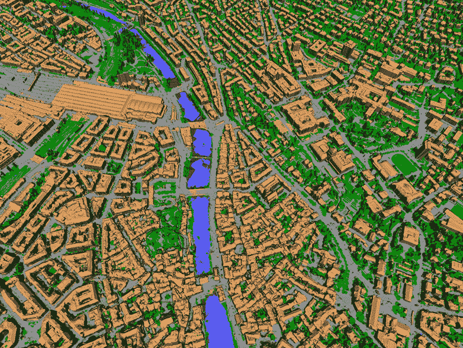

# 该项目从在线收集的图像中以丰富的 3D 形式再现城市 

> 原文：<https://web.archive.org/web/https://techcrunch.com/2017/05/19/project-recreates-cities-in-rich-3d-from-images-harvested-online/>

人们随时随地从各个角度在各大城市拍摄照片和视频。理论上，有了足够多的地图，你可以绘制出每条街道和每栋建筑——等等，我说的是理论上吗？我指的是实践，正如瑞士苏黎世的 [VarCity](https://web.archive.org/web/20221208235952/https://varcity.ethz.ch/) 项目所展示的那样。

这项历时多年的工作从众多在线来源——社交媒体、公共网络摄像头、交通摄像头和航拍——获取了图像，并对其进行分析，以创建该城市的 3D 地图。这有点像谷歌街景的反转:照片不是地图的插图，它们是地图本身的来源。

因为是这样，所以 VarCity 数据格外丰富。随着时间的推移，指向街道的网络摄像头会显示交通流向，人们何时走在上面，以及灯何时会熄灭。从同一栋建筑的不同角度拍摄的照片提供了尺寸数据，如窗户有多大和墙壁的表面积。

 苏黎世联邦理工学院计算机视觉实验室团队多年来创造和调整的算法还可以区分人行道和马路、人行道和草地等。它看起来很粗糙，但那些模糊的边缘和蓬乱的汽车可以很容易地解释和更精确地改装。

这个想法是，你可以在其他大量数据上释放这些算法，并自动创建一个类似的丰富数据集，而不必自己收集它。

[https://web.archive.org/web/20221208235952if_/https://www.youtube.com/embed/gwj4-0uaIms?feature=oembed](https://web.archive.org/web/20221208235952if_/https://www.youtube.com/embed/gwj4-0uaIms?feature=oembed)

视频

“平台可以评估的图像和视频越多，模型就变得越精确，”参与该项目的博士后 Kenneth Vanhoey 在苏黎世联邦理工学院的新闻发布会上说。“我们项目的目标是开发这种 3D 城市模型的算法，假设可用图像和视频的数量在未来几年也将大幅增加。”

几个创业公司已经从这个项目中脱颖而出:Spectando 和 Casalva 提供虚拟建筑检查和损坏分析。Parquery 通过其对城市的 3D 知识实时监控停车位。UniqFEED(另注)监控播放的游戏，告诉广告商和玩家他们在提要中出现了多长时间。

上面的视频总结了这项研究，但下周将出现一个更长的视频，深入研究数据并展示最终的模型。

更新:这是一段完整的视频，更详细地介绍了所使用的资源以及 VarCity 映射技术的应用。

[https://web.archive.org/web/20221208235952if_/https://www.youtube.com/embed/6pjEs84DR6Q?feature=oembed](https://web.archive.org/web/20221208235952if_/https://www.youtube.com/embed/6pjEs84DR6Q?feature=oembed)

视频

为了表扬该表扬的地方，团队的核心是:

*   Luc Van Gool——首席研究员兼教授
*   hayko Riemenschneider——项目负责人和研究员
*   肯尼斯·范霍伊——视频导演和研究员
*   卡洛斯·爱德华多·波尔图·德·奥利维拉——视频动画、编辑和作曲

新的进展将会发布到该项目的 Twitter 账户上。