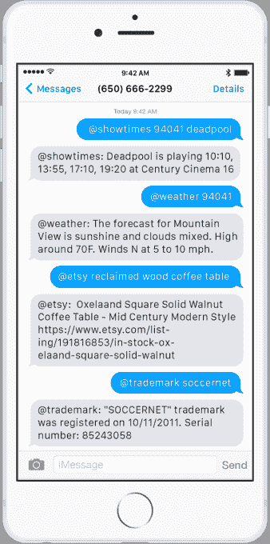

# Prompt 首次推出“现实世界的命令行”

> 原文：<https://web.archive.org/web/https://techcrunch.com/2016/03/07/prompt-debuts-a-command-line-for-the-real-world/>

在一个饱受应用程序过载之苦的世界里，Y Combinator 支持的初创公司 [Prompt](https://web.archive.org/web/20230323011840/http://www.promptapp.io/home) 引入了一种不同的方式来与服务互动，进行购买，甚至控制“物联网”设备——所有这些都是通过基于文本的界面。这款应用可以通过短信、Slack 或网络使用，让你发短信做一些事情，比如请求优步、改变 Nest 恒温器的温度、获取方向、跟踪航班或包裹等等。

这家公司是由汤姆·哈德菲尔德创办的，他早些时候用他的初创公司 Fetch[和前 TechCrunch Disrupt 战地决赛选手](https://web.archive.org/web/20230323011840/https://techcrunch.com/2014/05/05/fetch-launches-mobile-shopping-app/)试验了基于短信的互动[。这项服务是像](https://web.archive.org/web/20230323011840/https://techcrunch.com/2015/04/28/fetch-lets-you-buy-book-or-schedule-anything-from-your-apple-watch/) [Magic](https://web.archive.org/web/20230323011840/https://techcrunch.com/2015/02/23/magic-is-a-startup-that-promises-to-bring-you-anything-if-youre-willing-to-pay-for-it/) 、 [Operator](https://web.archive.org/web/20230323011840/https://techcrunch.com/2015/04/22/the-request-network/#.o0tzqc:gzLB) 和 [GoButler](https://web.archive.org/web/20230323011840/https://techcrunch.com/2015/04/13/gobuttler-nyc/#.o0tzqc:km5n) 这样的服务的竞争对手，可以被视为 Prompt 的先驱，因为它也专注于通过允许用户简单地发送文本来获得帮助，例如购买产品或预订旅行等，从而使任务变得更容易。

Fetch 在筹集了 305 万美元后于去年夏天关闭。根据哈德菲尔德的说法，这项服务增长迅速，保留率和参与度都很高，但团队找不到可扩展的商业模式。

有了提示，原来想法已经改变了。Prompt 不是与礼宾式的服务进行交互，而是提供跨类别的自动化帮助，包括商业、家庭自动化、信息和生产力。这意味着你可以发短信订购优步或达美乐披萨，获取路线，查询航班，阅读新闻或获取天气，在 Yelp 上找到一家企业，获取食谱或管理你的物联网设备，如 WeMo 开关，Hue 灯泡，Rachio 洒水器或 Nest 等。

在推出时，已经有大量的集成，包括优步，AngelList，Bitly，Etsy，Foursquare，谷歌地图，IMDb，WhoIs，韦氏词典，Hue，Powerball，NYT，天气频道，维基百科，WeMo，XE.com，Wolfram Alpha，雅虎财经，Yelp，Zillow 和许多其他的，只是给你一个想法。还有几个正在开发中，包括访问 CrunchBase、Domino's、Evernote、Gmail 和 Google Calendar、PayPal 和 Wunderlist。

你可以访问 www.promptapp.io 上的提示命令目录，或者发短信/list 到 650-666-2299，如果你想自己看的话。

“我们从 Fetch 了解到，当用户确切知道他们想要什么时，用户喜欢文本界面，因为它比加载应用程序更快更容易，”哈德菲尔德解释道。“和许多人一样，我相信对话界面将改变我们与周围世界的互动方式。有一个完整的生态系统需要建立，其规模类似于应用商店。”

同样和 App Store 一样，Prompt 对第三方开发者开放。它的聊天机器人开发工具包(CDK)允许开发者用 30 行代码在 30 分钟内构建聊天机器人。我们被告知，该公司计划在未来提供聊天机器人托管、分析和支付处理。

要使用[提示](https://web.archive.org/web/20230323011840/http://www.promptapp.io/home)，您可以将您的查询发送给服务。但是，您必须使用特定的语法来使查询工作——就像使用命令提示符一样。(因此得名，标语是“真实世界的命令行”)

例如，如果您想要请求优步，提示符会告诉您这是一种方法:

> @uber:发送“@ Uber from[pick-up]to[destination]”以获得费用估计，然后按照指示链接您的优步帐户并确认乘车请求。例子:@uber 从 YCombinator 到 SFO

有时，使用 Prompt 可以比其他方式更快地与各种服务进行交互。

再举一个例子，使用 Prompt 订购达美乐比萨变得容易多了:

> @多米诺大号夏威夷

在 Slack 中写肯定比在 Domino 的移动应用程序中花几分钟浏览六个结帐屏幕要快。

改变 Nest 的温度也很容易:

> @nest 73

或者查看您的邮政编码的天气:

> @天气 94107

也就是说，无法使用自然语言与 Prompt 进行交互可能会阻碍它在更主流的用户群中的采用，即使这有助于它在更倾向于技术的用户群中获得忠实的追随者。(哈德菲尔德说，该团队正在构建自然语言处理，以使命令“不那么脆弱”然而，该服务仍然专注于这种类似“命令行”的交互。)

[gallery ids="1287426，1287425，1287424，1287423"]

在未来，该计划是使它的一些命令“溢价”，这意味着你将支付添加到服务中。该公司还将对即时发生的商业交易收取佣金。

哈德菲尔德说，该团队正在努力将 Prompt 与 Telegram、WhatsApp、微信、LINE、Viber、Skype 和 HipChat 集成在一起，并为真正的极客提供命令行工具。

Prompt 得到了 Y Combinator、社会杠杆集团、资本工厂和斯图尔特·莱文森的支持。尽管 Prompt 是 Fetch 旗下的一家全新公司，但 Fetch 的所有投资者都参与其中。

这家初创公司目前处于公开测试阶段。要测试它，你可以访问 www.promptapp.io 或发短信“嗨”到 650-666-2299。