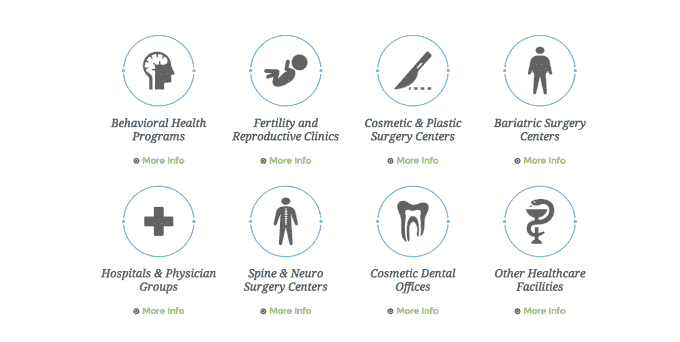

# Prosper Marketplace 以 2100 万美元收购美国医疗保健贷款 

> 原文：<https://web.archive.org/web/https://techcrunch.com/2015/01/27/prosper-marketplace-buys-american-healthcare-lending-for-21-million/>

# Prosper Marketplace 以 2100 万美元收购美国医疗贷款公司

在线贷款公司 [Prosper Marketplace](https://web.archive.org/web/20221207093734/https://www.prosper.com/) 已经同意以 2100 万美元的价格收购美国医疗贷款公司，以进一步丰富其贷款平台。

总部位于盐湖城的[美国医疗保健](https://web.archive.org/web/20221207093734/http://www.americanhealthcarelending.com/)是一个网络，让医生和其他医疗保健提供者能够在他们的办公室向患者提供贷款进行选择性医疗程序。

Prosper 首席执行官 Aaron Vermut 表示:“此次收购是我们战略的重要组成部分，旨在提高知名度，并将我们的产品和能力扩展到新的垂直市场。”。

美国医疗保健贷款采用软件即服务模式，其服务与许多合作伙伴的设施相集成。该公司服务于行为健康项目、生育诊所、美容手术中心、减肥手术中心、美容牙科诊所以及医院和医生团体。

该公司为各种服务发放高达 10 万美元的贷款。美国医疗保健贷款公司首席执行官肖恩·索伦森(Shaun Sorensen)在一份声明中表示:“医疗保健行业正处于大规模变革之中，这将影响数百万消费者的自付费用。

Prosper 在 2014 年 5 月筹集了最后一轮资金，投资者包括 [Phenomen Ventures](https://web.archive.org/web/20221207093734/https://www.crunchbase.com/organization/phenomen-ventures-fund) 、[Institutional Venture Partners(IVP)](https://web.archive.org/web/20221207093734/https://www.crunchbase.com/organization/institutional-venture-partners)和 [Francisco Partners。](https://web.archive.org/web/20221207093734/https://www.crunchbase.com/organization/francisco-partners)

该公司表示，去年，Prosper 通过其平台转移了超过 16 亿美元的贷款，比前一年增长了 350%，仅在 12 月份就在该平台上转移了 2.05 亿美元的贷款。

该平台上的贷款范围从高息信用卡债务的再融资，到购买汽车，到房屋装修。该公司总共为 25 万借款人提供了超过 25 亿美元的贷款。