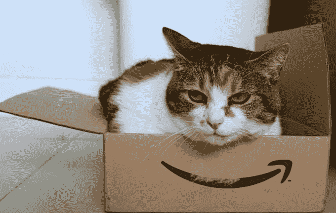

# PSA:亚马逊 Prime 会员优惠 27%，仅限今天 

> 原文：<https://web.archive.org/web/https://techcrunch.com/2015/01/24/psa-amazon-prime-memberships-are-27-off-today-only/>

# PSA:亚马逊 Prime 会员优惠 27%，仅限今天

没有亚马逊 Prime？想要亚马逊 Prime？

你知道什么！亚马逊 Prime 今天打折——相当罕见。

Prime 刚推出时，一年只要 75 美元。2014 年 3 月，他们将价格提高到 99 美元。

今天，为了庆祝亚马逊赢得第 72 届金球奖，[他们将价格降至 72 美元](https://web.archive.org/web/20230128094009/https://www.amazon.com/gp/prime/pipeline/prime_gifting_landing?&ref=Transparentprime)。这大约是 27%的折扣，是我见过的最便宜的 Prime go(除了他们曾经向学生提供的免费会员资格)。

这也是一个真正的 prime 会员，拥有所有通常的 Prime 特权:无限制的[云照片存储](https://web.archive.org/web/20230128094009/https://techcrunch.com/2014/11/04/amazon-prime-members-newest-benefit-is-free-unlimited-photo-storage/)(只要你是会员)，访问 Prime 视频和音乐服务，访问 Kindle 所有者的借阅图书馆(假设你有 Kindle——不只是 iPad 上的 Kindle 应用程序)，以及旗舰功能，大多数(不是所有)亚马逊商品的免费两天送货。

从技术上讲，它只对新会员开放。如果你已经有了 Prime，亚马逊希望你支付标准费用。因为，嘿，他们已经让你着迷了。试图以当前 Prime 会员的身份购买今天的交易会在结账时出现错误。

Twitter 上的一些人报告说，你可以通过禁用 Prime 帐户上的“自动续订”来规避这一限制，然后为自己购买今天的交易作为礼物(发送给自己)，到达日期设置为 Prime 帐户到期后的一天。这几乎肯定是可行的(当亚马逊准备提高价格时，同样的策略也是可行的)——但是这一点点工作是否过于粗略取决于你。

你可以在这里找到[打折优惠页面。](https://web.archive.org/web/20230128094009/https://www.amazon.com/gp/prime/pipeline/prime_gifting_landing?&ref=Transparentprime)

[via [Slickdeals](https://web.archive.org/web/20230128094009/http://slickdeals.net/f/7616776-1-year-amazon-prime-membership-72-new-members-only)