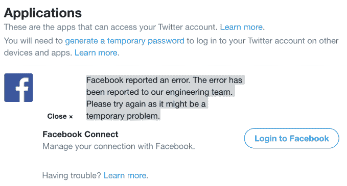

# PSA:从今天起，自动交叉发布推文到脸书不再有效

> 原文：<https://web.archive.org/web/https://techcrunch.com/2018/08/01/psa-cross-posting-tweets-to-facebook-no-longer-works-as-of-today/>

# PSA:从今天起，自动交叉发布推文到脸书不再有效

你不能再自动交叉发布你的推文到脸书。Twitter 今天宣布，该功能现在即将结束，如果用户想在脸书分享一条推文，他们将不得不复制一条推文的 URL。在一份声明中，该公司将这一变化归因于最近的脸书更新。

具体来说，这个问题与脸书对其 API 平台的封锁有关——这是继[剑桥分析公司丑闻](https://web.archive.org/web/20230329090625/https://techcrunch.com/tag/cambridge-analytica/)多达 8700 万脸书用户的[数据被不当获取和共享之后正在进行的一次彻底检查。](https://web.archive.org/web/20230329090625/https://www.nytimes.com/2018/04/04/technology/mark-zuckerberg-testify-congress.html)

自那以后，脸书一直在堵塞其 API 平台的漏洞，以防止未来的数据滥用。其中一个变化涉及脸书登录，[早在四月份](https://web.archive.org/web/20230329090625/https://developers.facebook.com/blog/post/2018/04/24/new-facebook-platform-product-changes-policy-updates/)就宣布了。该公司表示，被授权以登录用户身份向脸书发布帖子的应用程序将不再拥有该权限。新的应用程序在宣布改变的当天将不能使用这一功能。对于较旧的应用程序，许可将于 2018 年 8 月 1 日撤销，也就是今天。

脸书还表示，之前使用该 API 的开发者可以转而使用脸书的网络共享对话框。但是推特的声明并没有提到除了使用现有的“复制推特链接”功能之外，还有一种内置于推特的替代分享方式。当然，这是一种手动分享推文的方式，并不能替代正在丢失的内容。

到目前为止，设置脸书共享的选项还没有从 Twitter 的应用程序中完全消失。

脸书仍然通过网络出现在“应用”部分，按钮“登录脸书”似乎在等待点击。但是，该选项从今天起将不再有效。相反，它返回错误:*“脸书报告了一个错误。这个错误已经报告给我们的工程团队。请重试，因为这可能是一个临时问题。*

鉴于这种情况，Twitter 用户寻找其他解决办法似乎也不会有多大成功。其他应用程序，比如 IFTTT，也在今天抛出错误。

