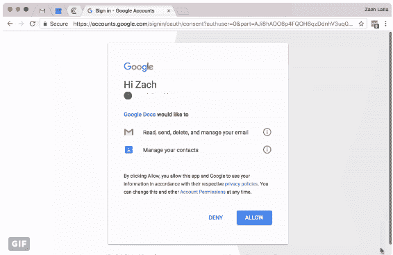

# PSA:这个谷歌文档的骗局正在迅速蔓延，并将向你认识的每一个人发送电子邮件

> 原文：<https://web.archive.org/web/https://techcrunch.com/2017/05/03/psa-this-google-doc-scam-is-spreading-fast-and-will-email-everyone-you-know/>

# PSA:这个谷歌文档骗局传播很快，会给你认识的每个人发邮件

几个小时前，一个新的 Google Docs 网络钓鱼骗局刚刚浮出水面，它正在像野火一样蔓延。谷歌似乎正在采取行动阻止它，但与此同时:现在要超级，超级警惕谷歌医生的邀请。如果你中了这一招(很多目光敏锐的人已经中了)，它会向你联系人列表中的每个人抛出诱饵。

你需要知道的是:

*   点击这个链接会把你带到一个真正的谷歌托管页面，上面有一个你的谷歌账户列表，随时可以点击
*   它要求你选择一个账户，并提供一个名为“谷歌文档”的应用程序——是的，他们以某种方式被允许将第三方应用程序命名为“谷歌文档”——并提供账户权限
*   只要你点击“允许”按钮，这个实际上并不完全是谷歌文档的应用程序现在就有权阅读你的电子邮件并给你所有的联系人发电子邮件……后者几乎会立即开始，将蠕虫病毒传播给你发过电子邮件的几乎所有人。

这个*超级*鬼祟；几乎唯一能在上当之前发现它的方法就是点击实际谷歌托管页面上的小“谷歌文档”链接*，注意开发者信息似乎……关闭了。*

Hack Club 的 Zach Latta 抓了一个全流程的视频，这样你就不用测试命运自己去看了:

## 我怎么知道我是否被击中了？我如何修理它？

检查你的谷歌账户的[应用权限](https://web.archive.org/web/20230123111950/https://myaccount.google.com/permissions)。那里*不应该*有一个叫“Google Docs”的应用——实际上*Google Docs 默认可以访问你的账户。如果你看到它列在那里，通过点击标签和点击“删除”来删除它*

**更新:**Google Docs Twitter 账户刚刚承认了此次攻击，并表示他们正在处理，但同时表示不要点击任何东西。

**更新:**谷歌[表示，现在应该阻止这种特定的攻击](https://web.archive.org/web/20230123111950/https://techcrunch.com/2017/05/03/heres-googles-official-statement-on-todays-fast-spreading-phishing-attack/)，他们正在努力防止类似的攻击继续发展。