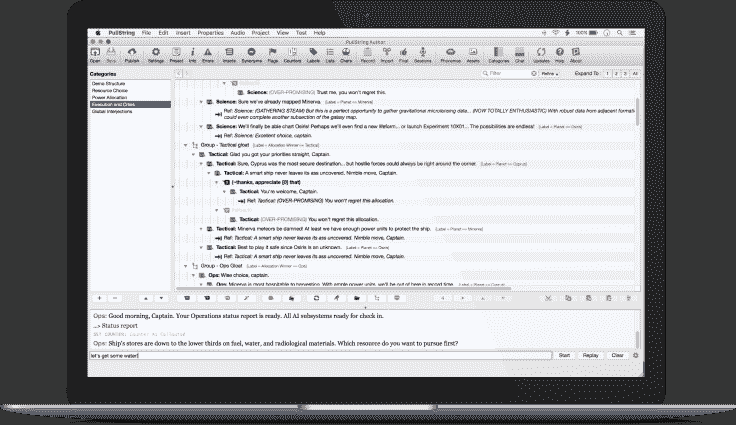

# Pullstring 推出有趣且有利可图的机器人创作工具 

> 原文：<https://web.archive.org/web/https://techcrunch.com/2016/09/27/pullstring-bot-authoring-tools/>

[pull string](https://web.archive.org/web/20230127141218/https://pullstring.com/)—[née toy talk](https://web.archive.org/web/20230127141218/https://techcrunch.com/2016/04/26/pullstring-bot-authoring/)—今天发布了它的同名产品，从私人测试版到各地对话界面的创造者手中。开箱即用，创作者可以为 Facebook Messenger、Slack、Skype、Kik、Telegram 以及几乎所有其他平台制作机器人——使用该公司的 Web API。

该公司的创作工具以桌面软件包的形式出现，今天将可用于 Mac OS X 平台，Windows“即将推出”

## 娱乐和商务聊天机器人

你知道你不是在和一个真正的人说话…或者你知道吗？假面合成聊天机器人的截图，它偷走了我生命中比它应有的更多的时间。这是值得的。

Pullstring 首席执行官柳文欢·雅各布说:“这个周末，我们迄今为止看到的聊天机器人的最佳范例之一作为第四频道[人类](https://web.archive.org/web/20230127141218/http://www.channel4.com/programmes/humans)电视节目的一部分推出它很受欢迎，并且吸引了大量的关注。"

急于检验机器人的质量，我一头扎进了人工合成人物的世界，不好意思地说，我本来打算写这篇文章的时候，我却在和一个聊天机器人进行有趣的对话([试试看，这很棒](https://web.archive.org/web/20230127141218/https://www.messenger.com/t/PersonaSynthetics/))。雅各布声称，不要误解我的意思，机器人不会通过图灵测试，但尝试这样做是一个不同的计算领域。

雅各布抱怨道:“我经常说，角色更好的定义是他们不能谈论的事情，而不是他们知道什么。”他做了一个比较，当你从披萨店订购披萨时，你可以开始谈论汉堡。一个人工操作员会被激怒，提醒你他们是一家比萨饼店。机器人也这样做是有道理的。“当谈话偏离主题时会发生什么很重要。有了 Pullstring，我们创造了范围广泛的机器人。例如，当你和你的银行谈论金融问题时，我们必须保持对话的紧凑和中肯。另一个极端是我们的 [Hello Barbie](https://web.archive.org/web/20230127141218/https://www.toytalk.com/product/hello-barbie/) 产品，孩子们可以谈论几乎任何事情。”

## 规则+人工智能=更聪明的机器人

在不久的将来，你可以和你的披萨机器人说话，让 Flirtey 的无人机把披萨送到你家。活着是多么美好的时光。无人机送货初创公司 Flirtey 开发了一种无人机，为达美乐(Domino's)运送热披萨。

新推出的 Pullstring 是一套工具，可以帮助开发者和内容创作者尽快创建引人注目的机器人和对话界面。也许最令人信服的是，互动是自我学习。通过使用简单规则和机器学习人工智能的结合，机器人可以进行真实而有用的对话。不仅如此，机器学习还可以帮助进行上下文相关的对话。

“我们与动视暴雪合作[帮助为《使命召唤:无限战争》中的角色之一雷耶斯少尉](https://web.archive.org/web/20230127141218/http://www.ibtimes.com/how-call-duty-infinite-warfare-used-facebook-bots-reveal-details-first-trailer-gamers-2363549)创造一个机器人，”雅各布告诉我，试图解释这项技术为了创造一种真实的氛围可以走多远。“为了获得对话的真实感受，我们将我们的人工智能指向了一个大型的使命召唤子编辑。我们从那里使用的语言中了解到玩家是如何一起交流的。因此，机器人说话的方式与游戏玩家相似。我们匹配了基调，创造了非常可信的体验。”

我已经有一段时间没有玩多人游戏了，但人们只能假设“pwned”和各种诋毁已经从话语中过滤掉了。不过，它的效果很好:在最初的 24 小时内，[通过 Facebook Messenger 交流了超过 600 万次聊天](https://web.archive.org/web/20230127141218/http://venturebeat.com/2016/05/03/call-of-duty-infinite-warfares-first-victory-6m-bot-messages-on-facebook/)，粉丝们急切地等待着这款游戏在 11 月推出。

## 度量和智能学习

Humani: Jessie 的故事是一个基于与 Jessie 来回传递消息的互动游戏，试图帮助她获得新的男朋友，新的工作和公寓。的确是忙碌的一天。

基于规则的对话是将对话产品推向市场的好方法；这是这次经历的梗概。然而，随着数百万客户开始对话，从这些互动中学习变得可能。

Pullstring 的平台包括度量工具，帮助分析对话界面的执行情况。除了显而易见的部分，如警告机器人的创造者客户在对话中陷入困境，还有一些方法可以优化对话，以实现特定的目标或结果。

然而，该平台的超级能力在于，它在较长的对话中保持上下文感知，因此你与客户的对话不太可能消失在杂草中。

## 这(不仅仅)是娱乐

游戏是 Pullstring 技术的早期采用者，包括该公司自己的 Facebook Messenger 和 Skype 游戏 [Humani](https://web.archive.org/web/20230127141218/https://pullstring.com/product/humani/) 和[该公司 ToyTalk 品牌下的许多针对更年轻儿童的游戏](https://web.archive.org/web/20230127141218/https://toytalk.com/)。然而，认为这一切都是为了娱乐是错误的。

Jacob 解释道:“我们的目标是创建人性化的对话。“我们从娱乐开始，但这不是这项技术的主要目的。我们的客户正在构建健康、商业等领域的互动。”

然而，有一个很强的相似之处:在娱乐中，角色和叙事是唯一重要的事情——但同样的事情在与商业和企业机器人的互动中也变得越来越重要。对着电脑说话一点也不好玩——毕竟，上一次按 2 输入英语让你高兴得尖叫是什么时候？让对话感觉更人性化、更有对话性是一种更自然的对话方式。

“谈话不仅仅是他说她说的，”雅各布说。“多了去了。当你听两个人之间的真实对话时，会有大量的变量。对话是带着某种意图开始的:有人想完成某件事。当然，内容也很重要。他们一起创造了一个对话。”

除了正在说的实际单词之外，该公司还深入语言学领域，模拟真实的对话。最重要的是，还有语言层面的互动。真正的对话不是 A 人说完他们说的话，B 人在给出深思熟虑的答案之前仔细倾听。这是一个来回的游戏，是感叹词、疑问、提示和建议的游戏。这就是 Pullstring 试图在你与你的披萨店、你的发型师或者潜在的给你的汽车开罚单的自动计价器女服务员交谈时帮助促进的最终目标。又来了。

## DIY 或引导服务

随着今天的发布，Pullstring 提供了 DIY 解决方案，那些想要创作对话界面的人可以开始使用，或者更受管理的代理风格的选项。

“我们有教程、样本代码和样本电子商务解决方案，”Pullstring 的对话工程主管卢卡斯·艾夫斯(Lucas Ives)说。他说，在 Pullstring 的过去五年里，该公司比任何人都更了解如何让计算机假装人类对话，并且它渴望最大限度地向客户传递知识，“你可以观看视频，有一个巨大的文档库，我们的支持团队也在这里提供帮助。”

对于较大的客户，该公司继续提供其代理模式，该公司的作家和内容创作者可以与内部团队合作创建机器人。

从今天开始，Pullstring 的创作工具可供所有人使用，该公司在网站上[对其主要功能进行了概述。](https://web.archive.org/web/20230127141218/http://docs.pullstring.com/docs/key-features)