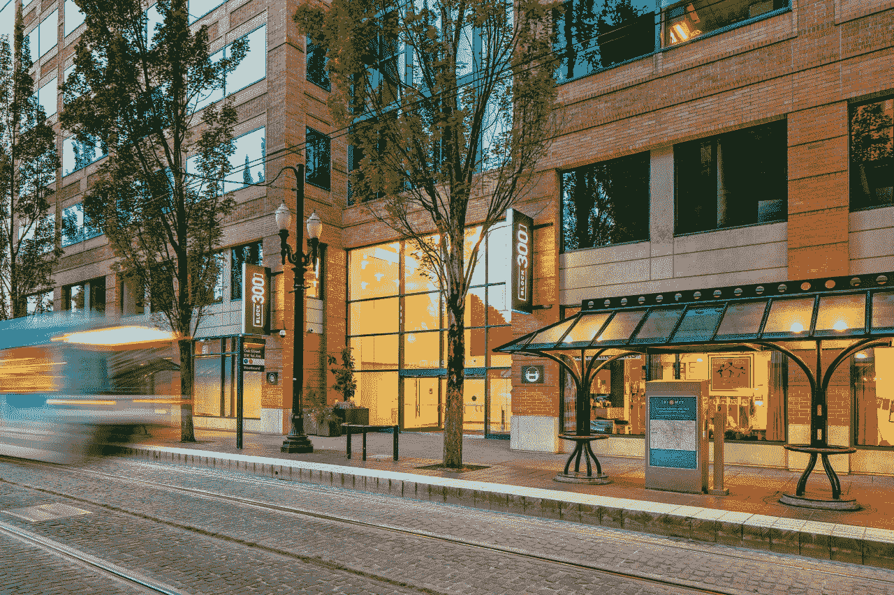

# Puppet Labs 从硅谷银行 TechCrunch 获得 2200 万美元信贷

> 原文：<https://web.archive.org/web/https://techcrunch.com/2016/01/20/puppet-labs-secures-22m-credit-from-silicon-valley-bank/>

# Puppet Labs 从硅谷银行获得 2200 万美元信贷

俄勒冈州波特兰市。总部位于 DevOps 的公司 [Puppet Labs](https://web.archive.org/web/20221208143338/https://puppetlabs.com/) 今天[宣布](https://web.archive.org/web/20221208143338/https://puppetlabs.com/blog-categories/company-news)它已经从硅谷银行获得了 2200 万美元的信贷额度。

此外，该公司今天任命前基因泰克首席财务官 Lou Lavigne 进入董事会，他将成为审计委员会的主席，这是一个关键的角色，因为它要为未来的 IPO 做准备。

虽然对于一家初创公司来说，获得大额信贷并非闻所未闻，但这确实有点不寻常。我询问了该公司的首席执行官卢克·卡尼兹(Luke Kanies)关于他决定获得信贷而不是寻求更多风险资金的问题。他告诉我，Puppet 不打算花钱，因为它仍有上一轮融资的一半资金存在银行，预计很快就会出现正现金流。

“这笔钱不会被用来资助增长，而是用来降低风险，”他告诉我。“如果你看看今天的市场，我认为我们处于非常有利的位置。即使事情变得不可思议，我们仍然有现金来运营我们的业务。”

尽管如此，Kanies 也承认，他认为万一经济衰退或其部分计划失败，木偶实验室可以使用更多的缓冲。

木偶实验室今天也宣布，它正在扩大。它签署了一份最少增加 37，500 平方英尺到它在[波特兰海滨](https://web.archive.org/web/20221208143338/http://www.block300.com/)的总部。目前的办公室占地 75，000 平方英尺，新租约将于 2018 年生效。

