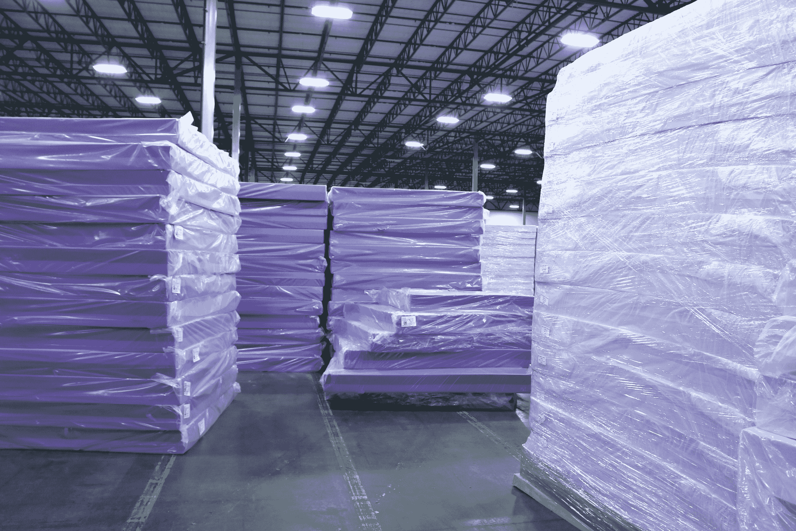
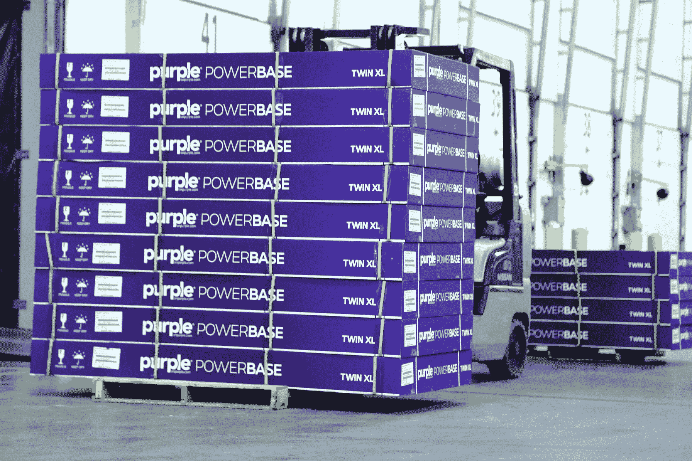

# 你可能从未听说过的犹他州床垫初创公司 Purple 正在走向独角兽世界

> 原文：<https://web.archive.org/web/https://techcrunch.com/2017/04/13/purple-a-utah-mattress-startup-youve-probably-never-heard-of-is-on-track-to-unicorndom/>

如果你生活在湾区泡沫中，你可能从未听说过这家公司，但 Purple，一家完全自力更生的床垫初创公司，正在使用无毒的专利技术实现无压睡眠——并可能成为床垫独角兽中的第一家。

距离硅谷近 1000 英里，就在犹他州大盐湖的西面，在一个几乎不知名的地方，是宁静的奶牛小镇格兰茨维尔，人口[9617](https://web.archive.org/web/20230325133058/https://www.google.com/search?q=grantsville+utah+population&oq=granstville+utah+popu&aqs=chrome.1.69i57j0l2.4848j0j1&sourceid=chrome&ie=UTF-8)。它就在那里，在一个加起来有八个沃尔玛那么大的仓库里，你会发现[紫色](https://web.archive.org/web/20230325133058/https://onpurple.com/)，一家直接面向消费者的床垫初创公司，正在努力准备成千上万的枕头、电源座，当然还有床垫，准备发货。

该公司十年前开始做轮椅生意。它正在制造一种专利缓冲技术，以防止整天坐着的人产生褥疮。但是创始人(和兄弟)托尼和特里·皮尔斯注意到床垫领域的转变。它正走向在线，像 Casper，Tuft and Needle，Leesa 和其他一些初创公司开始涌现。因此，三年前，两人决定利用这一趋势，使用轮椅缓冲垫中使用的相同技术来制作自己的床上用品。

事实证明，这是一个明智之举，公司也因此成长了不少。就在去年，Purple 的团队从 30 人发展到 600 人，在 Grantsville 建立了前面提到的 574，000 平方英尺的制造工厂，据我所知，销售额直线上升。

Purple 目前正在努力完成其新推出的 27，000 个枕头的订单，尽管这家初创公司不愿透露数字，但有消息人士告诉我，今年的收入将达到 1.5 亿至 2 亿美元。相比之下，其最大的竞争对手 Casper 在 2016 年的累计销售额达到了 1 亿美元，据报道，T8 有望在今年年底达到 2 亿美元。

*更新:Casper 表示，去年销售额突破 2 亿美元大关，迄今总收入达到 3 亿美元。*

但是，与迄今已获得 7000 万美元资金的 Casper 不同，Purple 尚未获得风险投资。它还拥有自始至终的制造过程。犹他州的土地和劳动力都很便宜，床垫初创公司可以以比湾区竞争对手低得多的成本制造产品。

对于格兰茨维尔这个没有太多工作机会的小镇来说，这也是一个巨大的就业机会。紫色很快将成为那里最大的雇主，计划再雇用几千人，并与当地的高中和培训机构合作，为当地人提供他们在不久的将来需要在仓库帮忙的技能。

成千上万的紫色床垫堆放在新的 574，000 平方英尺的仓库里。

公司总部位于南边一个小时车程的阿尔派因镇，正好位于犹他州的瓦萨奇前线下方，这是一条从奥格登到普罗沃的山脉，由于该州过去几年蓬勃的科技发展，这条山脉蜿蜒而上，被称为“硅坡”。

几只独角兽点缀着这一地区，包括 Pluralsight、Domo 和 Accel Capital 迄今为止最大的投资 Qualtrics，后者本周刚刚获得了高达 25 亿美元的估值。

紫色公司的首席执行官山姆·伯纳兹认为，他的公司正在成为该地区下一个价值 10 亿美元的创业公司，如果这些销售额有任何迹象，他可能是对的。尽管 Purple 目前还没有从投资者那里获得任何现金，但 Bernards 告诉我，他已经收到了一些来自硅谷的询价，他会考虑在不久的将来帮助公司扩大规模。

犹他州格兰茨维尔紫色新床垫厂的工人们正在卷起床垫。

这些床垫的价格与卡斯帕的接近。例如，一张特大床要 1300 美元。卡斯帕国王坐在稍低于 1150 美元。然而，对于该领域的其他人来说，这是高端产品。另一家位于凤凰城的床垫初创公司 Tuft and Needle 的这种尺寸售价为 750 美元。

伯纳兹认为，紫色属于另一个领域。首先，它是为防止褥疮而设计的，所以对于那些长时间待在被窝里的人来说，这是个不错的选择。Purple 总共使用了 16 项专利，使其床垫足够柔软，可以拥抱你的身体，但又足够坚固，可以整夜抱着你。而且，万一有世界末日，你可以吃它们。超弹性床垫材料由食品级聚合物制成，不含乳胶或其他有毒成分。

我最近去犹他州时亲自测试了这款产品。我能描述它的最好方式是躺在一堆超级软的果冻上，但是没有地震波活动。它的舒适度比得上 Casper(我也试过)和我家的布鲁克林床垫。我身体的每个压力点都被我下面这种果冻状的网状材料支撑着，这种材料允许更长时间的舒适和透气性，所以你也不太可能在被子下出汗。

紫色还为那些想亲自试用的人提供 100 天退款保证，并表示每张床垫应该可以使用大约 10 年，或者说大多数人开始寻找新床垫的平均时间。

Purple 的 powerbases 可以让顾客将床垫移动到坐姿或睡姿。

但也不是没有激烈的竞争。Casper 是在线床垫初创公司，在我询问的旧金山人中，它的品牌认知度最高。根据 [Inc.](https://web.archive.org/web/20230325133058/https://www.inc.com/magazine/201603/liz-welch/casper-changing-mattress-industry.html) 的数据，美国有 600 多家床垫公司，其中几家有实体店，你可以在那里试用床垫，并与销售人员聊天。

然而，紫色似乎是全速前进。当然，它必须加快速度来完成这些过期订单，但将当前的增长和兴趣、制造过程的所有权、更廉价的劳动力市场、独特的品牌和良好的销售与未来进入全球销售的计划相结合，再加上一些风险投资基金来帮助它扩大规模，Purple 可能会超过所有其他公司。

观看上面的视频，深入了解紫色为格兰茨维尔镇做了什么，并与首席执行官就床垫业务进行了交谈。

**本文是关注犹他州科技场景的大型系列文章的一部分。在接下来的几周里，我们将在 TechCrunch 的新闻提要中散布一些这样的文章和视频，所以请系好你的滑雪靴，继续关注我们引导你通过“硅斜坡！”*