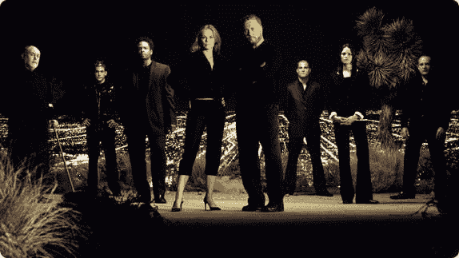
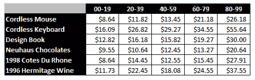
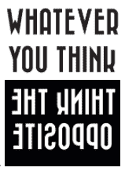

# 将偏见付诸实践可能是更好的投资决策策略

> 原文：<https://web.archive.org/web/https://techcrunch.com/2017/07/04/putting-biases-to-work-can-be-a-strategy-for-better-investment-decision-making/>

拉希德·萨巴撰稿人

More posts by this contributor

生活中最重要的技能是正确的决策。然而，我们从未被教导如何做出好的决定。相反，我们从一个错误跌倒到下一个错误，满怀希望地走向“智慧”。

更糟糕的是，其他人利用我们的偏见获利。营销人员利用行为心理学设计广告和网站，让我们不断点击和购买:想想闪购、冲动购买和名人代言。由此我们得出结论，人类的偏见使我们变得软弱。最佳行为是抑制情绪，而是像计算机一样做出经过计算的、理性的决定。

但是如果我们换个角度思考认知偏差会怎么样呢？如果我们把它们视为数十亿年进化的恩惠呢？它们允许我们从少数实例中发现模式，想象我们从未见过的事物，并在不断变化的环境中稳健地运行。我们能设计出既有人类偏见的好处又没有缺点的决策过程吗？我们能驾驭非理性变得更加理性吗？

我相信我们可以。我们可以变得“后理性”，利用而不是压制我们的偏见。我提供将我们认知上的弱点转化为优势的策略。鉴于我作为对冲基金经理的经验，我专注于投资领域，但我坚信这种思维会转移到其他需要平衡理性和直觉的领域(例如，情报行业、医疗诊断、招聘、创业等)。)

**预抵押**

我们天生喜欢讲故事。我们创造故事来理解任何事物:过去、他人、我们自己。我们甚至创造故事来解释无法解释的事情，比如每天的股市波动。故事通过让事情看起来不那么随机来提供安慰。

但故事可能会让我们陷入投资困境。负责投资总计数十亿退休账户的专业人士告诉我，他们不会投资超重的首席执行官，因为这表明缺乏纪律性。其他人告诉我的情况正好相反:他们投资超重的首席执行官，因为这表明他们极度专注。事实很可能是体重和表现没有什么关系。

这里发生的事情很常见:我们从很少的数据点进行归纳，并创建叙述来合理化我们所看到的。我们非常擅长讲故事，以至于我们可以对遇到的任何事情做出“解释”。

我们如何更好地利用我们讲故事的天赋？或许，我们可以利用故事来识别新的风险，而不是创造故事来“解释”我们所看到的。

例如，假设我们正在评估是否投资一家公司。为了识别潜在的问题，通常会问“这项投资怎么会出错？”这个问题依赖于我们引出风险的理论或预测技巧。

相反，如果我们想象我们生活在一个投资已经出错的世界，然后我们写一个故事来解释发生了什么呢？[研究](https://web.archive.org/web/20230328022125/http://onlinelibrary.wiley.com/doi/10.1002/bdm.3960020103/abstract)表明，这种解释未来哪里出错的技术——一种“预判”——比询问事情可能如何出错产生了更丰富的解释。它运用了我们讲故事的技巧，要求我们想出故事，我们知道这是自然而然的。

用你目前正在考虑的一个决定来试试吧:讲述一下事情是如何变糟的。你可能会发现重要的新风险，并制定应对这些风险的措施。

**校准培训**

我们过于自信了。90%的人认为自己[高于普通司机](https://web.archive.org/web/20230328022125/https://80000hours.org/2012/11/do-you-think-you-re-better-than-average/)。75%的基金经理认为他们的业绩高于平均水平。我们相信我们比实际上更有技能，我们知道的比实际做的多。

这是投资的问题。过度自信导致我们不准确地量化预测的不确定性。相对于所涉及的不确定性，我们最终会押下过大的赌注。

更糟糕的是，投资分析师做出的预测需要几个季度或几年才能解决。所以我们很久以后才知道我们是对还是错。相比之下，扑克玩家或气象学家可以立即得到他们预测的反馈。

也许我们可以创造反馈环境来改善我们的预测。[研究](https://web.archive.org/web/20230328022125/http://www.sciencedirect.com/science/article/pii/0030507380900525)表明，校准培训对抑制过度自信是有效的。一种方法包括量化我们围绕大量琐事问题的不确定性，例如，你有多确定牛顿在 1650 年后写了《原理》？在几十个问题之后，你会开始对你不确定性的真实程度有一个更好的感觉。为了减轻过度自信，我们需要不断向自己展示我们知道的是多么少。

**抛锚到对面**

假设我让你为一瓶酒出价。但是首先，写下你的社会安全号码的最后 2 位数。这两个数字会影响你的出价吗？[实验](https://web.archive.org/web/20230328022125/https://youarenotsosmart.com/2010/07/27/anchoring-effect/)已经证明确实如此；下表显示了学生根据他们的社会保险号(列)的最后两位数对物品(行)的出价。

学生们声称这些数字对他们的出价没有影响。但是表格显示了一个很大的影响:数字最大的学生比数字最小的学生多出价 3 倍！结论是，我们的决策会受到我们事先接触到的东西的潜意识影响。

这种锚定效应会损害投资。例如，我们可能会过度受我们购买股票的价格的影响，并持有它以避免实现损失。或者，在确定杠杆水平时，我们可能会锚定最近的波动水平，在波动性较低时将更多风险堆积到投资中。

如果我们受到决策前刺激的过度影响，那么控制和预先选择最佳刺激是非常有意义的。而最好的刺激是什么？嗯，做决定的困难不在于从一系列选择中做出明智的选择，而在于想象我们实际拥有的所有选择。考虑对立面的简单协议有助于扩大考虑的备选方案集，避免狭隘的框架。

我相信，在做出决定之前，最好的刺激是那些容易考虑到相反情况的刺激。因此，举例来说，我们可能会在重要会议上指定一个“相反的思考者”。或者，我们可能会在会议室安装物理提示(如下图),提醒我们从相反的方向思考。

我们的认知偏见受到很多负面报道，但是，它们是生存工具。虽然我们在办公室的电脑前消磨时间，但这并不意味着我们的生存工具不好或无关紧要。相反，我们可以创造性地重新设计我们的环境来利用这些工具。这样做让我们变得后理性，为了我们自己的利益收回这些偏见。