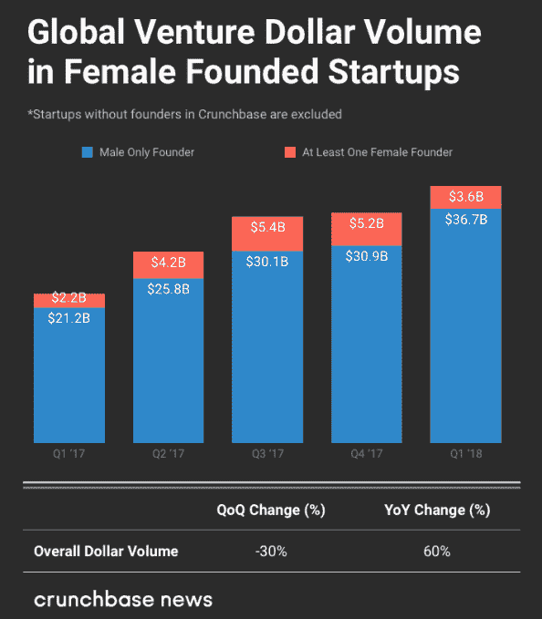
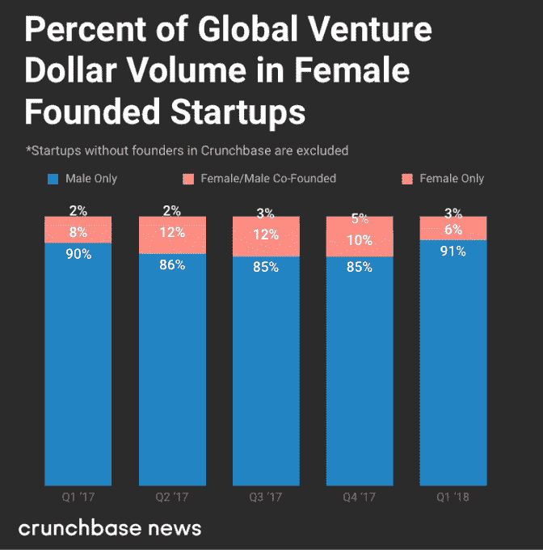
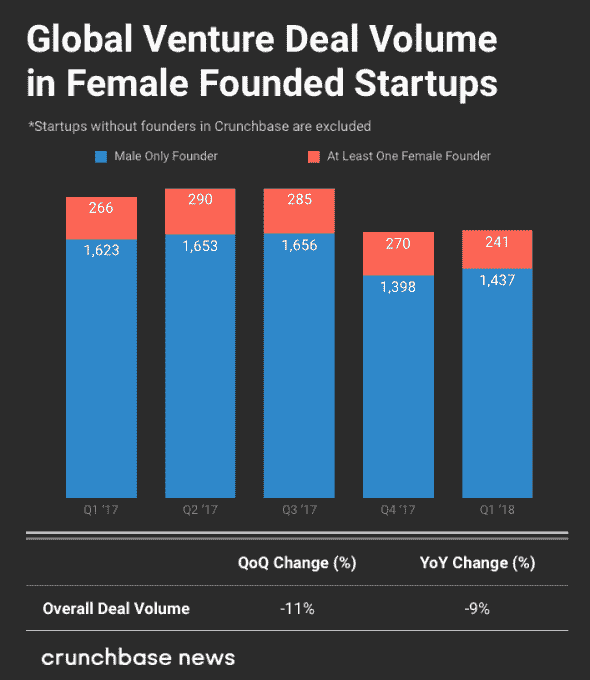
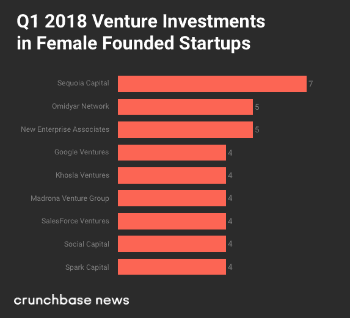
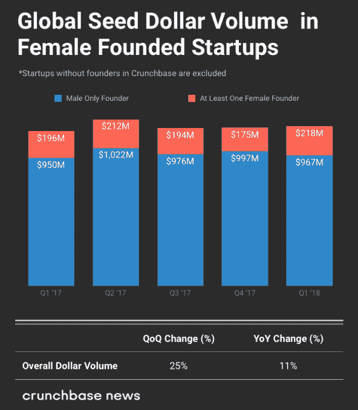
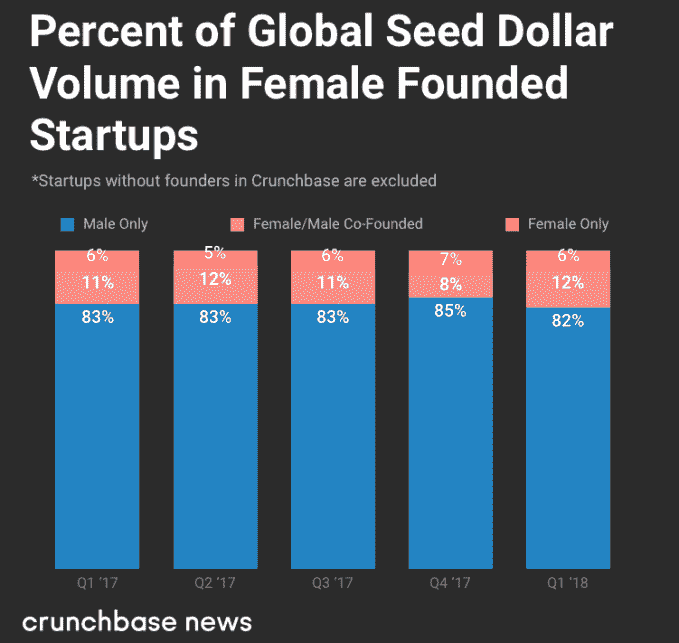
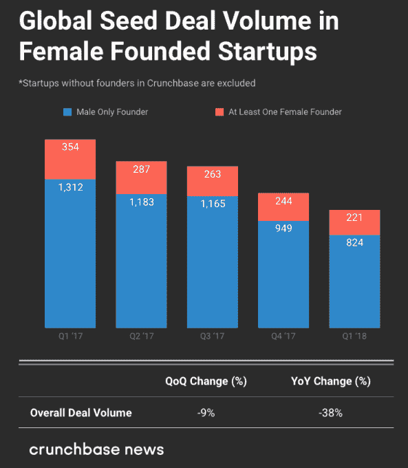
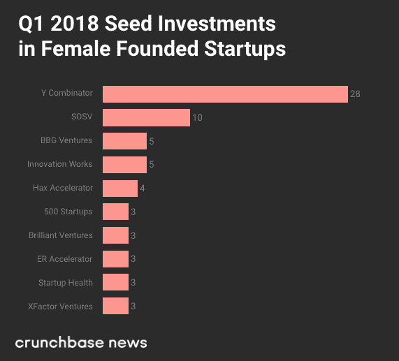

# Q1 2018 年全球多元化投资报告:女性创始人的投资趋势

> 原文：<https://web.archive.org/web/https://techcrunch.com/2018/04/17/q1-2018-global-diversity-investment-report-investing-trends-in-female-founders/>

More posts by this contributor

在这份报告中，我们观察了过去五个季度女性创业公司的风险和种子投资趋势。在这段时间内，我们研究了超过 9119 笔风险交易和 6802 笔创始人相关公司的种子交易。

首先，在 2018 年 Q1 奥运会上，36 亿美元投资于至少有一名女性创始人的公司。这一结果比 Q1 2017 年的 22 亿美元增长了 60%，但比 2017 年第四季度下降了 30%。我们完全预计，随着该季度追溯性地增加更多资金，这一数额将会上升。

总体而言，投资于至少有一名女性创始人的公司的资金仅占 2018 年 Q1 奥运会风险投资的 9%。这比 Q1 2017 年 10%的结果低了一个百分点。2017 年第二、第三和第四季度的百分比也较高:分别有 14%、15%和 15%的风险投资美元投入了这些季度。

然而，当我们缩小标准时，数字就下降了。在 2018 年 Q1 中，3%的风险资金投资于单身女性创始人。

从交易量的角度来看，2018 年 Q1 奥运会有 14%的风险交易包括至少一名女性创始人。这一结果反映了一年前 Q1 2017 年的数据。然而，与我们在查看 2017 年有女性和没有女性的团队之间的美元交易量细分时看到的情况一致，中期季度显示交易数量较高，占所有风险交易的 15%和 16%。

## 值得注意的交易

虽然交易和美元数量的进展会令许多人失望，但数据中有许多有趣的交易，我们想强调一下。然而，出于篇幅的考虑，我们选择了三个来分享。

以下是 2018 年 Q1 奥运会上与女性创始人达成的引人注目的风险投资交易，这些交易引起了我们的注意:

*   Glossier :一家总部位于纽约的直接面向消费者的美容公司，由艾米丽·维斯创立。Glossier 筹集了 5200 万美元的 C 轮融资。指数创投和机构创投合伙人领投了 C 轮融资。
*   [DataVisor](https://web.archive.org/web/20230323153425/https://www.crunchbase.com/organization/datavisor) :一家总部位于硅谷的反欺诈公司，由两位女性创始人谢和领导。DataVisor 融资 4000 万美元 C 轮。红杉资本中国领投了这轮融资，之前的投资者 NEA 和 GSR Ventures 也参与了。
*   [Zum](https://web.archive.org/web/20230323153425/https://www.crunchbase.com/organization/liftee) :由 Ritu Narayan 创建的一家为经过严格审查的司机的孩子的父母提供预定点播服务的公司。Zum 从 Spark Capital 筹集了 1900 万美元的 B 轮融资，之前的投资者红杉资本和 AngelPad 也参与了融资。

接下来，我们将转向谁在开支票。或者更准确地说，哪些公司正在投资女性创始人的公司。

## 女性创始人的主要风险投资者

在至少有一名女性创始人的初创公司中，投资者的交易数量最多，包括红杉资本(Sequoia Capital)和奥米迪亚网络(Omidyar Network)和新企业联盟(New Enterprise Associates)的投资，分别为 2018 年 Q1 奥运会的五项投资。

但是，当然，投资者有不同的关注点，特别是当涉及到创业成熟度的时候。因此，为此，我们将把投资细分为女性创始人处于某一特定阶段的公司。

## 对女性创始人的种子投资

2018 年，至少有一名女性创始人的种子基金公司在 Q1 筹集了 2.18 亿美元。这占该季度种子资金总额的 18%，高于 2017 年第四季度的 15%和 2017 年 Q1 的 17%。

总的来说，seed 是风险投资的领先指标，从 2009 年我们开始衡量这些趋势以来，以绝对美元计算，seed 每年都在增长%。这意味着，如果女性在种子阶段筹集的交易和资金比例上升，我们或许可以期待更多女性创办的早期、中期和晚期公司及时筹集风险资本。

以下是投资于有女性创始人和没有女性创始人的公司的种子资本金额:

接下来是相对百分比的相同数据。

回到大背景，种子交易数量每季度都略有下降。由于超过 59%的种子交易量是在特定季度结束后报告的，种子交易的数量将从下面列出的数量开始增加:

同样，我们现在想知道是谁与女性创始人达成了这些交易。

## 主要种子投资者

至少有一名女性创始人的公司的主要种子投资者包括[Y Combinator](https://web.archive.org/web/20230323153425/https://www.crunchbase.com/organization/y-combinator)28 人、[SOSV](https://web.archive.org/web/20230323153425/https://www.crunchbase.com/organization/sosv)10 人、以及 [BBG 风险投资](https://web.archive.org/web/20230323153425/https://www.crunchbase.com/organization/bbg-ventures)和[创新工场](https://web.archive.org/web/20230323153425/https://www.crunchbase.com/organization/innovation-works)各 5 笔投资。

## 投资多元化创始人

[卡普尔资本](https://web.archive.org/web/20230323153425/https://www.crunchbase.com/organization/kapor-capital)、[后台资本](https://web.archive.org/web/20230323153425/https://www.crunchbase.com/organization/backstage-capital)、 [BBG 创投](https://web.archive.org/web/20230323153425/https://www.crunchbase.com/organization/bbg-ventures)、[百老汇天使](https://web.archive.org/web/20230323153425/https://www.crunchbase.com/organization/broadway-angels)、[管道天使](https://web.archive.org/web/20230323153425/https://www.crunchbase.com/organization/pipeline-fund)等等一直在冲锋陷阵投资各种创始人。随着过去五年女性创业者数量的增加，风险投资界的压力也在不断加大。前 100 名公司中有 74%没有女性投资伙伴，将女性和少数族裔纳入他们的行列和投资组合是一个目标。

## All Raise 为投资多元化创始人设定了新目标

由杰出的女性风险投资者领导的 AllRaise.org 于上周成立，旨在影响这些数字。该组织在美国设定的目标是，在 10 年内或 2028 年前，女性投资伙伴的比例从 9%翻一番，达到 18%。

为什么是 10 年？对于风险行业来说，这是单个基金的典型生命周期。风险投资是一个家庭手工业，合伙人通常会承诺在一只或多只基金的生命周期内留下来。因此，合伙人级别的人员流动往往比其他行业慢得多。随着基金募集金额越来越大，而且越来越频繁，扩大团队提供了一个引入多元化候选人的机会。根据 All Raise 的数据，女性合伙人增长最快的不是现有公司，而是新基金。

在接下来的五年里，所有人都希望看到女性创办的公司的风险投资从 15%上升到 25%。该组织正在努力直接影响这些数字，为寻求资助的女性提供支持，让科技创始人和首席执行官致力于增加团队、董事会和投资者的多样性。

Crunchbase 正在与 All Raise 合作，以便与美国国内的这些数字保持同步。市场。对于女性创业者的风险投资，我们有办法在未来五年内达到 25%。回顾过去 10 年的数据，2015 年是至少有一名女性创始人的公司突破 10%风险投资门槛的第一年。2017 年是迄今为止最好的一年，占风险投资的 14%。

美国市场反映了这一比例。我们需要看到平均每年两个百分点的增长率才能达到这个目标。随着女性创办的公司数量每年缓慢增长，这些数字显得有些牵强；然而，这仍有可能实现。