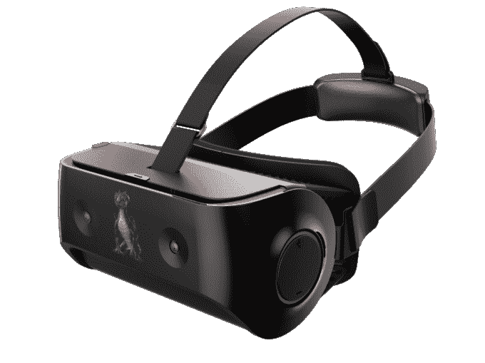

# 高通宣布新的虚拟现实开发套件和耳机加速器计划

> 原文：<https://web.archive.org/web/https://techcrunch.com/2017/02/23/qualcomm-announces-new-vr-dev-kit-and-headset-accelerator-program/>

# 高通宣布新的虚拟现实开发套件和耳机加速器计划

虚拟现实的未来肯定是移动的，目前没有人比高通更能控制移动设备。

那么，在全球 ODM(原始设计制造商)中促进虚拟现实的发展无疑符合公司的最大利益。未来不仅仅是基于插入式手机，在中国等地，一体化移动 VR 耳机已经受到了很多关注。去年，高通[展示了基于 Snapdragon 820 架构的参考设计耳机，今年该公司更新了新 835 芯片。](https://web.archive.org/web/20230402040531/https://techcrunch.com/2016/09/01/qualcomm-unveils-standalone-eye-tracking-vr-headset-reference-design/)

高通 VR 820 参考设计

高通已经吸引了四家中国 ODM 的注意，以建立其虚拟现实参考设计，但为了吸引更广泛的观众，该公司正准备推出一个头戴式显示器加速器计划，该计划将使制造虚拟现实耳机的公司能够接触高通的部分供应链合作伙伴，以及与产品营销相关的努力。

这家芯片制造商还指出，尽管该项目最初是为 VR 耳机制造商设计的，但 AR 领域的那些人很快就可以加入进来，了解更多关于新 Snapdragon 835 的最佳构建方式。

除了耳机加速器计划的消息，高通还宣布他们将更新他们的开发套件，以突出 835 的开发重点。新的开发套件将基于一对摄像头进行自由运动 6DOF 内外跟踪，并将突出新的眼球跟踪技术，这将减轻系统的计算负载。

当耳机加速器计划现在开放时，开发者套件预计将在某个时间到达 Q2。