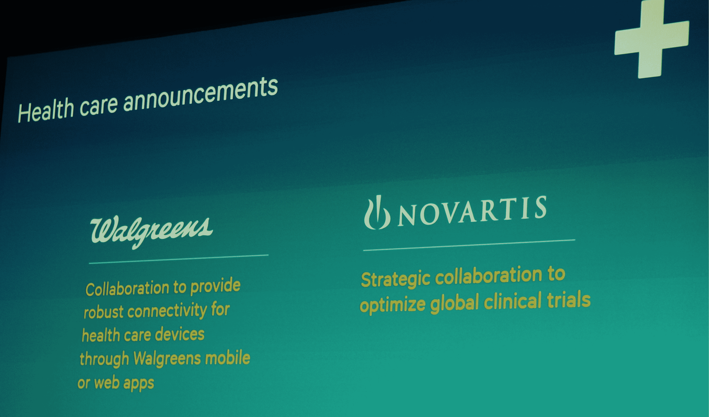
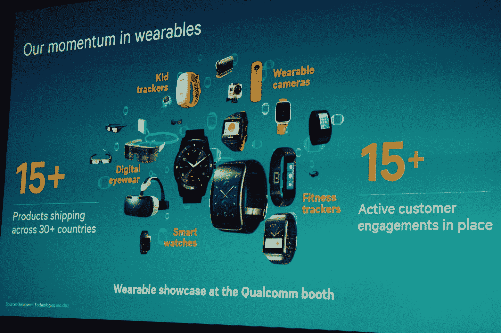
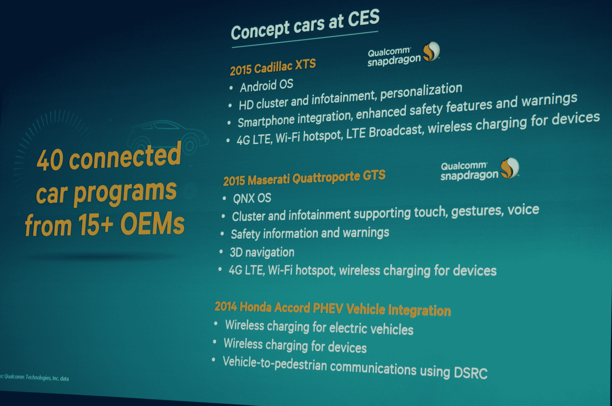

# 高通打破为万物互联制造芯片的计划 

> 原文：<https://web.archive.org/web/https://techcrunch.com/2015/01/05/qualcomm-announces-some-stuff/>

# 高通打破了为万物互联制造芯片的计划

在今天的 CES 新闻发布会上，半导体公司[高通](https://web.archive.org/web/20221006072257/http://www.crunchbase.com/organization/qualcomm)宣布与沃尔格林和诺华合作，使用其 [2net](https://web.archive.org/web/20221006072257/http://www.qualcommlife.com/wireless-health) 无线健康平台。

总部位于圣地亚哥的公司总裁 Derek Arberle 也花了大量时间讨论其之前宣布的 Snapdragon 810 芯片，该芯片将在新的 [LG G Flex 2 today](https://web.archive.org/web/20221006072257/https://beta.techcrunch.com/2015/01/05/lg-g-flex-2-hands-on-ces/) 中首次亮相，该芯片将支持 4K 视频和高分辨率游戏内容。

其他话题还包括可穿戴设备和汽车领域。在这里，高通几次提到，它正在与实际发货的产品合作，不像其他一些公司那样，它不知何故没有直接点名。

概括地说，无论我们将看到什么样的实物产品越来越多的连接和内置的计算能力，高通都希望制造芯片来处理这些工作。

该公司最近报告的季度收益显示利润低于投资者的预期，导致其 T2 股票大幅下跌。该公司于 1991 年上市。

高通的 Arberle 引用了一个有趣的统计数据，指出在一些分析师眼中，2014 年至 2018 年将有 80 亿部智能手机出货。这个数字很重要，因为它表明，可能成为高通收入增长核心引擎的东西还有上升空间——我怀疑很多人会认为该公司正在开发的可穿戴设备和其他小众产品能提供类似的实质性收入。

偶然想到这个概念，Arberle 指出，他的公司的芯片现在用于“超过 10 亿”的 Android 手机。在最近结束的 2014 财年，该公司售出了 8.6 亿块这种芯片。

回到医疗保健，该公司刚刚宣布的与沃尔格林和诺华的交易使其处于健康的两个方面——消费者和企业。该公司没有讨论这些安排的任何潜在财务条款。

