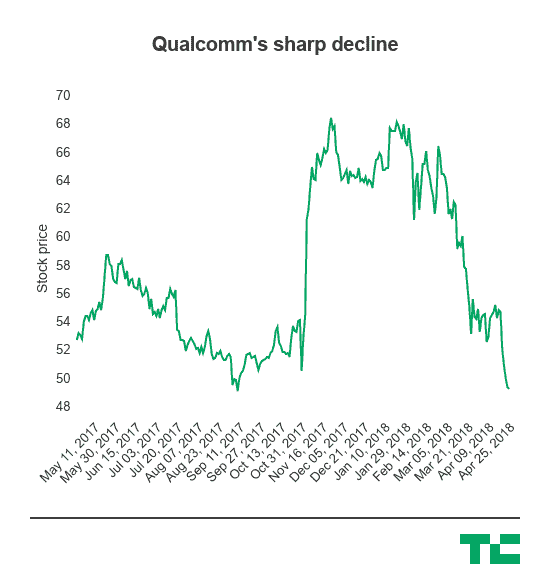

# 在混乱的一年中，高通第二季度表现好于预期 

> 原文：<https://web.archive.org/web/https://techcrunch.com/2018/04/25/qualcomm-delivers-a-better-than-expected-second-quarter-amid-its-chaotic-year/>

# 在混乱的一年中，高通第二季度的表现好于预期

在经历了一系列令人怀疑高通未来的大规模连锁惨败后，该公司成功报告了一个基本积极的第一季度，并防止股价进一步下跌。

由于各种各样的原因，高通一直承受着相当大的压力，其中最明显的一个原因是博通的大规模收购尝试失败。但除此之外，高通还面临着试图完成对恩智浦的收购的问题，面临着与苹果的持续公开争吵，并在下一代无线技术开始推出之际，在对其未来感到紧张的情况下，试图吸引华尔街的同时，寻求削减成本。该公司的营业收入同比下降了 40%,原因是它与苹果在版税问题上持续争吵。

该公司最终以盈利结束，报告每股收益 80 美分，而分析师预期每股收益 70 美分。该公司表示，它创造了 52.3 亿美元的收入，而分析师预期为 51.9 亿美元。除了自身的具体问题，高通还严重依赖智能手机供应链的健康。举例来说，苹果没有达到华尔街对 iPhone 销量的预期目标。

在 BroadQualm 崩溃后，该公司表示将努力降低年度成本，并裁员约 1，500 人。这也发生在它的前任主席保罗·雅各布斯辞职的时候，他说[他将探索收购高通并将其私有化的可能性](https://web.archive.org/web/20221025222203/https://techcrunch.com/2018/03/16/qualcomms-former-exec-chair-will-exit-after-exploring-an-acquisition-bid/)。除了与苹果的争斗和试图完成对恩智浦的收购，这还为芯片设计师的未来带来了大量不确定性。

博通收购高通，这是一笔非常紧张的交易，最终白宫终止了这笔交易，将两家最大的无晶圆厂芯片公司合并为一个部门——但目前尚不清楚博通首席执行官陈福基会对高通做什么，后者目前正卷入与苹果公司关于专利费的一系列争吵。特朗普政府提议对中国产品征收关税，给局势增添了又一层不确定性。