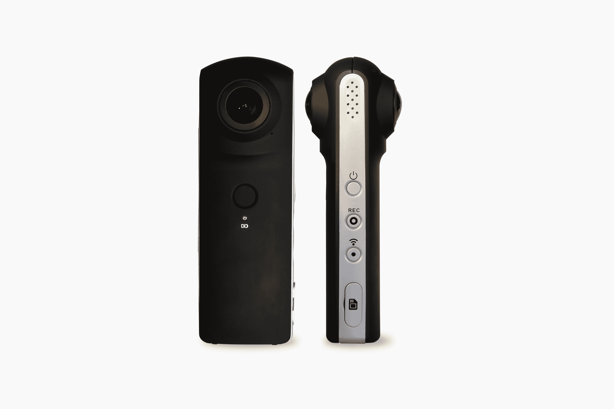

# 高通推出面向物联网设备的新视觉智能平台 

> 原文：<https://web.archive.org/web/https://techcrunch.com/2018/04/11/qualcomm-launches-its-new-vision-intelligence-platform-for-iot-devices/>

高通的芯片已经为市场上几乎所有的 Android 智能手机提供动力，但该公司早就将目光放在了这个核心市场之外，越来越多地将物联网视为其下一个主要增长领域之一。今年早些时候，它为物联网开发者推出了新的[嵌入式平台](https://web.archive.org/web/20221207144742/https://techcrunch.com/2018/02/21/qualcomm-launches-its-premium-820e-embedded-platform-for-iot-developers/)；今天，它推出了两款新的物联网片上系统[，QCS605 和 QCS603](https://web.archive.org/web/20221207144742/https://www.qualcomm.com/products/qualcomm-vision-intelligence-platform) ，它们将多核 ARM 处理器与该公司的人工智能引擎和图像信号处理器相结合。

这些芯片的标准用途是用于消费者和行业的智能安全摄像机，以及运动摄像机、可穿戴摄像机、虚拟现实、机器人和智能显示器——任何需要大量边缘计算能力以及解释图像和运行预先训练的机器学习模型的能力的地方。

高通的物联网之旅始于几年前。早期，这主要是为了让该公司的骁龙移动芯片适应这个市场。正如高通的产品管理副总裁 Seshu Madhavapeddy 告诉我的那样，该公司现在认为它已经在物联网领域达到了业务的临界质量，正因为如此，它现在也对市场的需求有了更好的理解。高通不再只是重复使用和调整现有系统，而是正在寻求创造专门制造的芯片组，这些芯片组仍然利用其智能手机技术的构建模块，但也具有定制设计的功能。

对于这些新芯片，定制设计主要集中在人工智能引擎上。该部分芯片每秒可处理 2.1 万亿次神经网络推理操作。这仅仅比 [Mobileeye EyeQ4 芯片](https://web.archive.org/web/20221207144742/https://www.mobileye.com/our-technology/evolution-eyeq-chip/)承诺的性能慢一点点。正如 Madhavapeddy 所强调的，从延迟和带宽的角度来看，将推理带到边缘要有效得多。毕竟，数据不需要往返于数据中心。“我们预料到了这种趋势，我们已经看到了这种趋势，我们正在迎合这种趋势，”他说。

开发者和数据科学家可以使用任何标准的机器学习框架来创建他们的模型，高通将提供一个 SDK 来将这些移植到其芯片上。

只有当你有好的数据可以处理时，所有这些人工智能的能力才是有用的，所以该团队也非常关注芯片的实际图像处理部分。“摄像技术使用了我们高通最好的摄像技术，”马达瓦佩迪说。尽管底层技术相似，但该团队预期的用例类型并不完全符合智能手机用户的期望。例如，你希望在物联网和消费类摄像机中获得出色的低光视频性能，但在像安全摄像机这样的物联网设备中，你的重点不是美学。同样，你将安装在山地车上的运动相机的图像稳定算法需要与智能手机的图像稳定算法进行不同的调整。

当然，一旦你有了所有这些构建模块，你还需要为开发者提供在其上运行软件的能力。“不管你在构建什么产品，我们的客户都会添加许多不同的软件来区分他们正在构建的产品，”Madhavapeddy 说。例如，对于虚拟现实摄像机，这是一种将所有摄像机的图像组合在一起的软件。

为了帮助开发人员和原始设备制造商在这些新 SOC 的基础上进行开发，高通今天还宣布了与 Altek 合作的基于 QCS605 的新 VR 摄像机参考设计，以及基于 QCS603 的工业安全摄像机参考设计。

这两个系统现在都在出样片，我们可能会在今年第二季度看到基于它们的第一批产品。