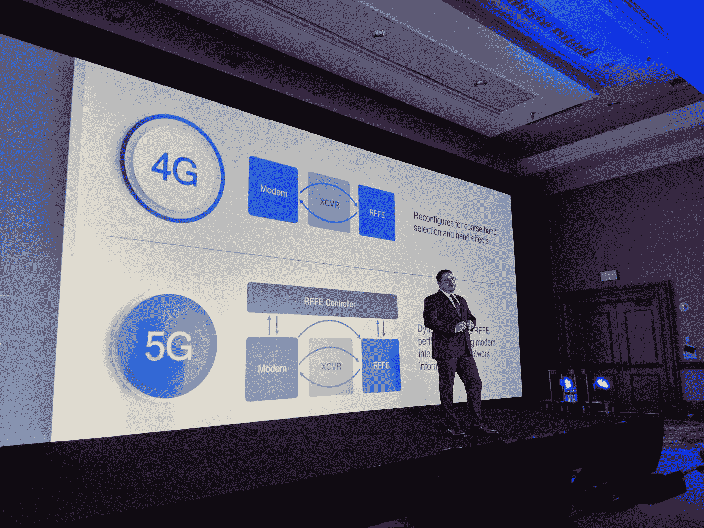

# 高通总统:Spectre/Meltdown 不是我们关心的领域

> 原文：<https://web.archive.org/web/https://techcrunch.com/2018/01/08/qualcomm-president-spectre-meltdown-are-not-an-area-of-concern-for-us/>

# 高通总统:幽灵/熔毁“不是我们关心的领域”

在 CES 的新闻发布会上，高通总统 [Cristiano Amon](https://web.archive.org/web/20221025223038/https://beta.techcrunch.com/2018/01/03/kernel-panic-what-are-meltdown-and-spectre-the-bugs-affecting-nearly-every-computer-and-device/) 宣布了围绕汽车行业、[移动](https://web.archive.org/web/20221025223038/https://beta.techcrunch.com/2018/01/08/qualcomm-shows-off-a-chip-for-the-next-generation-of-bluetooth-earbuds/)、语音助手和 5G 的一系列新的合作伙伴关系和产品。然而，在活动结束时，他也被问及对困扰芯片行业的[幽灵/灾难安全漏洞](https://web.archive.org/web/20221025223038/https://beta.techcrunch.com/2018/01/03/kernel-panic-what-are-meltdown-and-spectre-the-bugs-affecting-nearly-every-computer-and-device/)的反应。据阿蒙称，对移动行业的影响可能不会很高，因为修复程序已经可用，不会对性能产生任何重大影响。

阿蒙指出，移动生态系统是独一无二的，高通及其合作伙伴在去年 12 月发布了第一批补丁。“移动生态系统有一些独特之处，”他在谈到移动安全时说道。“用户从应用商店下载。最重要的是，你对 Android 和 ARM 的影响——我们早在 12 月就向一些原始设备制造商发布了补丁。”他还称赞谷歌和 ARM 积极主动地迅速向他们的生态系统发布解决方案。

“具体来说，当我们看到可用的修复方法时，尤其是当你看到内存映射时，全球生态系统已经适应了，”他说。“这不是我们和移动生态系统关心的领域。”

你不太可能从那些制造台式机、笔记本电脑和服务器芯片的人那里听到同样的反应，但移动生态系统确实不同，用户往往会相对快速地更新和安装补丁。这与个人电脑世界有很大的不同，例如，在个人电脑世界，许多用户仍然使用微软不再支持的 Windows 版本。

