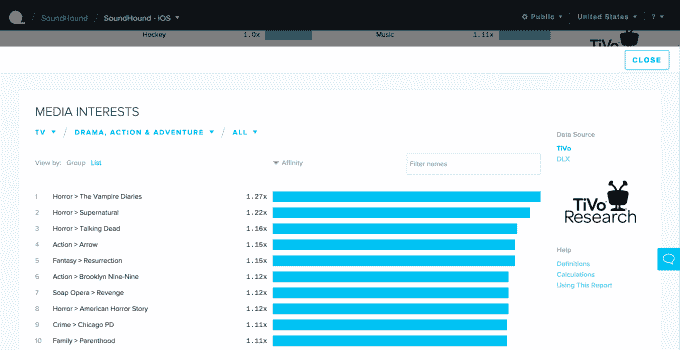

# Quantcast 推出受众网格来连接在线和离线广告定位 

> 原文：<https://web.archive.org/web/https://techcrunch.com/2015/10/07/quantcast-audience-grid/>

由于 Quantcast 公司推出了一款名为 Audience Grid 的新产品，在线广告商和出版商可能会更加了解他们的观众的离线习惯。

Quantcast 首席执行官康拉德·费尔德曼(Konrad Feldman)将其描述为“最大的开放式数据营销平台，弥合了线下和线上的差距。”正如他解释的那样，Audience Grid 将 Quantcast 的在线数据与 TiVo Research 等合作伙伴的数据联系起来。

费尔德曼认为，其他针对受众的努力在网上举步维艰，因为“它们没有任何规模。”因此，当广告商在“互联网规模”发起广泛的活动时，他们被迫使用“非常简单的受众描述”——通常只是年龄和性别等粗略的描述。

他认为，另一方面，Quantcast 已经“非常清楚地证明了我们如何能够创建准确、规模化的数据”，通过将其数据和方法与新的合作伙伴相结合，它可以提供更多的见解。

首先，通过使用电视数据，观众网格可以帮助在线广告客户锁定特定节目的粉丝，或者帮助出版商查看他们的读者实际观看的节目。事实上，该公司表示，它已经发现 Vox 读者更有可能观看黑名单*，而华尔街日报读者更有可能观看美好生活*。*(随你怎么弄。)*

除了 TiVo，Audience Grid 的初始数据合作伙伴包括 Kantar Shopcom、NetWise Data、Relevate Auto、IRI、V12 Group、Oracle Datalogix、Rsearch Now 和 Luth Research。

TiVo Research 的高级副总裁兼总经理弗兰克·福斯特(Frank Foster)表示，与 Quantcast 合作是他的公司让电视“更负责任”的更广泛努力的一部分这就是为什么 TiVo 正在进行自己的研究和跟踪，比如电视广告是否真的推动了店内流量和销售。他补充说，他希望观众网格最终能够改善电视广告以及在线广告。

“Quantcast 的本质是它们在不断进化，”他说。“这符合我们对合作伙伴的要求，他们会不断挑战极限。”

Quantcast 表示，观众网格中的所有数据都将被匿名化。它还表示，将向任何使用 Quantcast Measure 的人免费提供这些数据。

“我们认为，让这种详细的专业知识和细致入微的准确数据广泛用于整个生态系统会有巨大的价值，”费尔德曼说。