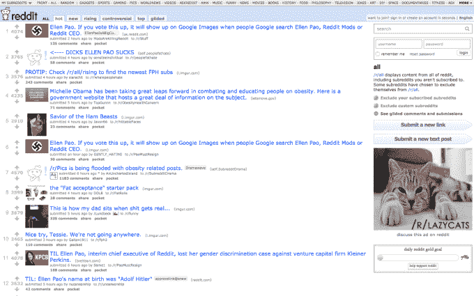
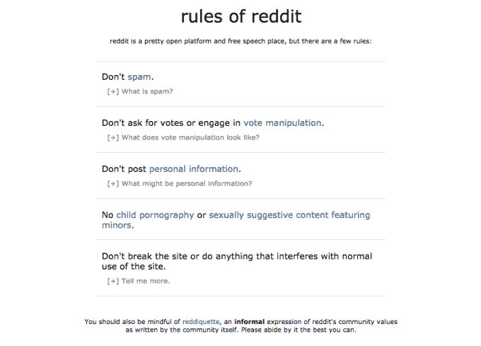

# Reddit 禁止了五个骚扰性的 Subreddits，它的 Trolls 的反应完全如你所料

> 原文：<https://web.archive.org/web/https://techcrunch.com/2015/06/11/quelle-surprise/>

# Reddit 禁止了五个骚扰性的 Subreddits，它的 Trolls 正如你所期待的那样回应

被称为“互联网首页”的人气极高的在线社区 Reddit 已经对其网站上被认为违反其禁止骚扰用户政策的五个团体进行了处罚。

其中包括 [r/fatpeoplehate](https://web.archive.org/web/20230316161150/http://www.reddit.com/r/fatpeoplehate) ，这是一个子网站，顾名思义，是一个评论胖子的地方，是五个网站中最大的，拥有超过 5000 名订户超过 15 万名订户( [h/t @rabite](https://web.archive.org/web/20230316161150/https://twitter.com/rabite/status/609016000093282305) )。其他的还有[r/hamplanethathan](https://web.archive.org/web/20230316161150/https://www.reddit.com/r/hamplanethatred)(3071 个订阅者) [r/transf*gs](https://web.archive.org/web/20230316161150/https://www.reddit.com/r/transfags) (149 个) [r/neof*g](https://web.archive.org/web/20230316161150/https://www.reddit.com/r/neofag) (1239 个)和 [r/shitni**erssay](https://web.archive.org/web/20230316161150/https://www.reddit.com/r/shitniggerssay) (219 个)。

“我们的目标是让尽可能多的人能够在一个开放的平台上进行真实的对话，分享想法和内容。我们希望尽可能少地参与管理这些互动，但在需要时会参与保护隐私和自由表达，并防止骚扰，”Reddit 在一份声明中说。

“平衡这些价值观并不容易，尤其是随着互联网的发展。我们正在学习，并希望随着我们的前进而改进，”博客帖子进一步解释道。

假装惊讶了一会儿。Reddit 社区的一部分人对禁止这些团体感到愤怒，这对于任何了解该网站的人来说都不奇怪。

他们的反应？让网站充斥骚扰 Reddit 首席执行官 Ellen Pao 的内容。许多人还威胁要离开社区，以回应“审查”。

Reddit 代表了许多不同类型的观点和兴趣，从无害的乐趣，如猫、育儿、烹饪和旅行，到更敏感的话题，如种族、性等。

该网站最糟糕的流氓恶名昭彰，因为他们把 Reddit 的部分内容弄得一塌糊涂。然而，尽管 Reddit 尽最大努力允许言论自由，但显然需要划定一条界限。问题是——至少在我看来——似乎是对这条线的选择性执行:一些粗俗的子街道被关闭，而另一些却继续存在。这使得禁令看起来在本质上是武断的，因此引发了这种反应。

如果 Reddit 上最极端的成员真的离开了，这也许并不是一件坏事，但这将代表一个非常不同的网站。但是我们已经看到[在过去](https://web.archive.org/web/20230316161150/https://techcrunch.com/2012/02/13/reddit-police-thyself/)对网站“审查”的愤怒，所以这一事件将如何长期发展还有待观察。

“虽然我们并不总是同意网站上表达的内容和观点，但我们确实保护人们表达观点的权利，并根据 reddit 的规则鼓励实际对话，”reddit 说。

