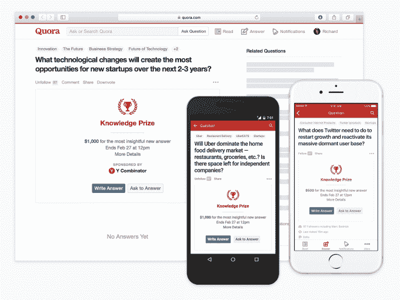
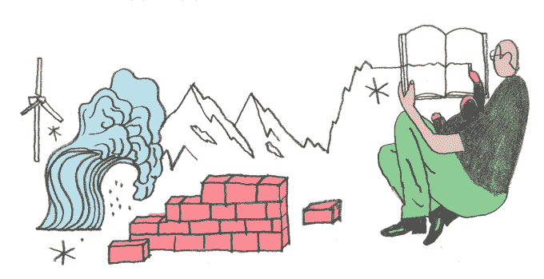
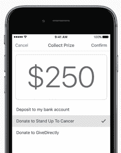

# Quora 让 8000 万访问者变成问答赏金猎人，获得知识奖励

> 原文：<https://web.archive.org/web/https://techcrunch.com/2016/01/27/quora-80-million-users/>

Quora 将让公司支付现金，以激励他们对燃眉之急的问题给出好的答案。这是一种强有力的方式，将私人见解挤入其公共问答网站，该网站已悄然增长至 8000 万独立访客——其中 50%来自美国，15%来自印度。

新的现金奖励叫做[知识奖励](https://web.archive.org/web/20230326023559/https://blog.quora.com/Knowledge-Prizes-Unlock-answers-to-important-questions)，可以让 Quora 发展得更快。专家可能会凭空出现，以一篇短文赢得 250 美元或 1000 美元。Quora 称之为“迷你 XPRIZES”

有点奇怪的是，出钱挑赢家的赞助商可以匿名。这自然会引发一个问题，“谁资助了 Twitter 需要做些什么来重启增长并激活其庞大的休眠用户群’这个奖项？”是推特吗？还有谁会从揭露这一问题上的明智之举中受益？"

也有人担心品牌会将知识奖作为 Quora 上的原生广告，Quora 目前还没有投放任何广告，但计划在年底前投放。Quora 确实收取了少量未披露的费用来促进比赛，但坚持认为这不是一个货币化的产品。

自然，垃圾邮件发送者和巨魔会尽他们最大的努力在比赛中作弊。但 Quora 认为，让爱管闲事的人和营销人员远离知识奖是一项挑战。如果做得好，Quora 可以扩大其用户和回答基础，同时让其他公司或个人买单。

## Quora 什么时候变得这么大了？

慢慢地。一年一年。每次 Quora 有消息，我都会缠着它透露它有多少用户。每次都被拒绝了。但这导致许多人做了最坏的假设并低估了它。然后在 12 月下旬，Quora 的联合创始人兼首席执行官 Adam D'Angelo 在 Quora 上的一个回答中巧妙地抛出了一个炸弹。它每月有 8000 万独立访客。

Quora 的商业和社区负责人兼公司发言人 Marc Bodnick 告诉我,“我们的增长多年来一直稳定增长。  我们的规模越来越大，但这实际上只是为了保持高质量。”这意味着删除重复的问题和打击垃圾邮件，但也要保持其好奇的文化，因为它已经膨胀到 130 名员工。

经过几年缓慢的微调，Quora 也在 12 月推出了热门产品——它的 Reddit 版本叫做 [Quora 写作会议](https://web.archive.org/web/20230326023559/https://techcrunch.com/2015/11/19/quora-writing-sessions/)。知名专家和公众人物提前几天或几周宣布一个会议，用户提交问题，作者准备答案，然后在指定的一个小时左右的时间里对它们进行发布和评论。他们应该是没有巨魔的，不像活的，没有剧本的 AMAs。

塞申斯通过吸引这些名人的观众来赚钱。平均每个会话有 200 万到 400 万次浏览。女权领袖格洛丽亚·斯泰纳姆(Gloria Steinem)观看了 550 万次。风险投资天才 Chamath Palihapitiya 抢到 750 万。现在 Quora 将看看知识奖是否有同样的吸引力。

## 公共咨询

知识奖的工作方式与 Quora 的其他部分非常相似。它们被发送给对主题感兴趣的人，答案排名也是一样。赞助者选择最佳答案仅仅是一种金钱上的激励。产品设计师理查德·亨利告诉我，“这个奖只是为了表明这个问题对赞助它的组织来说确实很重要。”

获胜者的答案上会有一枚徽章。如果他们愿意，他们可以通过“勇敢面对癌症”或“直接捐赠”向慈善机构捐赠现金，这也会显示在他们的徽章上。

以下是 Quora 从今天开始发布的首批知识奖问题:

如你所见，他们以技术为中心。这是因为这是一个 Quora 用户基础最强的话题，但它对更广泛的受众有普遍的吸引力。想要加入公测并获得奖品的用户可以点击上面的一个问题。知识奖可能会公开推出，并很快完全整合到 Quora 中。

博德尼克认为，大公司会利用知识奖，因为这让它们获得相当于咨询的东西，但这些专家可能永远不会愿意正式为一家公司工作。因为知识奖的答案是公开的，而且钱可以捐给慈善机构，所以赞助商可能会吸引那些不想要钱但不介意一点公开承认的人。

Quora 必须努力确保赞助商不会恶意劫持比赛。你可以想象“骆驼香烟匿名”发起了一个问题“我可以吸烟同时保持健康吗？”奖励一个说“是”的答案。但博德尼克知道匿名已经扼杀了许多应用程序，所以他发誓要保持警惕，以确保你可以信任 Quora 保持知识奖的清洁，即使你不知道谁在资助他们。

人们知道的大部分事实上并不在网上。我们把它锁在我们的脑袋里或者小的专业圈子里。当有如此多的干扰时，让我们暴露它是一件相当麻烦的事。幸运的是，有了知识奖，你不必再去做志愿者了。